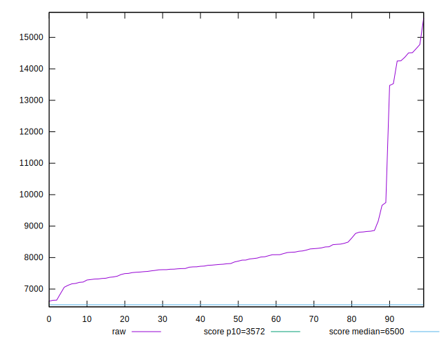

# //first-cpu-idle/samples/astro

[→ Parent](../..)


## Raw


```yaml
p90min: 6855.2480000000005
p90max: 14509.939999999999
p90range: 7654.691999999998
p90mean: 8377.521382978726
median: 7873.6759999999995
p90stdev: 1718.2461262526253
mad: 404.9899999999998
stdevBySn: 682.5094761999999
lfitCenter: 8237.487696334185
lfitStdev: 969.3247265670385
mfitCenter: 8237.487696334185
mfitStdev: 1214.8683846784033
mfitConfidence: 121.48683846784033
p90skewness: 2.7637508406106903
p90eccentricity: 1
p90discretization: 1
outlandishness: 1.0353192052192743

```


## Score


```yaml
p90min: 0.04
p90max: 0.45
p90range: 0.41000000000000003
p90mean: 0.318723404255319
median: 0.34
p90stdev: 0.09124708147536967
mad: 0.04000000000000001
stdevBySn: 0.065593
lfitCenter: 0.32580289415455727
lfitStdev: 0.0627763915392882
mfitCenter: 0.32580289415455727
mfitStdev: 0.07867853908501275
mfitConfidence: 0.007867853908501275
p90skewness: -1.800179332528401
p90eccentricity: 1.0000000000000002
p90discretization: 3.6153846153846154
outlandishness: 0.9780127279630517

```


## Raw Estimate


## Score Estimate


## P Score


```yaml
p90min: 0.04280689681840255
p90max: 0.4546551294756725
p90range: 0.41184823265726994
p90mean: 0.31846694872324344
median: 0.3407548581678896
p90stdev: 0.09122848545456415
mad: 0.03946469053676835
stdevBySn: 0.06738432057872616
lfitCenter: 0.3254167539601853
lfitStdev: 0.06252382384772764
mfitCenter: 0.3254167539601853
mfitStdev: 0.07836199242623224
mfitConfidence: 0.007836199242623224
p90skewness: -1.7852644902121524
p90eccentricity: 1
p90discretization: 1
outlandishness: 0.9779913410229061

```


## Score Difference


```yaml
p90min: 0
p90max: 5.551115123125783e-17
p90range: 5.551115123125783e-17
p90mean: 3.543264972207946e-18
median: 0
p90stdev: 1.3569671737421593e-17
mad: 0
stdevBySn: 0
lfitCenter: 2.593298623283183e-18
lfitStdev: 6.196756661059375e-18
mfitCenter: 2.593298623283183e-18
mfitStdev: 7.766482736624675e-18
mfitConfidence: 7.766482736624675e-19
p90skewness: 3.568591947091796
p90eccentricity: 0.999999999999998
p90discretization: 47
outlandishness: 1.9881000000000004

```


## P Score Difference


```yaml
p90min: -0.004661464643511415
p90max: 0.0040708209362801395
p90range: 0.008732285579791554
p90mean: -0.00027008061279936796
median: -0.0002606816962965053
p90stdev: 0.002536358794274756
mad: 0.0024827517141625677
stdevBySn: 0.0030065156889074176
lfitCenter: -0.0002456293847862211
lfitStdev: 0.002208897665039951
mfitCenter: -0.0002456293847862211
mfitStdev: 0.002768442674263494
mfitConfidence: 0.0002768442674263494
p90skewness: -0.045588482148619026
p90eccentricity: 1
p90discretization: 1
outlandishness: 0.9059328201523817

```

