# //first-cpu-idle/samples/card

[→ Parent](../..)


## Raw


```yaml
p90min: 1780.2930000000001
p90max: 6666.74
p90range: 4886.447
p90mean: 2857.616511702127
median: 2658.0620000000004
p90stdev: 947.6695030207003
mad: 149.85600000000022
stdevBySn: 260.3958618000004
lfitCenter: 2805.762628014681
lfitStdev: 477.0258338310145
mfitCenter: 2805.762628014681
mfitStdev: 597.8632220067204
mfitConfidence: 59.786322200672046
p90skewness: 3.105517903378583
p90eccentricity: 0.9999999999999996
p90discretization: 1
outlandishness: 1.057448103687706

```

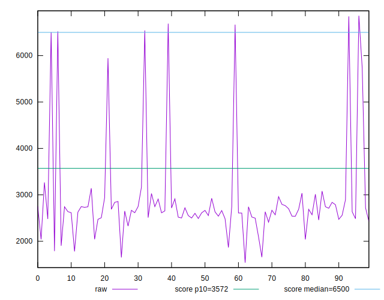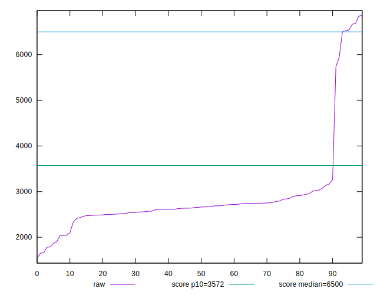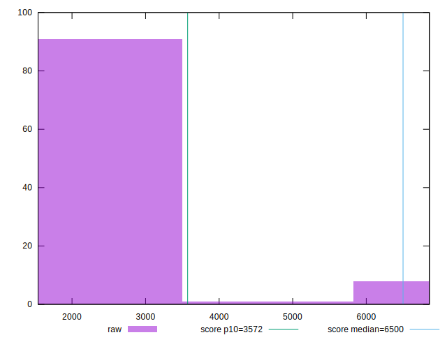
## Score


```yaml
p90min: 0.48
p90max: 1
p90range: 0.52
p90mean: 0.9435106382978717
median: 0.97
p90stdev: 0.11023869119217077
mad: 0.010000000000000009
stdevBySn: 0.011926000000000011
lfitCenter: 0.9502609703249041
lfitStdev: 0.05234133559929426
mfitCenter: 0.9502609703249041
mfitStdev: 0.06560013593858022
mfitConfidence: 0.006560013593858022
p90skewness: -3.5680877262328243
p90eccentricity: 0.9999999999999992
p90discretization: 7.230769230769231
outlandishness: 0.9732381995582187

```

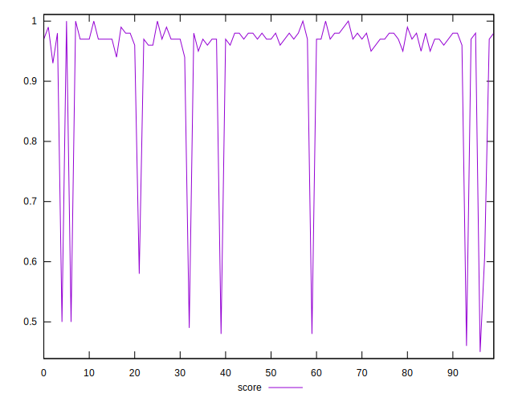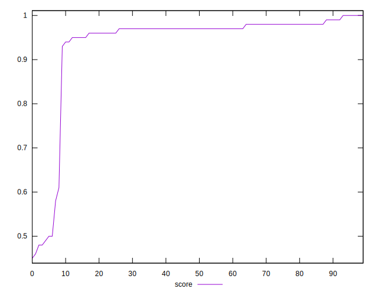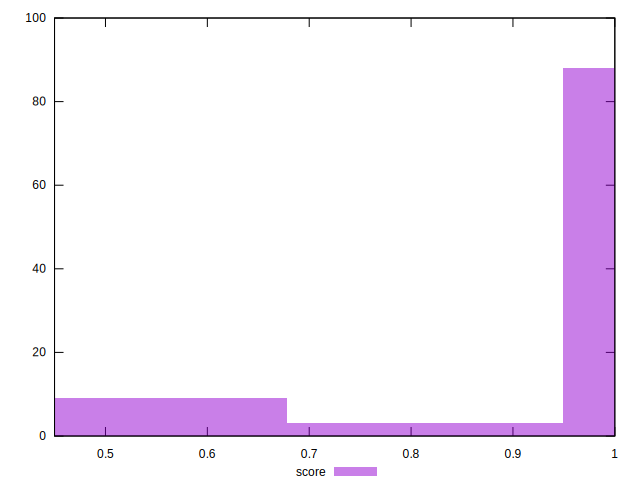
## Raw Estimate

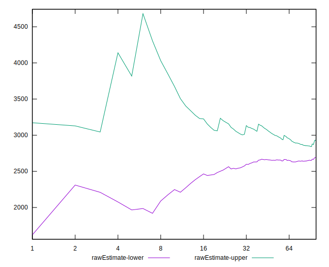
## Score Estimate

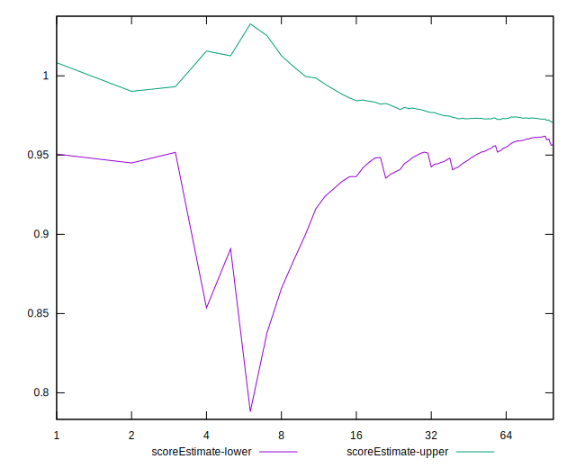
## P Score


```yaml
p90min: 0.4783799193580792
p90max: 0.9972158483184035
p90range: 0.5188359289603243
p90mean: 0.9433146616882169
median: 0.9722005248083818
p90stdev: 0.1105324325640265
mad: 0.007234486029640719
stdevBySn: 0.012740969469796321
lfitCenter: 0.9503741667590766
lfitStdev: 0.05269928561755767
mfitCenter: 0.9503741667590766
mfitStdev: 0.06604875975737351
mfitConfidence: 0.006604875975737351
p90skewness: -3.561508297219619
p90eccentricity: 0.9999999999999999
p90discretization: 1
outlandishness: 0.973076622523035

```

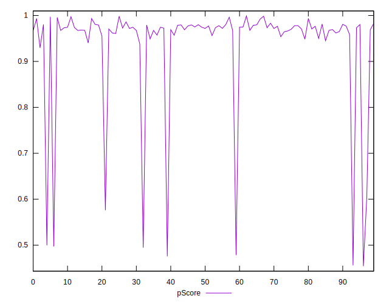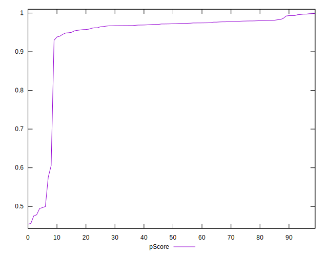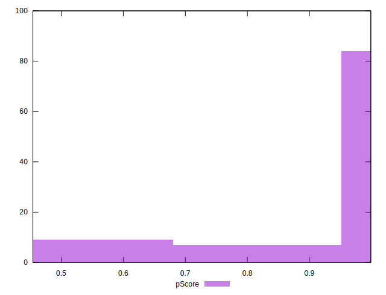
## Score Difference


```yaml
p90min: 0
p90max: 1.1102230246251565e-16
p90range: 1.1102230246251565e-16
p90mean: 4.724353296277262e-18
median: 0
p90stdev: 2.240957533134066e-17
mad: 0
stdevBySn: 0
lfitCenter: 3.922422896608463e-18
lfitStdev: 9.484689165475498e-18
mfitCenter: 3.922422896608463e-18
mfitStdev: 1.1887295031095097e-17
mfitConfidence: 1.1887295031095097e-18
p90skewness: 4.532597979574666
p90eccentricity: 0.9999999999999994
p90discretization: 47
outlandishness: 2.706025000000001

```

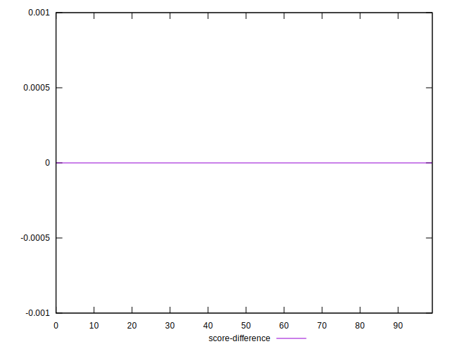
## P Score Difference


```yaml
p90min: -0.004505020202576371
p90max: 0.0045687367652891275
p90range: 0.009073756967865498
p90mean: -0.0002839172726582393
median: -0.0006413973229350001
p90stdev: 0.002612596259660795
mad: 0.0021806057970771286
stdevBySn: 0.003121471603681063
lfitCenter: -0.0003925799099392584
lfitStdev: 0.002266910096637804
mfitCenter: -0.0003925799099392584
mfitStdev: 0.002841150474998293
mfitConfidence: 0.0002841150474998293
p90skewness: 0.3334937050967666
p90eccentricity: 1.0000000000000002
p90discretization: 1
outlandishness: 0.9083177681259273

```

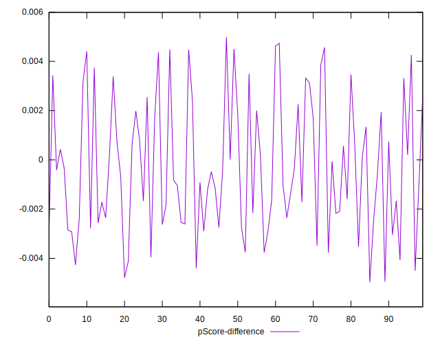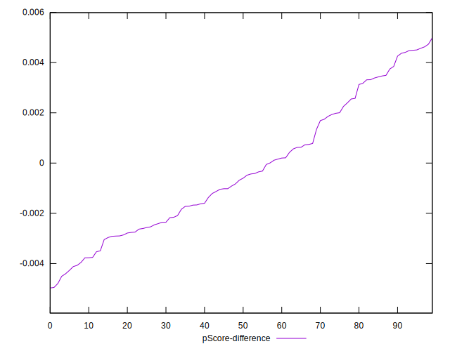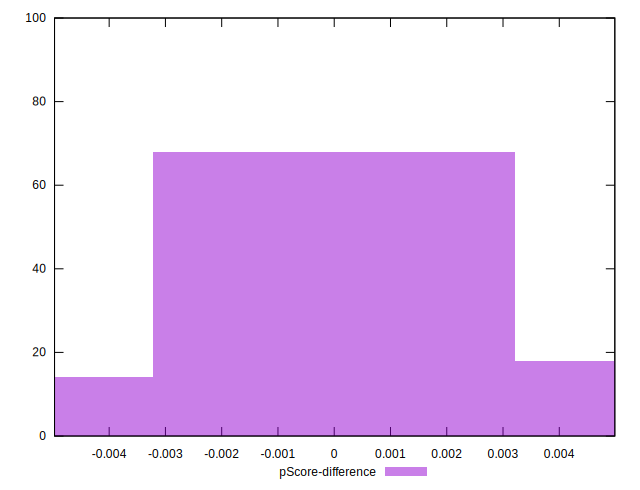