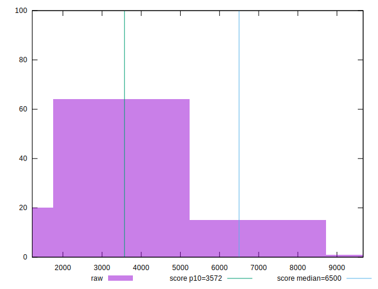

# //first-cpu-idle/samples/music

[→ Parent](../..)


## Raw


```yaml
p90min: 1563.243
p90max: 5930.2609999999995
p90range: 4367.018
p90mean: 2871.7078563829796
median: 2385.48675
p90stdev: 1418.6895415726456
mad: 615.1774999999999
stdevBySn: 872.7879117499996
lfitCenter: 2727.031614685162
lfitStdev: 1164.6111712477823
mfitCenter: 2727.031614685162
mfitStdev: 1459.6236468691438
mfitConfidence: 145.96236468691438
p90skewness: 1.1166065419723268
p90eccentricity: 1.0000000000000004
p90discretization: 1
outlandishness: 1.0710253432911185

```


## Score


```yaml
p90min: 0.58
p90max: 1
p90range: 0.42000000000000004
p90mean: 0.9129787234042552
median: 0.98
p90stdev: 0.14012023550640465
mad: 0.020000000000000018
stdevBySn: 0.023852000000000022
lfitCenter: 0.9315556763134376
lfitStdev: 0.11516489820836912
mfitCenter: 0.9315556763134376
mfitStdev: 0.14433779519228837
mfitConfidence: 0.014433779519228838
p90skewness: -1.4289835720568602
p90eccentricity: 1
p90discretization: 4.7
outlandishness: 0.9713386379528326

```


## Raw Estimate


## Score Estimate


## P Score


```yaml
p90min: 0.5778394822411377
p90max: 0.9988576219075969
p90range: 0.4210181396664592
p90mean: 0.9124950514236126
median: 0.9840546177264577
p90stdev: 0.1399143693222699
mad: 0.013542486734037407
stdevBySn: 0.017648632070436213
lfitCenter: 0.9314918362357536
lfitStdev: 0.11503981087840985
mfitCenter: 0.9314918362357536
mfitStdev: 0.1441810214730936
mfitConfidence: 0.014418102147309361
p90skewness: -1.4387972976397947
p90eccentricity: 0.9999999999999997
p90discretization: 1
outlandishness: 0.971368936252721

```


## Score Difference


```yaml
p90min: 0
p90max: 0
p90range: 0
p90mean: 0
median: 0
p90stdev: 0
mad: 0
stdevBySn: 0
lfitCenter: 1.5916911634687915e-18
lfitStdev: 3.932577909407442e-18
mfitCenter: 1.5916911634687915e-18
mfitStdev: 4.928755494914505e-18
mfitConfidence: 4.928755494914504e-19
p90skewness: .nan
p90eccentricity: .nan
p90discretization: 94
outlandishness: .inf

```


## P Score Difference


```yaml
p90min: -0.004419631875115959
p90max: 0.004759129904905124
p90range: 0.009178761780021083
p90mean: -0.0005043200478242507
median: -0.0013628416633214013
p90stdev: 0.0026472482735163776
mad: 0.00159537748383487
stdevBySn: 0.002557321630642216
lfitCenter: -0.0007230002745748463
lfitStdev: 0.0023388632514626654
mfitCenter: -0.0007230002745748463
mfitStdev: 0.0029313303812554857
mfitConfidence: 0.00029313303812554856
p90skewness: 0.61872577165335
p90eccentricity: 0.9999999999999994
p90discretization: 1
outlandishness: 0.841626949231474

```

