# //first-meaningful-paint/samples/astro

[→ Parent](../..)


## Raw


```yaml
p90min: 4800.920999999999
p90max: 8334.385999999997
p90range: 3533.4649999999974
p90mean: 6349.7686861702105
median: 6203.186000000001
p90stdev: 762.2978278875136
mad: 555.3090000000007
stdevBySn: 845.4123750500006
lfitCenter: 6325.367520191925
lfitStdev: 658.993947559702
mfitCenter: 6325.367520191925
mfitStdev: 825.9264317130062
mfitConfidence: 82.59264317130062
p90skewness: 0.483499370793524
p90eccentricity: 1.0000000000000002
p90discretization: 1
outlandishness: 1.0105376005817184

```

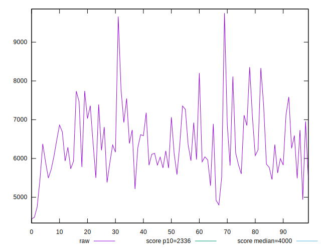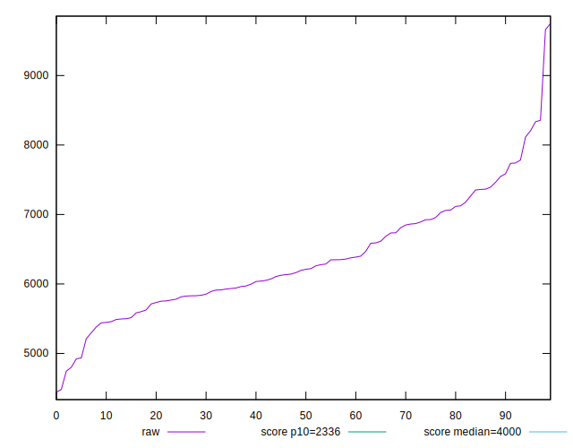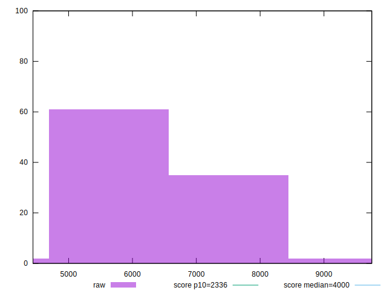
## Score


```yaml
p90min: 0.04
p90max: 0.33
p90range: 0.29000000000000004
p90mean: 0.14819148936170218
median: 0.15
p90stdev: 0.06145336868971234
mad: 0.04999999999999999
stdevBySn: 0.06559300000000001
lfitCenter: 0.1487022196198549
lfitStdev: 0.05145745222408629
mfitCenter: 0.1487022196198549
mfitStdev: 0.06449235240757922
mfitConfidence: 0.0064492352407579225
p90skewness: 0.48275699014358237
p90eccentricity: 1
p90discretization: 3.76
outlandishness: 1.0437709960942028

```

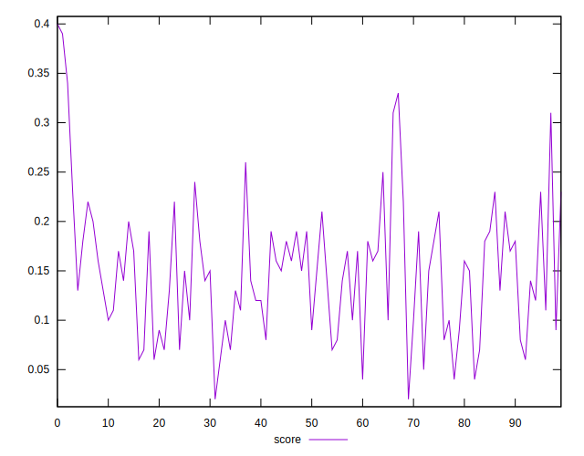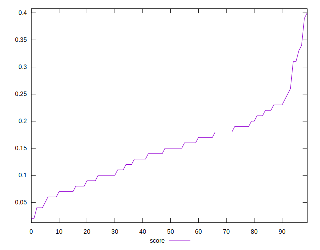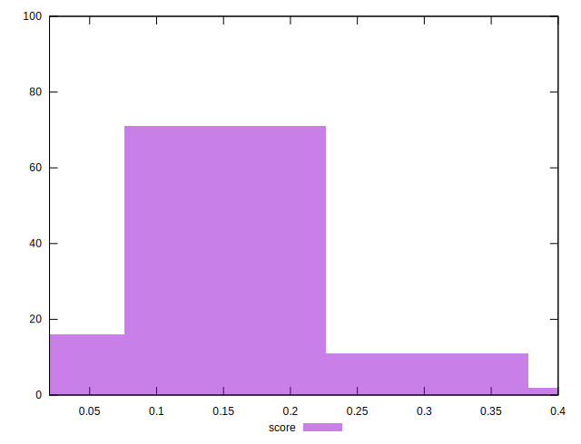
## Raw Estimate

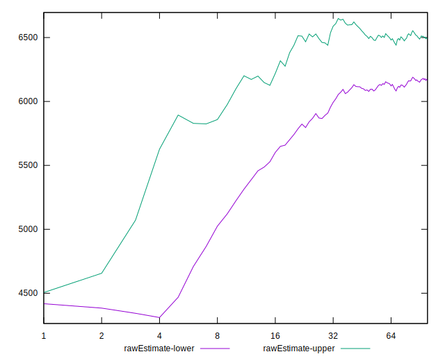
## Score Estimate

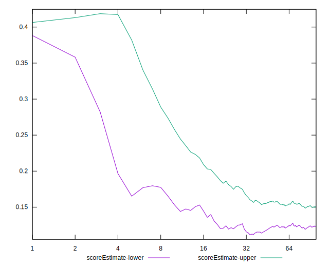
## P Score


```yaml
p90min: 0.04013356918700722
p90max: 0.33182596384406016
p90range: 0.29169239465705293
p90mean: 0.14835731014848189
median: 0.1479070114135403
p90stdev: 0.06187508387871645
mad: 0.047752367158331976
stdevBySn: 0.06758865836457525
lfitCenter: 0.14883455088692768
lfitStdev: 0.05244106100428636
mfitCenter: 0.14883455088692768
mfitStdev: 0.0657251231986321
mfitConfidence: 0.00657251231986321
p90skewness: 0.48265220196968234
p90eccentricity: 1.0000000000000007
p90discretization: 1
outlandishness: 1.0437047260131236

```

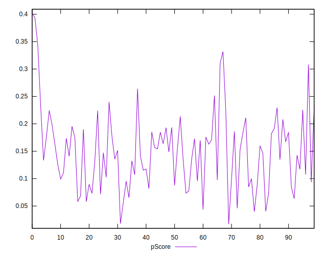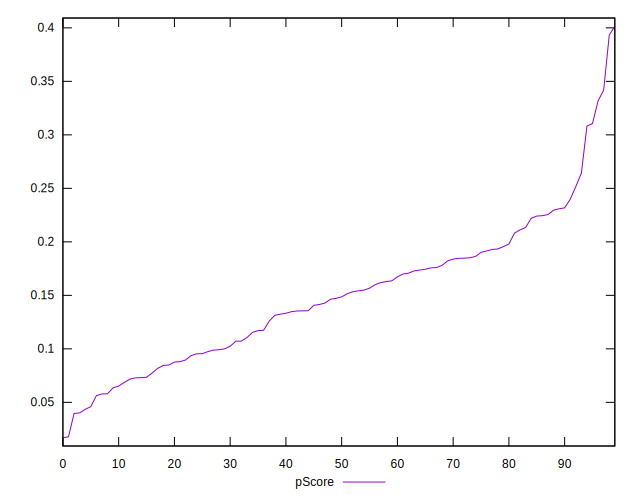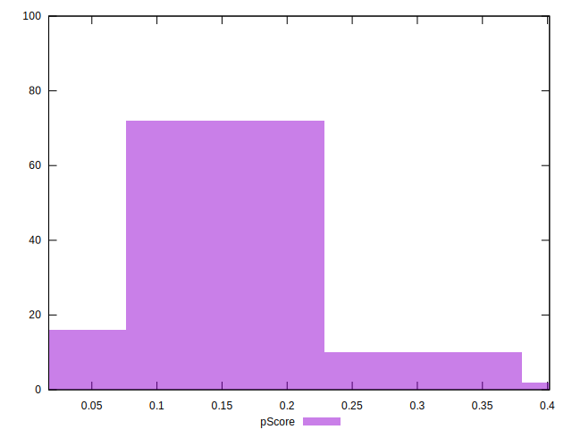
## Score Difference


```yaml
p90min: 0
p90max: 0
p90range: 0
p90mean: 0
median: 0
p90stdev: 0
mad: 0
stdevBySn: 0
lfitCenter: 0
lfitStdev: 0
mfitCenter: 0
mfitStdev: 0
mfitConfidence: 0
p90skewness: .nan
p90eccentricity: .nan
p90discretization: 94
outlandishness: .nan

```


## P Score Difference


```yaml
p90min: -0.00460446691781502
p90max: 0.004712737777104126
p90range: 0.009317204694919146
p90mean: 0.00017179154417110908
median: 0.0005553728091030816
p90stdev: 0.002886178833339464
mad: 0.002738405174040266
stdevBySn: 0.0033722395328599484
lfitCenter: 0.00023853271868516036
lfitStdev: 0.0026647368166457953
mfitCenter: 0.00023853271868516036
mfitStdev: 0.003339752327887878
mfitConfidence: 0.0003339752327887878
p90skewness: -0.15222762550550029
p90eccentricity: 0.9999999999999999
p90discretization: 1
outlandishness: 0.9180201775667695

```

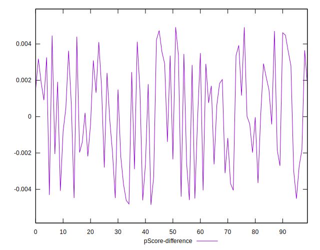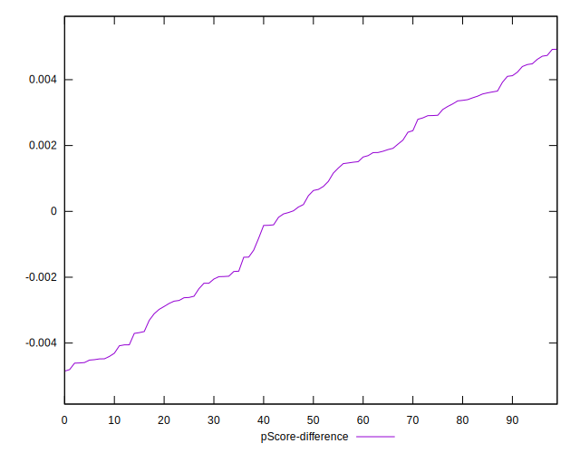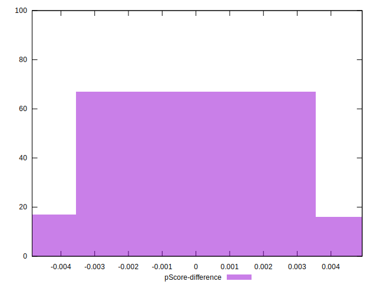