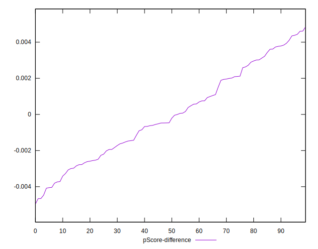

# //first-meaningful-paint/samples/music

[→ Parent](../..)


## Raw


```yaml
p90min: 1511.613
p90max: 2145.6984999999995
p90range: 634.0854999999995
p90mean: 1761.957345744682
median: 1742.94375
p90stdev: 153.34590808606373
mad: 102.80649999999991
stdevBySn: 157.27412500000028
lfitCenter: 1757.730321379161
lfitStdev: 124.00285366893792
mfitCenter: 1757.730321379161
mfitStdev: 155.41452972712983
mfitConfidence: 15.541452972712984
p90skewness: 0.594389423346674
p90eccentricity: 1.0000000000000004
p90discretization: 1
outlandishness: 1.0051276955338075

```


## Score


```yaml
p90min: 0.93
p90max: 0.99
p90range: 0.05999999999999994
p90mean: 0.9726595744680849
median: 0.98
p90stdev: 0.014671983137279868
mad: 0.010000000000000009
stdevBySn: 0.011926000000000011
lfitCenter: 0.9732620514636987
lfitStdev: 0.012223285171015551
mfitCenter: 0.9732620514636987
mfitStdev: 0.01531961612468795
mfitConfidence: 0.001531961612468795
p90skewness: -1.1324720445815712
p90eccentricity: 0.9999999999999984
p90discretization: 13.428571428571429
outlandishness: 0.9974117174407119

```


## Raw Estimate


## Score Estimate


## P Score


```yaml
p90min: 0.9310984618055812
p90max: 0.9897932073787713
p90range: 0.0586947455731901
p90mean: 0.9726600992156708
median: 0.9761121913989637
p90stdev: 0.013793103422528211
mad: 0.007676751716794883
stdevBySn: 0.01186699379536638
lfitCenter: 0.9732819401934747
lfitStdev: 0.01069591121225219
mfitCenter: 0.9732819401934747
mfitStdev: 0.01340533674727606
mfitConfidence: 0.0013405336747276061
p90skewness: -1.2577632777237215
p90eccentricity: 1
p90discretization: 1
outlandishness: 0.9974089403058956

```


## Score Difference


```yaml
p90min: 0
p90max: 1.1102230246251565e-16
p90range: 1.1102230246251565e-16
p90mean: 5.9054416203465774e-18
median: 0
p90stdev: 2.4915085490873306e-17
mad: 0
stdevBySn: 0
lfitCenter: 4.545807909231485e-18
lfitStdev: 1.0928096704220885e-17
mfitCenter: 4.545807909231485e-18
mfitStdev: 1.3696338107132798e-17
mfitConfidence: 1.3696338107132797e-18
p90skewness: 3.9819818903758084
p90eccentricity: 0.9999999999999967
p90discretization: 47
outlandishness: 2.262016

```


## P Score Difference


```yaml
p90min: -0.004468683920294203
p90max: 0.004433236174494537
p90range: 0.00890192009478874
p90mean: 0.0000015073168259022753
median: -0.00033573161262739903
p90stdev: 0.0024742308620969485
mad: 0.002276342007392851
stdevBySn: 0.0029189457704392003
lfitCenter: -0.000047046029522915454
lfitStdev: 0.002165178746011926
mfitCenter: -0.000047046029522915454
mfitStdev: 0.002713649134922383
mfitConfidence: 0.0002713649134922383
p90skewness: 0.12260947705386425
p90eccentricity: 1.0000000000000002
p90discretization: 1
outlandishness: 0.30196314299179633

```

