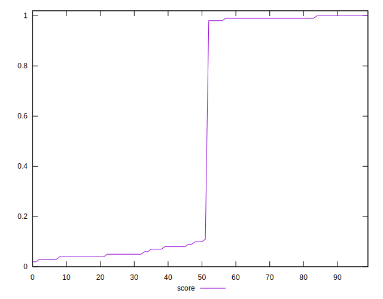

# //interactive/samples/agenda

[→ Parent](../..)


## Raw


```yaml
p90min: 1503.2224999999999
p90max: 19685.213000000003
p90range: 18181.990500000004
p90mean: 9693.452785638303
median: 14040.046499999997
p90stdev: 7412.211240854783
mad: 5892.1855
stdevBySn: 7186.986548650001
lfitCenter: 9677.443068200373
lfitStdev: 8783.006979851138
mfitCenter: 9677.443068200373
mfitStdev: 11007.866827064729
mfitConfidence: 1100.786682706473
p90skewness: -0.018624219000274812
p90eccentricity: 1.0000000000000004
p90discretization: 1
outlandishness: 1.0128540209390293

```


## Score


```yaml
p90min: 0.03
p90max: 1
p90range: 0.97
p90mean: 0.5046808510638296
median: 0.1
p90stdev: 0.46707487697065014
mad: 0.07500000000000001
stdevBySn: 0.095408
lfitCenter: 0.49443085055323294
lfitStdev: 0.5773380405256875
mfitCenter: 0.49443085055323294
mfitStdev: 0.7235859289289762
mfitConfidence: 0.07235859289289762
p90skewness: 0.0820749477475033
p90eccentricity: 1.000000000000001
p90discretization: 7.833333333333333
outlandishness: 1.001661735299262

```


## Raw Estimate


## Score Estimate


## P Score


```yaml
p90min: 0.0264644904354836
p90max: 0.9989762837231116
p90range: 0.972511793287628
p90mean: 0.5046415413951905
median: 0.10102093962967204
p90stdev: 0.4672644513469973
mad: 0.07600777162032735
stdevBySn: 0.09316674752499525
lfitCenter: 0.4944384362146266
lfitStdev: 0.5774105527843404
mfitCenter: 0.4944384362146266
mfitStdev: 0.7236768095679661
mfitConfidence: 0.0723676809567966
p90skewness: 0.082002671528025
p90eccentricity: 1.0000000000000007
p90discretization: 1
outlandishness: 1.0017314013641296

```


## Score Difference


```yaml
p90min: 0
p90max: 0
p90range: 0
p90mean: 0
median: 0
p90stdev: 0
mad: 0
stdevBySn: 0
lfitCenter: 0
lfitStdev: 0
mfitCenter: 0
mfitStdev: 0
mfitConfidence: 0
p90skewness: .nan
p90eccentricity: .nan
p90discretization: 94
outlandishness: .nan

```


## P Score Difference


```yaml
p90min: -0.004678461174170104
p90max: 0.0045313416532187095
p90range: 0.009209802827388813
p90mean: -0.000017240615460577746
median: -0.0002559669581710805
p90stdev: 0.002679012432221341
mad: 0.0021590849123076447
stdevBySn: 0.0031572761295445293
lfitCenter: -0.0000897318611398035
lfitStdev: 0.002374993371036207
mfitCenter: -0.0000897318611398035
mfitStdev: 0.00297661277094547
mfitConfidence: 0.00029766127709454697
p90skewness: 0.15239441445976748
p90eccentricity: 1
p90discretization: 1
outlandishness: 1.5957721199723554

```

