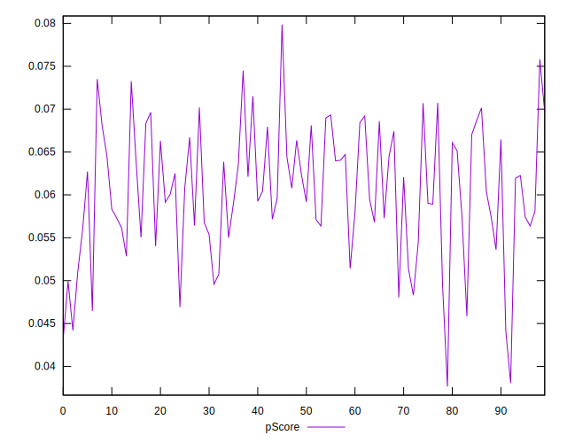

# //interactive/samples/astro

[→ Parent](../..)


## Raw


```yaml
p90min: 15350.116499999998
p90max: 17485.797
p90range: 2135.6805000000004
p90mean: 16201.94854787234
median: 16179.341
p90stdev: 507.61158519414096
mad: 383.3352499999992
stdevBySn: 613.4771668750036
lfitCenter: 16193.741869586165
lfitStdev: 430.7933022443177
mfitCenter: 16193.741869586165
mfitStdev: 539.9193365069224
mfitConfidence: 53.99193365069224
p90skewness: 0.5519117382414376
p90eccentricity: 1.0000000000000002
p90discretization: 1
outlandishness: 1.0026871454661392

```


## Score


```yaml
p90min: 0.04
p90max: 0.07
p90range: 0.030000000000000006
p90mean: 0.0607446808510638
median: 0.06
p90stdev: 0.007328080893316818
mad: 0.009999999999999995
stdevBySn: 0.011925999999999996
lfitCenter: 0.06069646970289758
lfitStdev: 0.005252442823785295
mfitCenter: 0.06069646970289758
mfitStdev: 0.006582960853115512
mfitConfidence: 0.0006582960853115512
p90skewness: -0.44107713860144
p90eccentricity: 1.0000000000000007
p90discretization: 23.5
outlandishness: 0.995242100226659

```


## Raw Estimate


## Score Estimate


## P Score


```yaml
p90min: 0.044159474940265786
p90max: 0.07350589427352827
p90range: 0.029346419333262486
p90mean: 0.060358674777979314
median: 0.06023327097806999
p90stdev: 0.0070896612132098245
mad: 0.005534058073805137
stdevBySn: 0.008487455819700774
lfitCenter: 0.06040961477978179
lfitStdev: 0.00611442633157071
mfitCenter: 0.06040961477978179
mfitStdev: 0.007663296970642859
mfitConfidence: 0.0007663296970642859
p90skewness: -0.2958417783316281
p90eccentricity: 0.9999999999999997
p90discretization: 1
outlandishness: 0.9956662183096705

```


## Score Difference


```yaml
p90min: 0
p90max: 0
p90range: 0
p90mean: 0
median: 0
p90stdev: 0
mad: 0
stdevBySn: 0
lfitCenter: 0
lfitStdev: 0
mfitCenter: 0
mfitStdev: 0
mfitConfidence: 0
p90skewness: .nan
p90eccentricity: .nan
p90discretization: 94
outlandishness: .nan

```


## P Score Difference


```yaml
p90min: -0.004623972133312448
p90max: 0.004494019971497676
p90range: 0.009117992104810124
p90mean: -0.00038417712765003885
median: -0.0007747767858264643
p90stdev: 0.0025858041086359073
mad: 0.0021202517703754684
stdevBySn: 0.0031501162385749334
lfitCenter: -0.000495294743918356
lfitStdev: 0.0021990397623692886
mfitCenter: -0.000495294743918356
mfitStdev: 0.00275608762546964
mfitConfidence: 0.000275608762546964
p90skewness: 0.3675280833748475
p90eccentricity: 1.0000000000000002
p90discretization: 1
outlandishness: 0.9389118544593861

```

