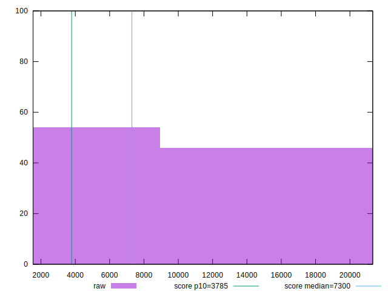

# //interactive/samples/card

[→ Parent](../..)


## Raw


```yaml
p90min: 1780.2930000000001
p90max: 19938.029999999995
p90range: 18157.736999999994
p90mean: 8930.471592021277
median: 2749.4415
p90stdev: 7263.096513787421
mad: 965.5049999999999
stdevBySn: 1273.0003216000002
lfitCenter: 8416.979225407475
lfitStdev: 8548.838012649356
mfitCenter: 8416.979225407475
mfitStdev: 10714.379549654846
mfitConfidence: 1071.4379549654846
p90skewness: 0.2393314184170129
p90eccentricity: 1
p90discretization: 1
outlandishness: 1.0304765107921972

```


## Score


```yaml
p90min: 0.02
p90max: 1
p90range: 0.98
p90mean: 0.5605319148936172
median: 0.97
p90stdev: 0.46308026743516356
mad: 0.030000000000000027
stdevBySn: 0.03577800000000003
lfitCenter: 0.5864300401769938
lfitStdev: 0.5657396458042815
mfitCenter: 0.5864300401769938
mfitStdev: 0.7090494968398454
mfitConfidence: 0.07090494968398454
p90skewness: -0.17319798527152377
p90eccentricity: 0.9999999999999997
p90discretization: 6.714285714285714
outlandishness: 0.9892112652090362

```


## Raw Estimate


## Score Estimate


## P Score


```yaml
p90min: 0.024974606953580503
p90max: 0.9970493264781524
p90range: 0.9720747195245718
p90mean: 0.56051499201892
median: 0.9716242408003102
p90stdev: 0.46268851053275534
mad: 0.025388771622223305
stdevBySn: 0.03159063611498356
lfitCenter: 0.586356270391637
lfitStdev: 0.5651542138741822
mfitCenter: 0.586356270391637
mfitStdev: 0.7083157667246778
mfitConfidence: 0.07083157667246778
p90skewness: -0.17324199769204573
p90eccentricity: 0.9999999999999996
p90discretization: 1
outlandishness: 0.9891367472835669

```


## Score Difference


```yaml
p90min: 0
p90max: 0
p90range: 0
p90mean: 0
median: 0
p90stdev: 0
mad: 0
stdevBySn: 0
lfitCenter: 0
lfitStdev: 0
mfitCenter: 0
mfitStdev: 0
mfitConfidence: 0
p90skewness: .nan
p90eccentricity: .nan
p90discretization: 94
outlandishness: .nan

```


## P Score Difference


```yaml
p90min: -0.0041922770850422175
p90max: 0.004184397923633471
p90range: 0.008376675008675689
p90mean: -0.00004170994276381622
median: 0.0002668311074969232
p90stdev: 0.002302314424711848
mad: 0.002084484972095735
stdevBySn: 0.0026828705606064445
lfitCenter: -0.00000966902261713952
lfitStdev: 0.002081160678354538
mfitCenter: -0.00000966902261713952
mfitStdev: 0.00260834810283149
mfitConfidence: 0.000260834810283149
p90skewness: -0.059904646917051364
p90eccentricity: 0.9999999999999997
p90discretization: 1
outlandishness: 0.8225881330219801

```

