# //interactive/samples/music

[→ Parent](../..)


## Raw


```yaml
p90min: 12882.582999999999
p90max: 15592.525500000003
p90range: 2709.9425000000047
p90mean: 14354.73482978724
median: 14378.32275
p90stdev: 530.1966218498245
mad: 366.53250000000116
stdevBySn: 562.4569935000017
lfitCenter: 14323.92126886446
lfitStdev: 482.16775946084823
mfitCenter: 14323.92126886446
mfitStdev: 604.3076700981007
mfitConfidence: 60.430767009810076
p90skewness: -0.09810283458729335
p90eccentricity: 1.0000000000000004
p90discretization: 1
outlandishness: 0.9896206547839906

```

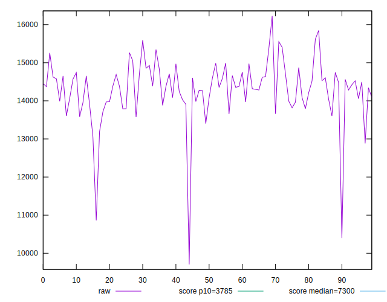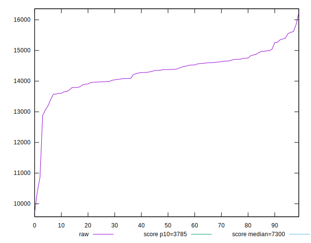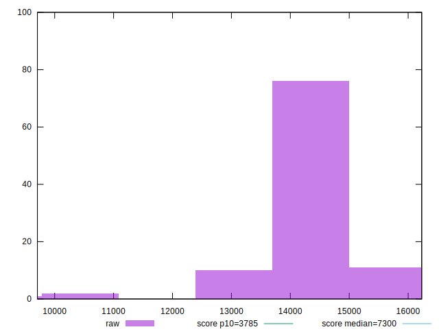
## Score


```yaml
p90min: 0.07
p90max: 0.13
p90range: 0.06
p90mean: 0.09414893617021272
median: 0.09
p90stdev: 0.0119760021095456
mad: 0.010000000000000009
stdevBySn: 0.011926000000000011
lfitCenter: 0.09557681871064659
lfitStdev: 0.012831123961924921
mfitCenter: 0.09557681871064659
mfitStdev: 0.016081429075309996
mfitConfidence: 0.0016081429075309995
p90skewness: 0.42413038609751086
p90eccentricity: 1.000000000000001
p90discretization: 13.428571428571429
outlandishness: 1.085693357081298

```

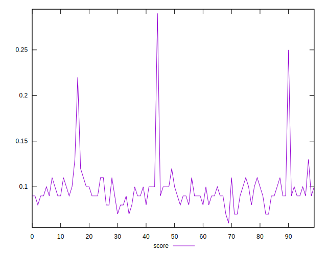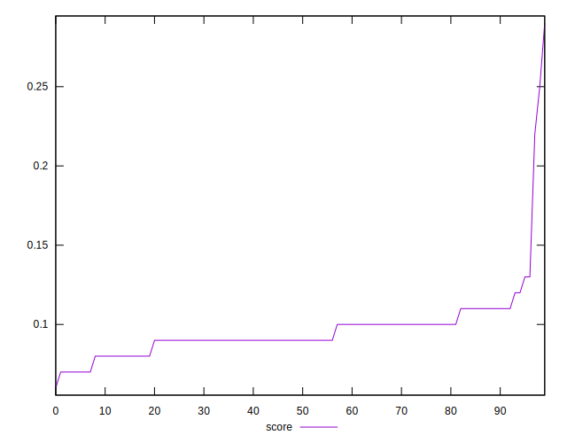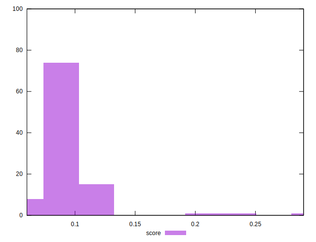
## Raw Estimate

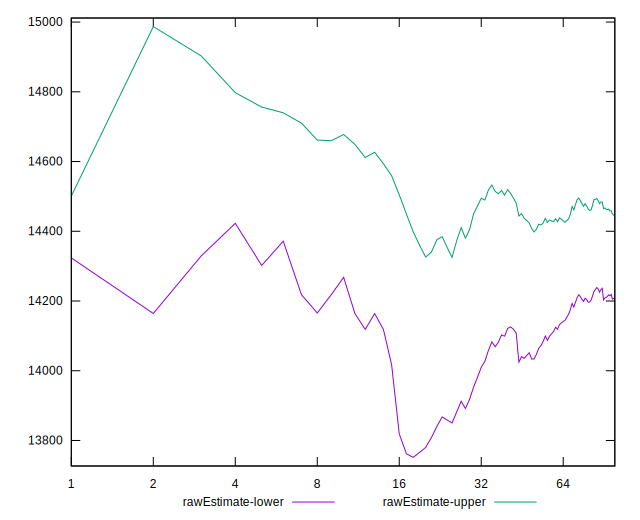
## Score Estimate

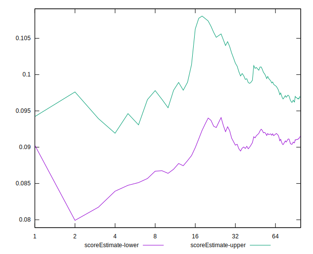
## P Score


```yaml
p90min: 0.06933807193141378
p90max: 0.1338790889719097
p90range: 0.06454101704049592
p90mean: 0.09432593247420029
median: 0.09299061513248638
p90stdev: 0.012285033379076488
mad: 0.00802748265277356
stdevBySn: 0.01326796158708406
lfitCenter: 0.09573675276215764
lfitStdev: 0.012560975629951673
mfitCenter: 0.09573675276215764
mfitStdev: 0.015742848351335027
mfitConfidence: 0.0015742848351335027
p90skewness: 0.5295301409443426
p90eccentricity: 0.9999999999999997
p90discretization: 1
outlandishness: 1.0824161488067423

```

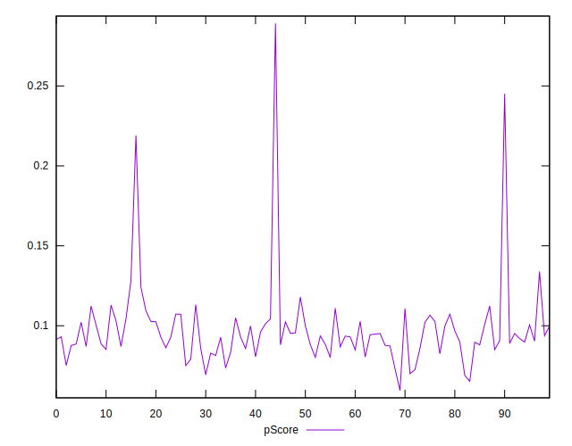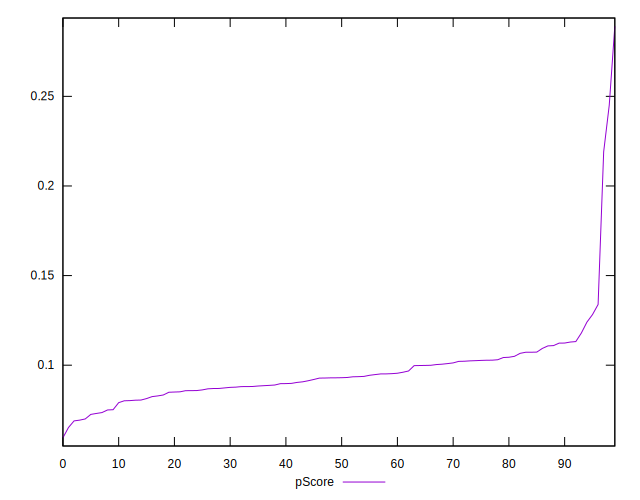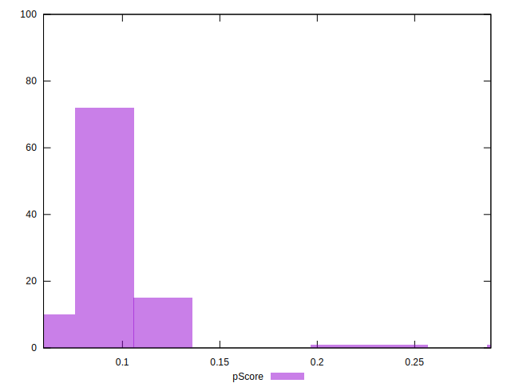
## Score Difference


```yaml
p90min: 0
p90max: 0
p90range: 0
p90mean: 0
median: 0
p90stdev: 0
mad: 0
stdevBySn: 0
lfitCenter: 0
lfitStdev: 0
mfitCenter: 0
mfitStdev: 0
mfitConfidence: 0
p90skewness: .nan
p90eccentricity: .nan
p90discretization: 94
outlandishness: .nan

```


## P Score Difference


```yaml
p90min: -0.004869468114004655
p90max: 0.004433294894465339
p90range: 0.009302763008469994
p90mean: 0.000040960848647854614
median: 0.0000696222175296593
p90stdev: 0.002716714384681453
mad: 0.0026483390532934456
stdevBySn: 0.003303255400253243
lfitCenter: 0.00010278763101767769
lfitStdev: 0.002369803749192366
mfitCenter: 0.00010278763101767769
mfitStdev: 0.0029701085445147176
mfitConfidence: 0.00029701085445147177
p90skewness: -0.22191351341602578
p90eccentricity: 0.9999999999999994
p90discretization: 1
outlandishness: 0.7713430290466048

```

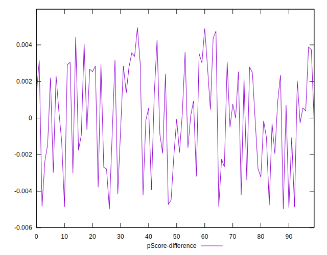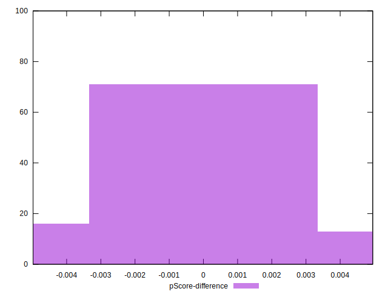