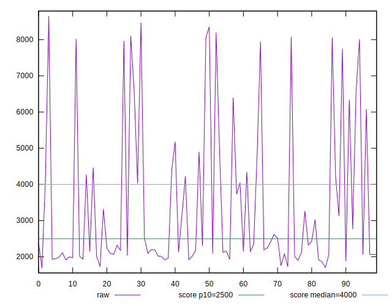

# //largest-contentful-paint/samples/agenda

[→ Parent](../..)


## Raw


```yaml
p90min: 1727.56
p90max: 8195.789
p90range: 6468.229000000001
p90mean: 3366.3131521276596
median: 2218.2275
p90stdev: 2002.3304891529112
mad: 304.9390000000001
stdevBySn: 485.19798029999924
lfitCenter: 3079.9564269224916
lfitStdev: 1626.0449266784437
mfitCenter: 3079.9564269224916
mfitStdev: 2037.9450965669066
mfitConfidence: 203.79450965669065
p90skewness: 1.3855414122128997
p90eccentricity: 0.9999999999999999
p90discretization: 1
outlandishness: 1.0627366650292318

```


## Score


```yaml
p90min: 0.03
p90max: 0.99
p90range: 0.96
p90mean: 0.7174468085106381
median: 0.945
p90stdev: 0.35027325555006933
mad: 0.03500000000000003
stdevBySn: 0.053667000000000055
lfitCenter: 0.7710067464765551
lfitStdev: 0.31417248058272423
mfitCenter: 0.7710067464765551
mfitStdev: 0.3937568118660226
mfitConfidence: 0.039375681186602264
p90skewness: -1.0178898755330055
p90eccentricity: 0.9999999999999997
p90discretization: 2.611111111111111
outlandishness: 0.9647818550455289

```


## Raw Estimate


## Score Estimate


## P Score


```yaml
p90min: 0.02523710525566919
p90max: 0.9889685315982673
p90range: 0.963731426342598
p90mean: 0.7174402075047623
median: 0.9459937280284154
p90stdev: 0.3508416449033918
mad: 0.03226311364278678
stdevBySn: 0.051956726616606594
lfitCenter: 0.7712618743330979
lfitStdev: 0.31450295043448484
mfitCenter: 0.7712618743330979
mfitStdev: 0.39417099440360753
mfitConfidence: 0.03941709944036075
p90skewness: -1.0199228652992323
p90eccentricity: 1.0000000000000002
p90discretization: 1
outlandishness: 0.9647837166272535

```


## Score Difference


```yaml
p90min: 0
p90max: 1.1102230246251565e-16
p90range: 1.1102230246251565e-16
p90mean: 9.448706592554524e-18
median: 0
p90stdev: 2.990276797139501e-17
mad: 0
stdevBySn: 0
lfitCenter: 6.5324080629589865e-18
lfitStdev: 1.530954837127005e-17
mfitCenter: 6.5324080629589865e-18
mfitStdev: 1.9187673428935698e-17
mfitConfidence: 1.9187673428935696e-18
p90skewness: 2.9678675841664983
p90eccentricity: 0.9999999999999979
p90discretization: 31.333333333333332
outlandishness: 1.67055625

```


## P Score Difference


```yaml
p90min: -0.004736334704041334
p90max: 0.004646363692453859
p90range: 0.009382698396495193
p90mean: -0.0000036144667187996928
median: 0.00005055336524620313
p90stdev: 0.0024596777095221957
mad: 0.002006991587995749
stdevBySn: 0.0029546031175117743
lfitCenter: -0.00007070043839121028
lfitStdev: 0.0021094971617489936
mfitCenter: -0.00007070043839121028
mfitStdev: 0.002643862618107303
mfitConfidence: 0.0002643862618107303
p90skewness: 0.2457486257257425
p90eccentricity: 0.9999999999999999
p90discretization: 1
outlandishness: 2.5783716946277604

```

