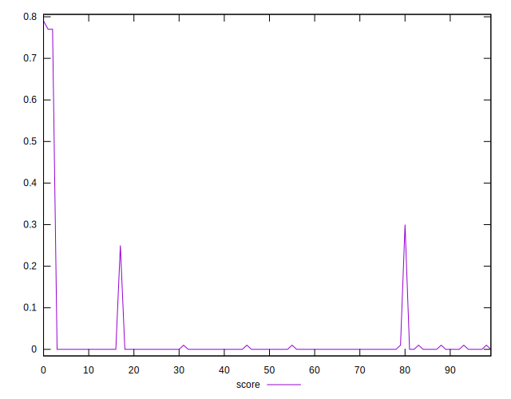

# //largest-contentful-paint/samples/astro

[→ Parent](../..)


## Raw


```yaml
p90min: 4850.877999999999
p90max: 17347.740999999995
p90range: 12496.862999999996
p90mean: 12204.517723404253
median: 12571.85375
p90stdev: 1821.9982312839422
mad: 789.8987499999994
stdevBySn: 1304.7234816000007
lfitCenter: 12229.855748909084
lfitStdev: 1330.9000029203473
mfitCenter: 12229.855748909084
mfitStdev: 1668.0357906917604
mfitConfidence: 166.80357906917604
p90skewness: -0.7218783337402992
p90eccentricity: 1
p90discretization: 1
outlandishness: 0.9830953690835609

```


## Score


```yaml
p90min: 0
p90max: 0.3
p90range: 0.3
p90mean: 0.006702127659574469
median: 0
p90stdev: 0.03982376863965229
mad: 0
stdevBySn: 0
lfitCenter: 0.0144068248338553
lfitStdev: 0.03404960994810489
mfitCenter: 0.0144068248338553
mfitStdev: 0.04267485756097961
mfitConfidence: 0.004267485756097961
p90skewness: 6.671449348676592
p90eccentricity: 1.0000000000000018
p90discretization: 23.5
outlandishness: 19.50554235323756

```


## Raw Estimate


## Score Estimate


## P Score


```yaml
p90min: 0.00003161864342687837
p90max: 0.2994847478048036
p90range: 0.29945312916137673
p90mean: 0.0075912151308235335
median: 0.0008966628592114168
p90stdev: 0.03956086279575484
mad: 0.00043023616411339005
stdevBySn: 0.0007484193106354851
lfitCenter: 0.015394187188052197
lfitStdev: 0.034006797240519825
mfitCenter: 0.015394187188052197
mfitStdev: 0.0426211997892525
mfitConfidence: 0.00426211997892525
p90skewness: 6.697315637619711
p90eccentricity: 0.9999999999999991
p90discretization: 1
outlandishness: 16.104859091515966

```


## Score Difference


```yaml
p90min: 0
p90max: 0
p90range: 0
p90mean: 0
median: 0
p90stdev: 0
mad: 0
stdevBySn: 0
lfitCenter: 0
lfitStdev: 0
mfitCenter: 0
mfitStdev: 0
mfitConfidence: 0
p90skewness: .nan
p90eccentricity: .nan
p90discretization: 94
outlandishness: .nan

```


## P Score Difference


```yaml
p90min: -0.0030478858981138803
p90max: 0.004431644905555365
p90range: 0.007479530803669246
p90mean: 0.0008955649849305278
median: 0.0007594699931580684
p90stdev: 0.0012307610102743015
mad: 0.0004204112066948096
stdevBySn: 0.0007484193106354851
lfitCenter: 0.0008483378687418236
lfitStdev: 0.0007976650186872609
mfitCenter: 0.0008483378687418236
mfitStdev: 0.0009997248457687424
mfitConfidence: 0.00009997248457687424
p90skewness: -0.01544263196856614
p90eccentricity: 1.0000000000000007
p90discretization: 1
outlandishness: 0.9311793355882962

```

