# //largest-contentful-paint/samples/card

[→ Parent](../..)


## Raw


```yaml
p90min: 2024.0579999999998
p90max: 8210.1745
p90range: 6186.116499999999
p90mean: 3568.8679787234064
median: 2522.5265
p90stdev: 1889.8722312542084
mad: 440.4765000000002
stdevBySn: 644.5263588
lfitCenter: 3339.8078762508208
lfitStdev: 1601.6312289909738
mfitCenter: 3339.8078762508208
mfitStdev: 2007.3470640802648
mfitConfidence: 200.73470640802648
p90skewness: 1.2856768193178783
p90eccentricity: 0.9999999999999994
p90discretization: 1
outlandishness: 1.0719507151721674

```

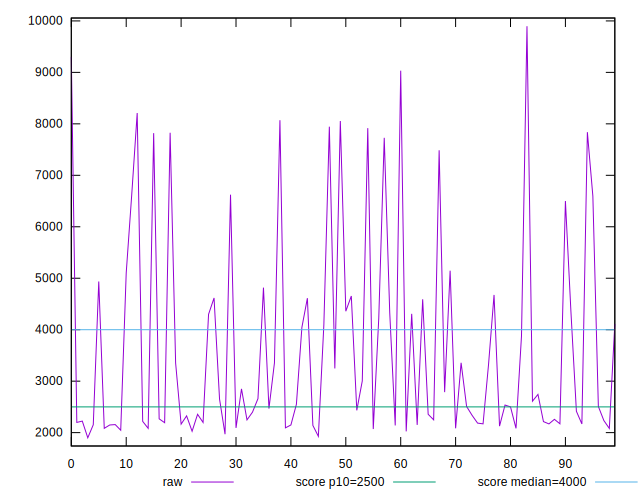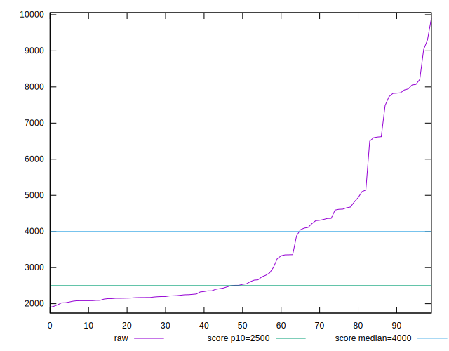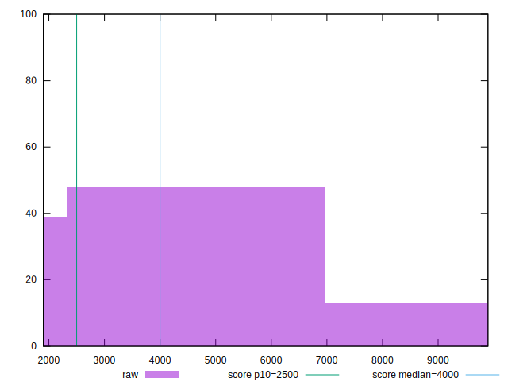
## Score


```yaml
p90min: 0.02
p90max: 0.97
p90range: 0.95
p90mean: 0.6756382978723408
median: 0.895
p90stdev: 0.34189882325299636
mad: 0.06499999999999995
stdevBySn: 0.09242649999999995
lfitCenter: 0.7206065561825546
lfitStdev: 0.32419490529428974
mfitCenter: 0.7206065561825546
mfitStdev: 0.40631805845984753
mfitConfidence: 0.040631805845984754
p90skewness: -0.8202406745641813
p90eccentricity: 0.9999999999999999
p90discretization: 2.6857142857142855
outlandishness: 0.9678829494961482

```

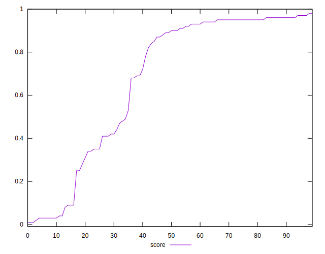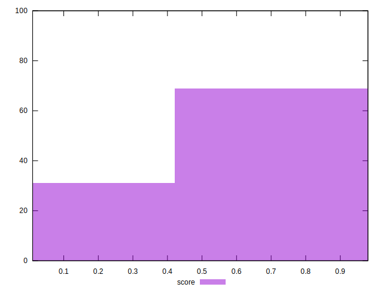
## Raw Estimate

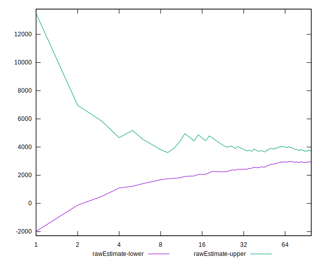
## Score Estimate

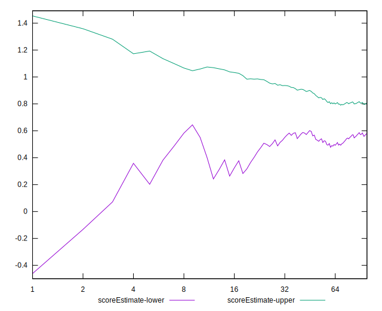
## P Score


```yaml
p90min: 0.024956728316869348
p90max: 0.9683722189531077
p90range: 0.9434154906362383
p90mean: 0.6757801646627333
median: 0.895622609945664
p90stdev: 0.34177407884810523
mad: 0.06757627793903198
stdevBySn: 0.09468217983137203
lfitCenter: 0.7204886083906599
lfitStdev: 0.3239830642897526
mfitCenter: 0.7204886083906599
mfitStdev: 0.4060525551337309
mfitConfidence: 0.04060525551337309
p90skewness: -0.8181187673141365
p90eccentricity: 1.0000000000000002
p90discretization: 1
outlandishness: 0.9678489880225208

```

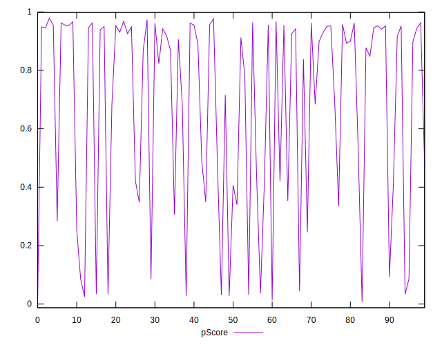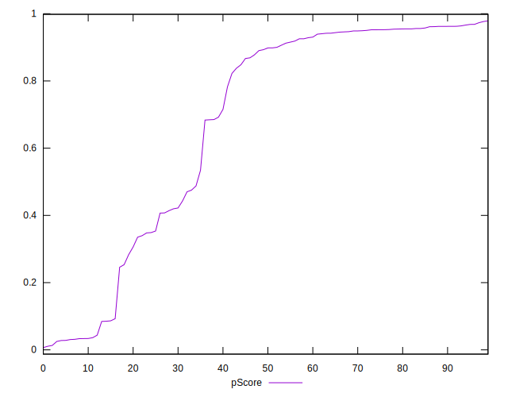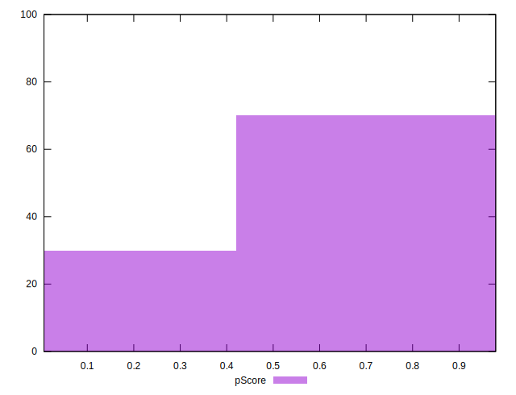
## Score Difference


```yaml
p90min: 0
p90max: 1.1102230246251565e-16
p90range: 1.1102230246251565e-16
p90mean: 3.011775226376754e-17
median: 0
p90stdev: 4.698074814097098e-17
mad: 0
stdevBySn: 0
lfitCenter: 2.2337710560973922e-17
lfitStdev: 4.2715072768237736e-17
mfitCenter: 2.2337710560973922e-17
mfitStdev: 5.3535404630762293e-17
mfitConfidence: 5.353540463076229e-18
p90skewness: 1.0248187393570503
p90eccentricity: 0.9999999999999994
p90discretization: 31.333333333333332
outlandishness: 1.1037356401384082

```

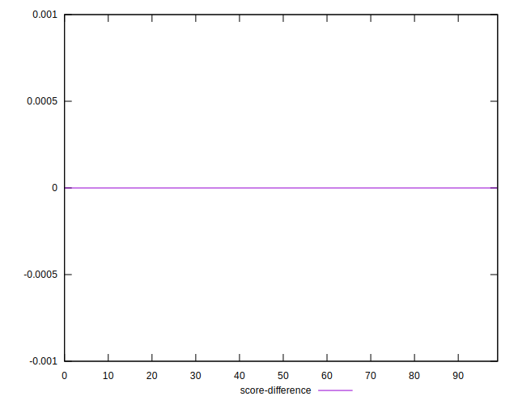
## P Score Difference


```yaml
p90min: -0.004739702181310035
p90max: 0.004759765329445109
p90range: 0.009499467510755144
p90mean: 0.00013288115873382614
median: 0.00033725802069523025
p90stdev: 0.0029078644318141136
mad: 0.0026239860002782722
stdevBySn: 0.003573015389976346
lfitCenter: 0.00018802496879154646
lfitStdev: 0.0027657666368618504
mfitCenter: 0.00018802496879154646
mfitStdev: 0.0034663744299825157
mfitConfidence: 0.0003466374429982516
p90skewness: -0.13269450539628466
p90eccentricity: 0.9999999999999999
p90discretization: 1
outlandishness: 0.9265182043302058

```

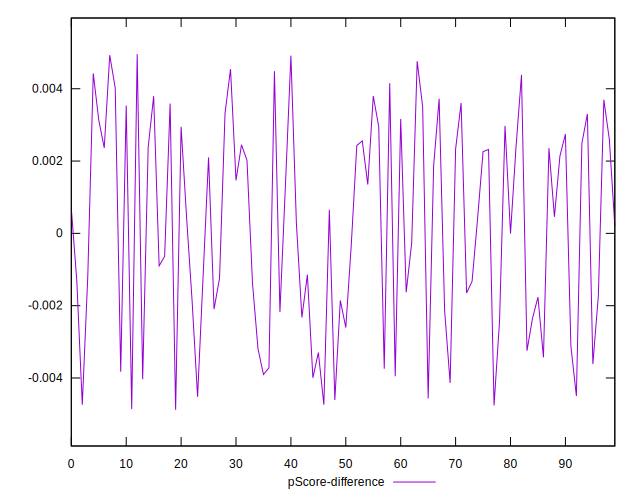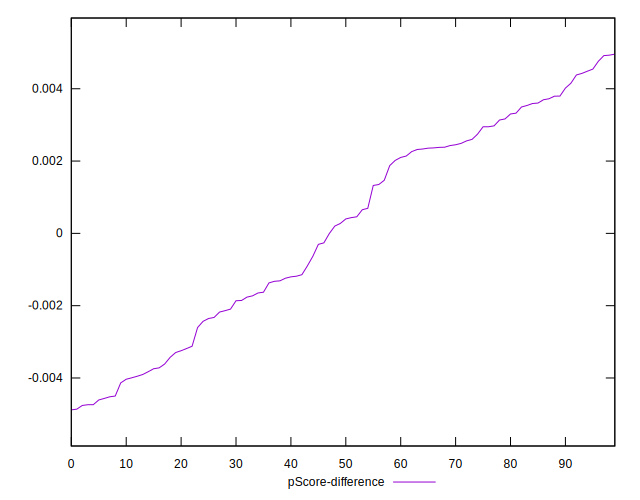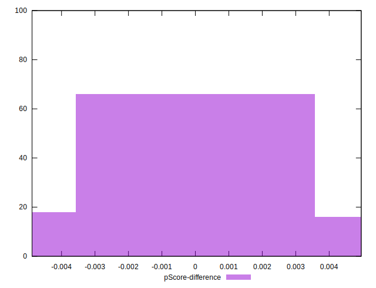