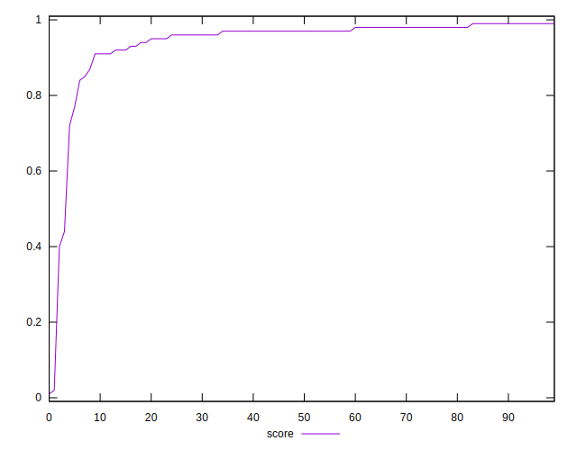

# //largest-contentful-paint/samples/music

[→ Parent](../..)


## Raw


```yaml
p90min: 1732.3979999999997
p90max: 4245.527
p90range: 2513.1290000000004
p90mean: 2069.1192553191495
median: 1984.0915
p90stdev: 353.0334951159458
mad: 143.0875000000001
stdevBySn: 211.68948149999989
lfitCenter: 2103.9391839037253
lfitStdev: 327.7660862777832
mfitCenter: 2103.9391839037253
mfitStdev: 410.7938700778759
mfitConfidence: 41.07938700778759
p90skewness: 3.2276380086046204
p90eccentricity: 1.0000000000000002
p90discretization: 1
outlandishness: 1.1468521650221248

```


## Score


```yaml
p90min: 0.44
p90max: 0.99
p90range: 0.55
p90mean: 0.9537234042553183
median: 0.97
p90stdev: 0.0681984594970645
mad: 0.010000000000000009
stdevBySn: 0.023852000000000022
lfitCenter: 0.9503031694274776
lfitStdev: 0.05002817487350039
mfitCenter: 0.9503031694274776
mfitStdev: 0.06270101889614256
mfitConfidence: 0.006270101889614256
p90skewness: -5.265650991222371
p90eccentricity: 0.9999999999999999
p90discretization: 6.266666666666667
outlandishness: 0.9518924327705598

```


## Raw Estimate


## Score Estimate


## P Score


```yaml
p90min: 0.43548245845982414
p90max: 0.9887452095168235
p90range: 0.5532627510569994
p90mean: 0.9535679784310582
median: 0.9720471550868036
p90stdev: 0.06816920486990319
mad: 0.0113910367472142
stdevBySn: 0.01707484181185236
lfitCenter: 0.9503452902500279
lfitStdev: 0.04994665254296506
mfitCenter: 0.9503452902500279
mfitStdev: 0.06259884580667291
mfitConfidence: 0.006259884580667291
p90skewness: -5.361091388642603
p90eccentricity: 0.9999999999999999
p90discretization: 1
outlandishness: 0.9519936253331682

```


## Score Difference


```yaml
p90min: 0
p90max: 1.1102230246251565e-16
p90range: 1.1102230246251565e-16
p90mean: 3.543264972207946e-18
median: 0
p90stdev: 1.9514781802162966e-17
mad: 0
stdevBySn: 0
lfitCenter: 3.3158666172059827e-18
lfitStdev: 8.063403855810743e-18
mfitCenter: 3.3158666172059827e-18
mfitStdev: 1.0105978057540984e-17
mfitConfidence: 1.0105978057540984e-18
p90skewness: 5.326002287485493
p90eccentricity: 1.0000000000000042
p90discretization: 47
outlandishness: 3.5344000000000007

```


## P Score Difference


```yaml
p90min: -0.004517541540175862
p90max: 0.004552834699510733
p90range: 0.009070376239686595
p90mean: -0.00010572381340314619
median: -0.00038186000977941115
p90stdev: 0.0028070476850725183
mad: 0.0026389082839363143
stdevBySn: 0.0033301190482583763
lfitCenter: -0.00014697902342142866
lfitStdev: 0.0025622206722444394
mfitCenter: -0.00014697902342142866
mfitStdev: 0.0032112673946772946
mfitConfidence: 0.0003211267394677295
p90skewness: 0.08458121763405443
p90eccentricity: 1.0000000000000007
p90discretization: 1
outlandishness: 0.9342918109341621

```

