# //legacy-javascript/samples/astro

[→ Parent](../..)


## Raw


```yaml
p90min: 0
p90max: 150
p90range: 150
p90mean: 36.702127659574465
median: 0
p90stdev: 63.75465436279829
mad: 0
stdevBySn: 0
lfitCenter: 27.674801006093254
lfitStdev: 56.582920837669946
mfitCenter: 27.674801006093254
mfitStdev: 70.91617468781442
mfitConfidence: 7.0916174687814415
p90skewness: 1.1875786969649493
p90eccentricity: 1.0000000000000002
p90discretization: 23.5
outlandishness: 1.3157752371350557

```

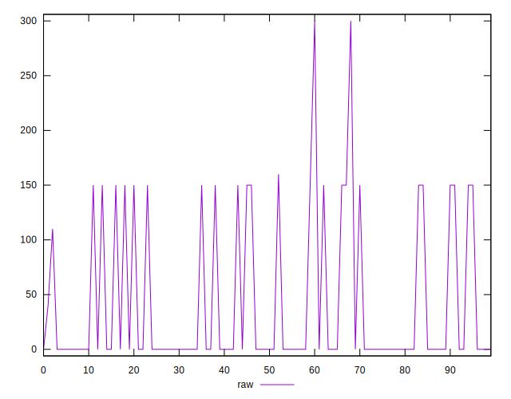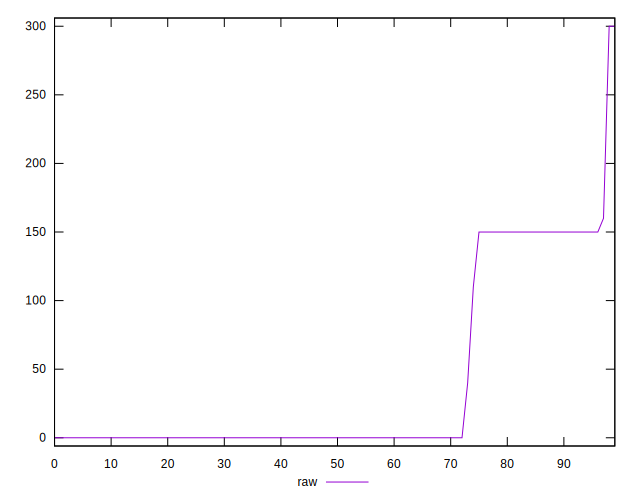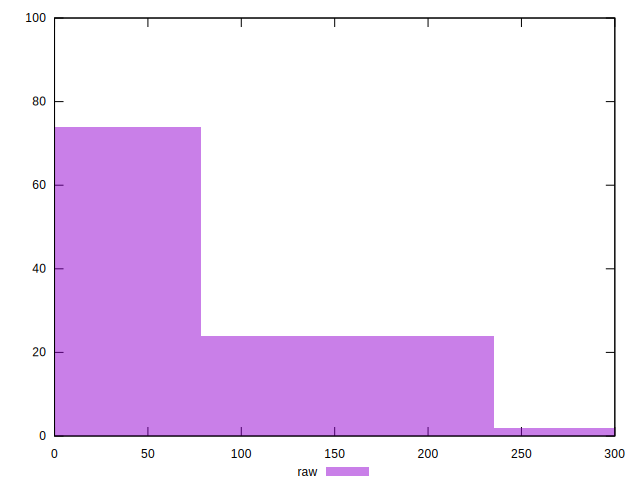
## Score


```yaml
p90min: 0.88
p90max: 1
p90range: 0.12
p90mean: 0.9706382978723403
median: 1
p90stdev: 0.05102791290044206
mad: 0
stdevBySn: 0
lfitCenter: 0.977756592470188
lfitStdev: 0.045478085538619865
mfitCenter: 0.977756592470188
mfitStdev: 0.05699832760095003
mfitConfidence: 0.005699832760095003
p90skewness: -1.187597958541758
p90eccentricity: 1.0000000000000007
p90discretization: 23.5
outlandishness: 0.9906706992854641

```

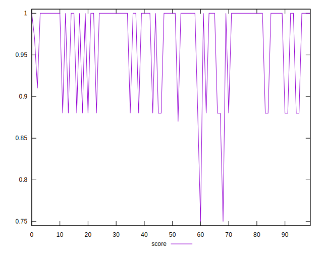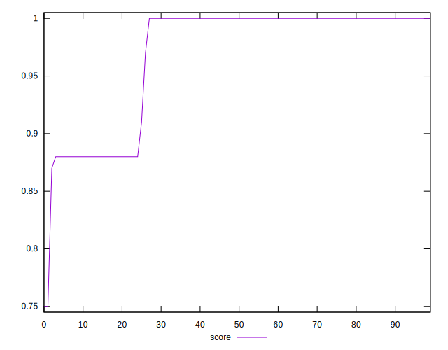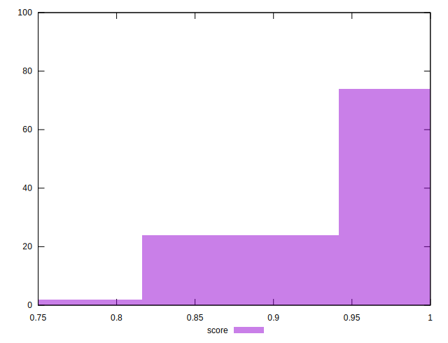
## Raw Estimate

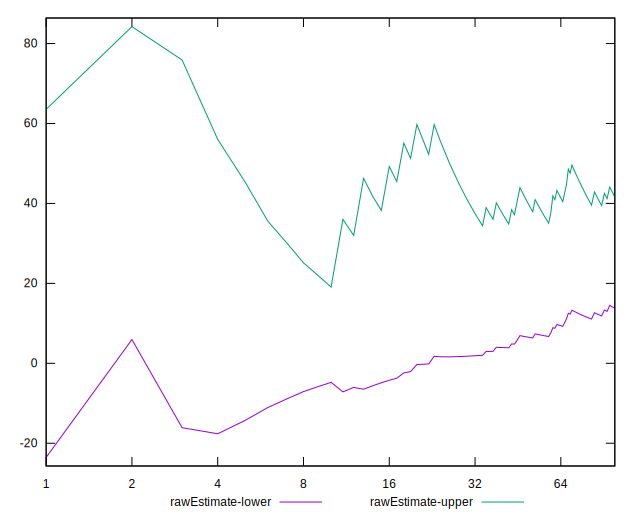
## Score Estimate

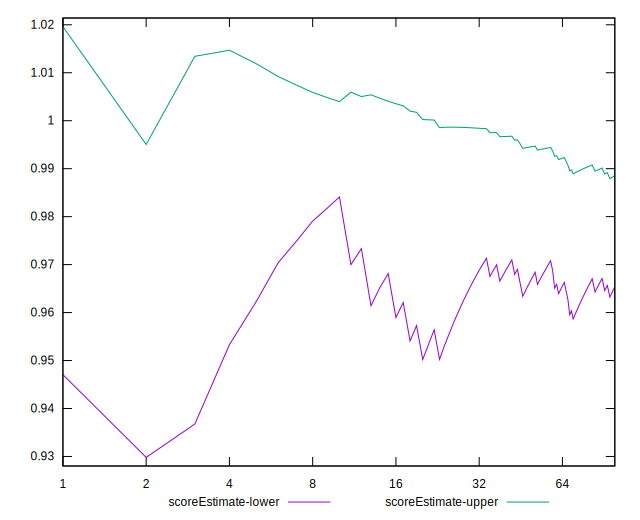
## P Score


```yaml
p90min: 0.875
p90max: 1
p90range: 0.125
p90mean: 0.9694148936170213
median: 1
p90stdev: 0.05312887863566521
mad: 0
stdevBySn: 0
lfitCenter: 0.9769376658282559
lfitStdev: 0.04715243403139137
mfitCenter: 0.9769376658282559
mfitStdev: 0.05909681223984503
mfitConfidence: 0.005909681223984503
p90skewness: -1.1875786969649518
p90eccentricity: 1.0000000000000007
p90discretization: 23.5
outlandishness: 0.9907412383195461

```

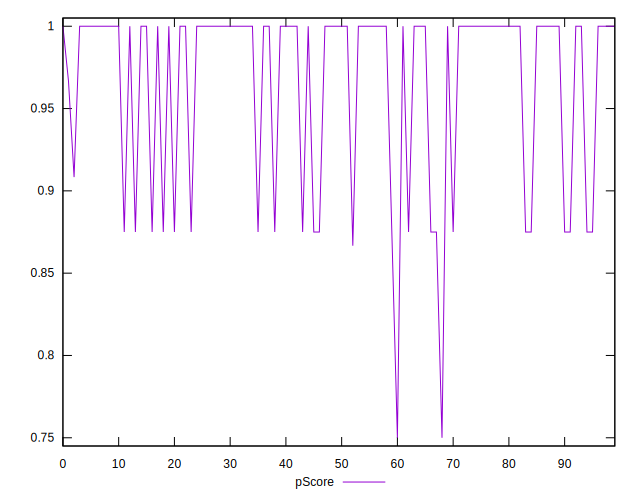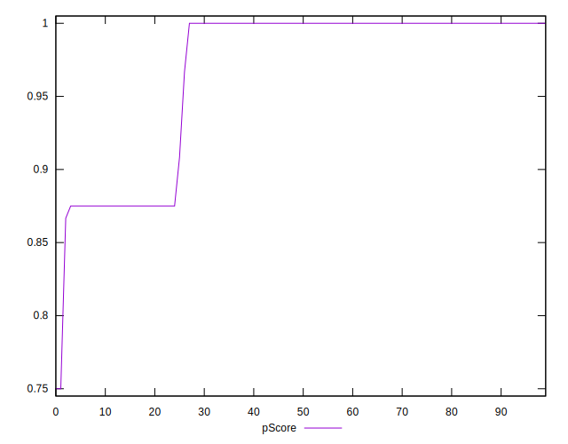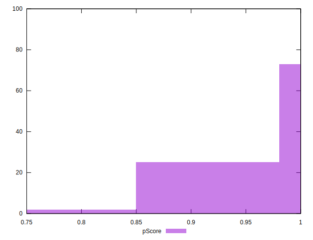
## Score Difference


```yaml
p90min: 0
p90max: 0
p90range: 0
p90mean: 0
median: 0
p90stdev: 0
mad: 0
stdevBySn: 0
lfitCenter: 0
lfitStdev: 0
mfitCenter: 0
mfitStdev: 0
mfitConfidence: 0
p90skewness: .nan
p90eccentricity: .nan
p90discretization: 94
outlandishness: .nan

```


## P Score Difference


```yaml
p90min: -0.0050000000000000044
p90max: 0
p90range: 0.0050000000000000044
p90mean: -0.0010992907801418445
median: 0
p90stdev: 0.002027488277861392
mad: 0
stdevBySn: 0
lfitCenter: -0.0007668501530320473
lfitStdev: 0.0016045172879120694
mfitCenter: -0.0007668501530320473
mfitStdev: 0.002010964202530839
mfitConfidence: 0.0002010964202530839
p90skewness: -1.3460108264284634
p90eccentricity: 1.0000000000000013
p90discretization: 23.5
outlandishness: 1.1587480749219563

```

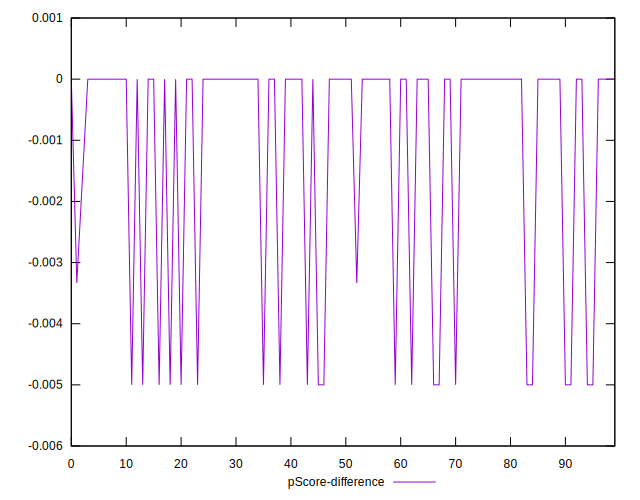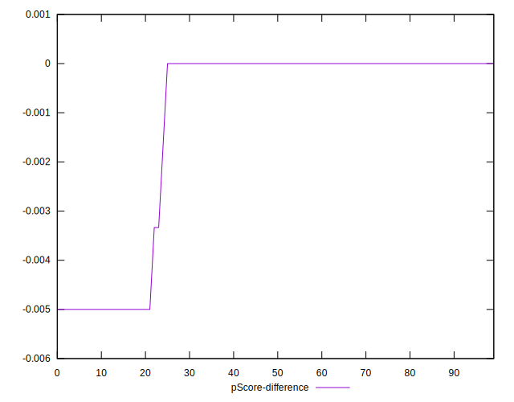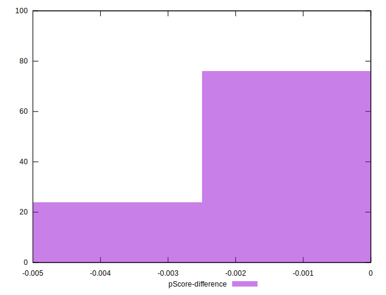