# //mainthread-work-breakdown/samples/agenda

[→ Parent](../..)


## Raw


```yaml
p90min: 1063.0600000000013
p90max: 4049.839999999989
p90range: 2986.7799999999875
p90mean: 2394.728468085101
median: 2813.2799999999843
p90stdev: 1088.6125818760459
mad: 1210.689999999995
stdevBySn: 1455.9129613999999
lfitCenter: 2396.855954144453
lfitStdev: 1215.1540457190201
mfitCenter: 2396.855954144453
mfitStdev: 1522.9697460482505
mfitConfidence: 152.29697460482504
p90skewness: 0.010616691551065725
p90eccentricity: 1.0000000000000004
p90discretization: 1
outlandishness: 1.0115954255393238

```

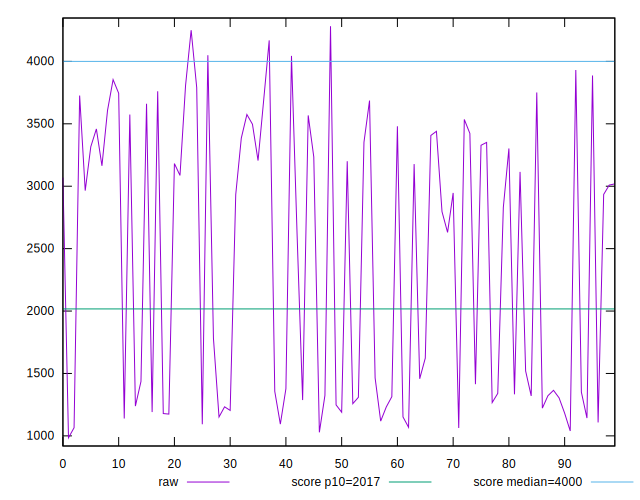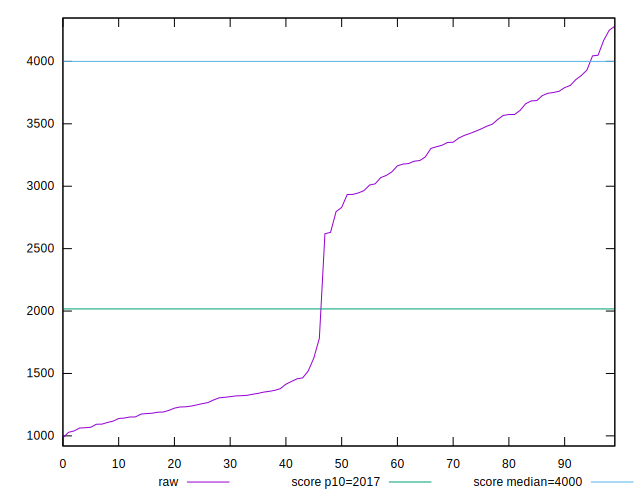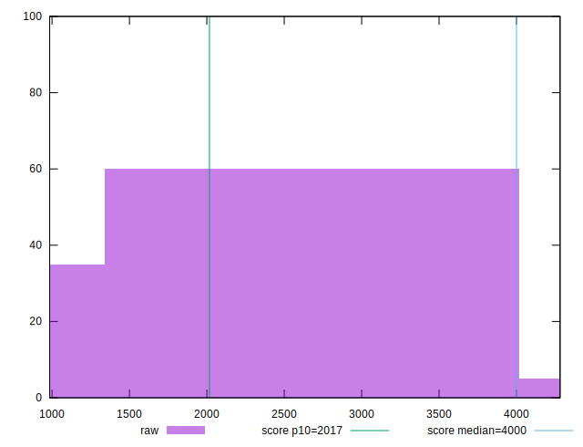
## Score


```yaml
p90min: 0.49
p90max: 0.99
p90range: 0.5
p90mean: 0.7918085106382978
median: 0.745
p90stdev: 0.1864846281153321
mad: 0.22499999999999998
stdevBySn: 0.268335
lfitCenter: 0.7956685772891723
lfitStdev: 0.20538705395679965
mfitCenter: 0.7956685772891723
mfitStdev: 0.25741449860465987
mfitConfidence: 0.025741449860465986
p90skewness: -0.10248007147779035
p90eccentricity: 0.9999999999999997
p90discretization: 2.8484848484848486
outlandishness: 0.9899006790340971

```

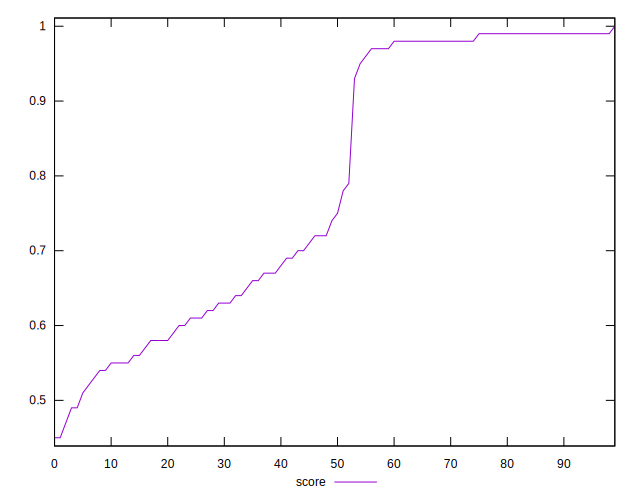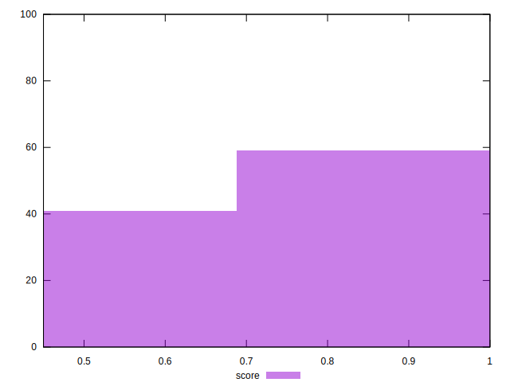
## Raw Estimate

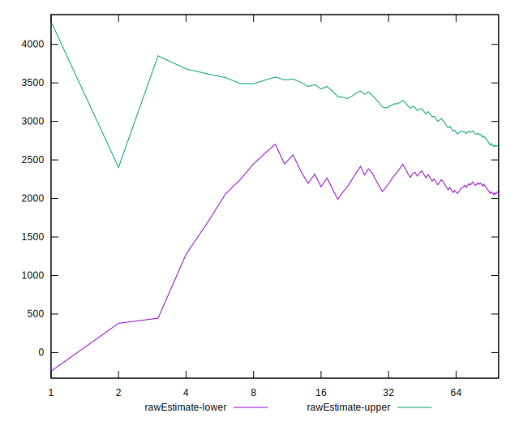
## Score Estimate

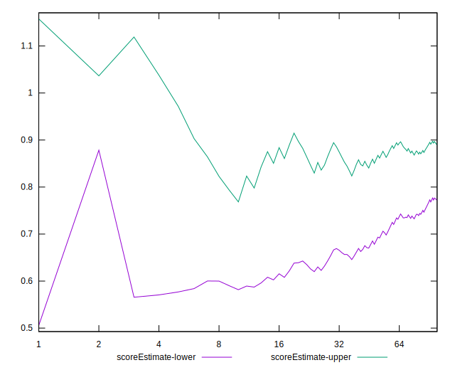
## P Score


```yaml
p90min: 0.49075416580707165
p90max: 0.9934369155510431
p90range: 0.5026827497439714
p90mean: 0.7921612167295795
median: 0.744968693255075
p90stdev: 0.18659649503059772
mad: 0.22434026137573354
stdevBySn: 0.270367928560031
lfitCenter: 0.7960595227200116
lfitStdev: 0.20576811203419842
mfitCenter: 0.7960595227200116
mfitStdev: 0.2578920840806826
mfitConfidence: 0.02578920840806826
p90skewness: -0.10195305223484884
p90eccentricity: 1
p90discretization: 1
outlandishness: 0.9900444245516443

```

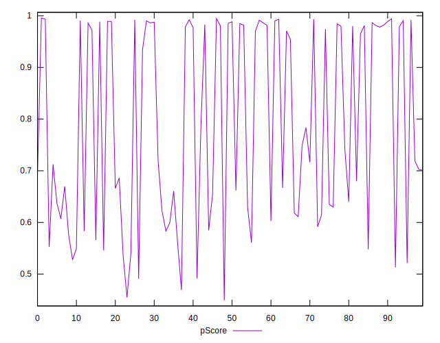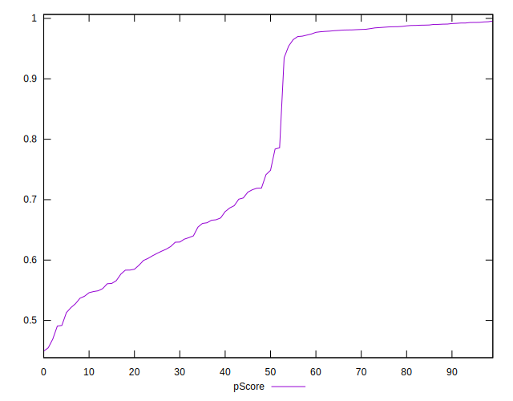
## Score Difference


```yaml
p90min: 0
p90max: 1.1102230246251565e-16
p90range: 1.1102230246251565e-16
p90mean: 4.133809134242604e-18
median: 0
p90stdev: 2.022559872484381e-17
mad: 0
stdevBySn: 0
lfitCenter: 3.6191447569072225e-18
lfitStdev: 8.75134170102002e-18
mfitCenter: 3.6191447569072225e-18
mfitStdev: 1.0968180285403719e-17
mfitConfidence: 1.096818028540372e-18
p90skewness: 4.876863729774648
p90eccentricity: 0.9999999999999972
p90discretization: 31.333333333333332
outlandishness: 3.047518367346939

```

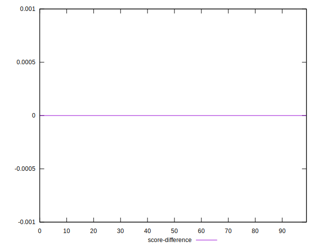
## P Score Difference


```yaml
p90min: -0.004125825024123175
p90max: 0.004819012182217586
p90range: 0.008944837206340761
p90mean: 0.0004171066906684537
median: 0.0005544941770229128
p90stdev: 0.0025178501914950935
mad: 0.002015386086084814
stdevBySn: 0.0028026914880347645
lfitCenter: 0.0004294878326135519
lfitStdev: 0.0021006282063164043
mfitCenter: 0.0004294878326135519
mfitStdev: 0.002632747030869233
mfitConfidence: 0.0002632747030869233
p90skewness: -0.06451115475574407
p90eccentricity: 1.0000000000000002
p90discretization: 1
outlandishness: 0.957481304464657

```

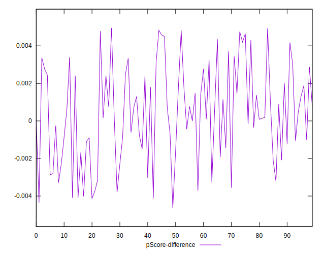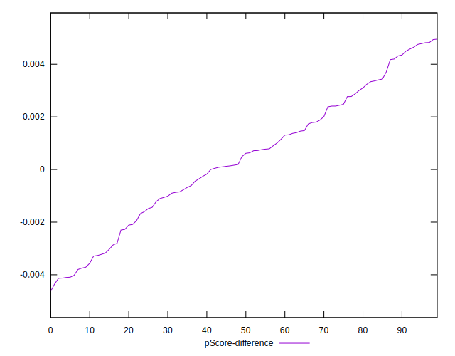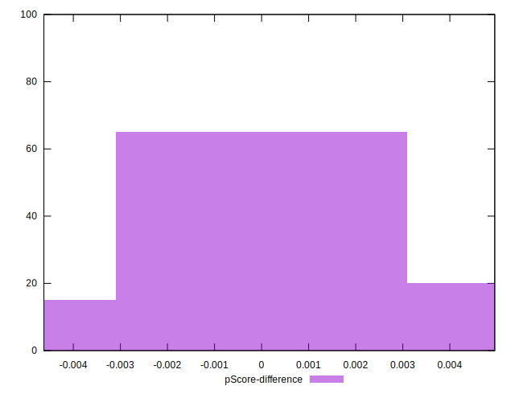