# //mainthread-work-breakdown/samples/astro

[→ Parent](../..)


## Raw


```yaml
p90min: 3039.8159999999984
p90max: 5449.715999999988
p90range: 2409.899999999989
p90mean: 3939.4209787234
median: 3944.3279999999936
p90stdev: 531.1161202659545
mad: 446.14999999999577
stdevBySn: 651.6282917999998
lfitCenter: 3927.6845669554345
lfitStdev: 483.70837570441626
mfitCenter: 3927.6845669554345
mfitStdev: 606.2385462182854
mfitConfidence: 60.623854621828535
p90skewness: 0.5790936612647294
p90eccentricity: 1.0000000000000002
p90discretization: 1
outlandishness: 1.0129223065509743

```

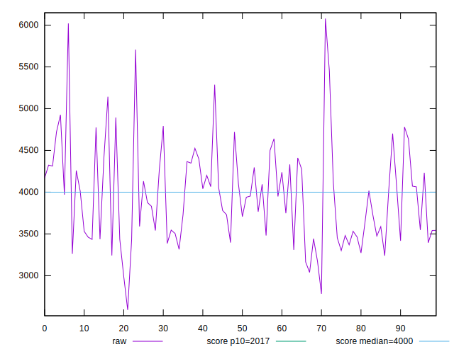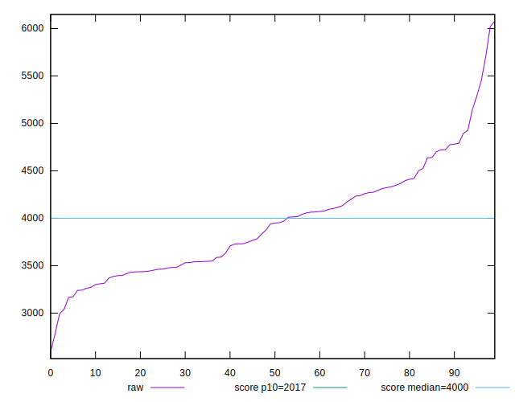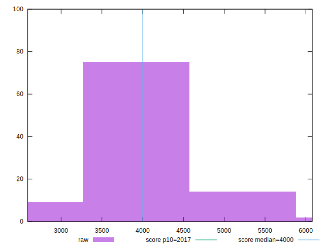
## Score


```yaml
p90min: 0.28
p90max: 0.7
p90range: 0.41999999999999993
p90mean: 0.5178723404255321
median: 0.51
p90stdev: 0.09635784745864154
mad: 0.08000000000000002
stdevBySn: 0.11925999999999998
lfitCenter: 0.5195101722984947
lfitStdev: 0.08903763672350092
mfitCenter: 0.5195101722984947
mfitStdev: 0.1115921289710142
mfitConfidence: 0.01115921289710142
p90skewness: -0.3184615648700796
p90eccentricity: 1.0000000000000002
p90discretization: 2.8484848484848486
outlandishness: 0.9935519235508468

```

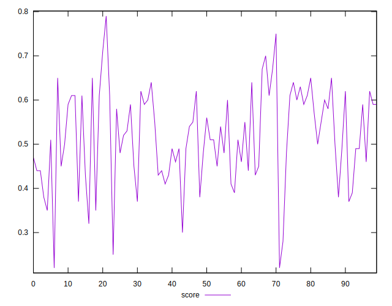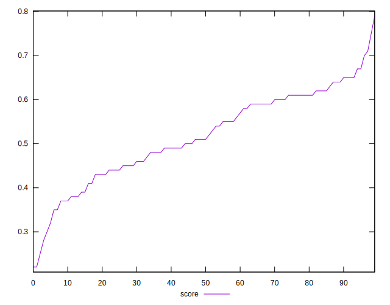
## Raw Estimate

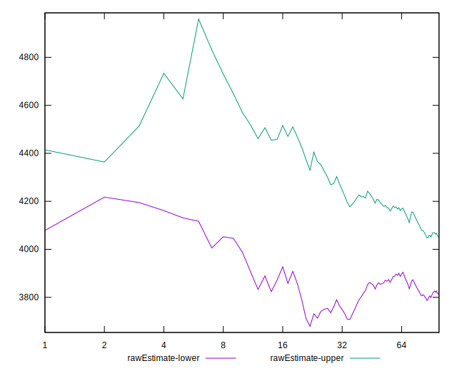
## Score Estimate

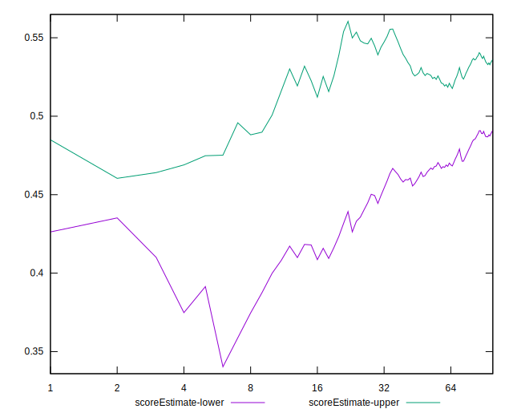
## P Score


```yaml
p90min: 0.28133750134872604
p90max: 0.6963001943596714
p90range: 0.41496269301094535
p90mean: 0.5177528359592877
median: 0.5104651095253181
p90stdev: 0.09631411312023974
mad: 0.08235782846895087
stdevBySn: 0.12291524254326835
lfitCenter: 0.5194330003733498
lfitStdev: 0.08973582643917032
mfitCenter: 0.5194330003733498
mfitStdev: 0.11246718001307146
mfitConfidence: 0.011246718001307146
p90skewness: -0.3211027005908729
p90eccentricity: 1.0000000000000002
p90discretization: 1
outlandishness: 0.9936251795901198

```

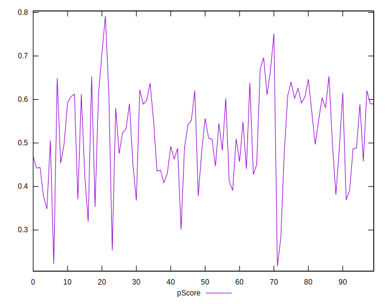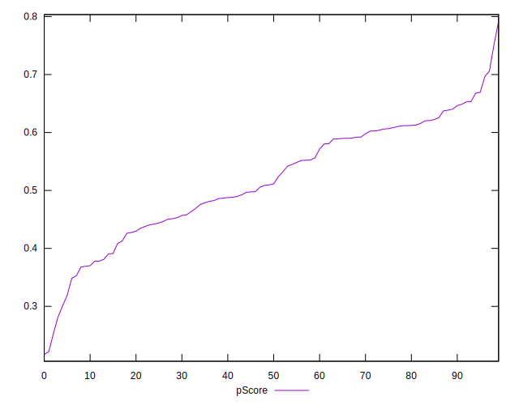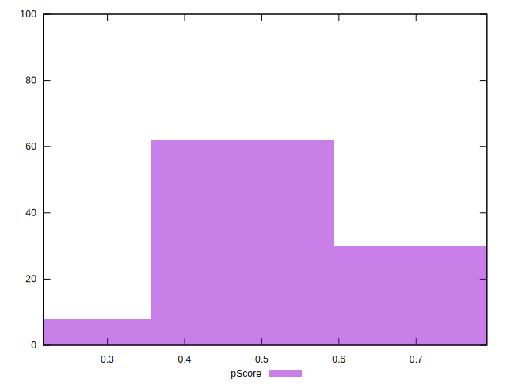
## Score Difference


```yaml
p90min: 0
p90max: 5.551115123125783e-17
p90range: 5.551115123125783e-17
p90mean: 2.362176648138631e-18
median: 0
p90stdev: 1.1204787665670327e-17
mad: 0
stdevBySn: 0
lfitCenter: 2.4847418709225276e-18
lfitStdev: 6.008277262127832e-18
mfitCenter: 2.4847418709225276e-18
mfitStdev: 7.530258841113346e-18
mfitConfidence: 7.530258841113345e-19
p90skewness: 4.532597979574667
p90eccentricity: 1.0000000000000033
p90discretization: 47
outlandishness: 4.473224999999999

```

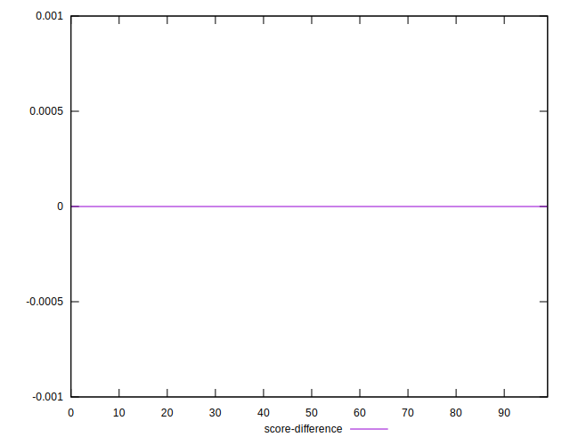
## P Score Difference


```yaml
p90min: -0.0041927188406166715
p90max: 0.003888173838731135
p90range: 0.008080892679347806
p90mean: -0.0001146398420037454
median: 0.0001347954551881858
p90stdev: 0.002233290462044777
mad: 0.002010231382265415
stdevBySn: 0.002686659327110461
lfitCenter: -0.00006759713630745654
lfitStdev: 0.0020401911642544597
mfitCenter: -0.00006759713630745654
mfitStdev: 0.0025570004315592465
mfitConfidence: 0.00025570004315592467
p90skewness: -0.13043188955911647
p90eccentricity: 1.0000000000000002
p90discretization: 1
outlandishness: 0.7623212942384137

```

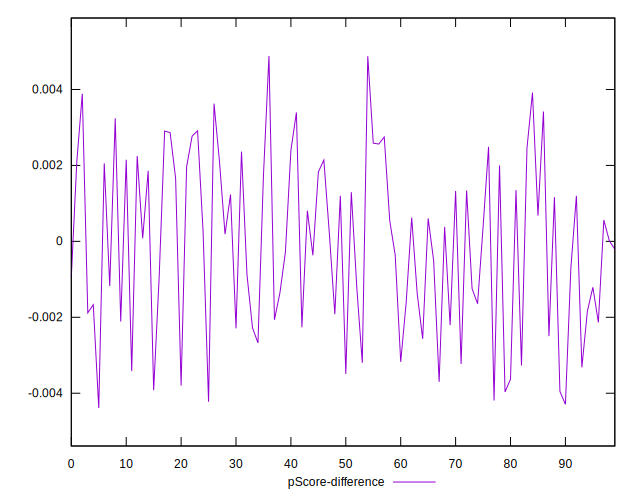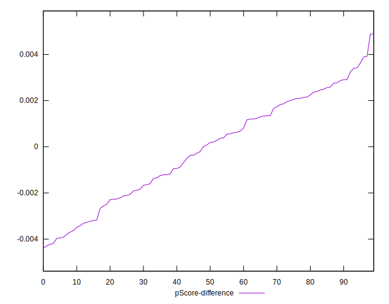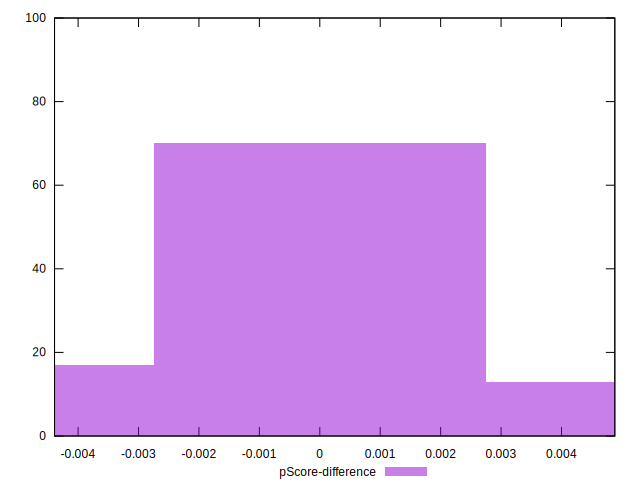