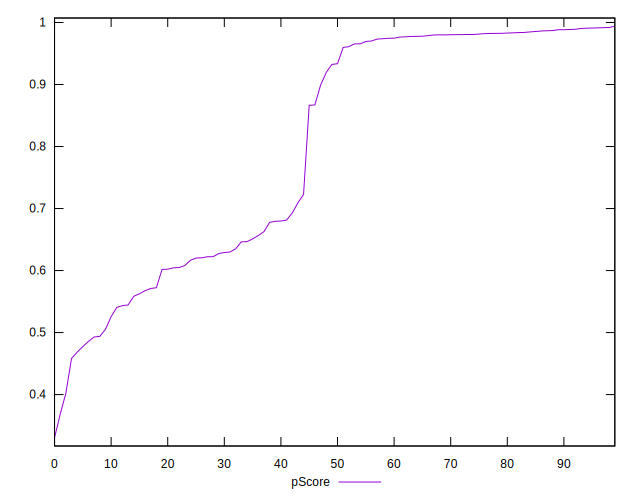

# //mainthread-work-breakdown/samples/card

[→ Parent](../..)


## Raw


```yaml
p90min: 1120.9960000000008
p90max: 4230.831999999989
p90range: 3109.8359999999884
p90mean: 2342.1826808510586
median: 1796.7379999999994
p90stdev: 1091.104030028278
mad: 664.0159999999988
stdevBySn: 858.175878399999
lfitCenter: 2286.6387957282627
lfitStdev: 1209.5521450612307
mfitCenter: 2286.6387957282627
mfitStdev: 1515.9488047509412
mfitConfidence: 151.59488047509413
p90skewness: 0.27716166542226517
p90eccentricity: 1.0000000000000007
p90discretization: 1
outlandishness: 1.031207513644652

```


## Score


```yaml
p90min: 0.46
p90max: 0.99
p90range: 0.53
p90mean: 0.8044680851063827
median: 0.93
p90stdev: 0.19211929483923446
mad: 0.05999999999999994
stdevBySn: 0.07155599999999994
lfitCenter: 0.818442861649221
lfitStdev: 0.21479233846822704
mfitCenter: 0.818442861649221
mfitStdev: 0.26920227466016766
mfitConfidence: 0.026920227466016765
p90skewness: -0.35888127799767316
p90eccentricity: 0.9999999999999996
p90discretization: 3.357142857142857
outlandishness: 0.9812733739900384

```


## Raw Estimate


## Score Estimate


## P Score


```yaml
p90min: 0.4581827329533509
p90max: 0.9913672072930119
p90range: 0.533184474339661
p90mean: 0.8044974894619475
median: 0.9329318185085687
p90stdev: 0.1922356051885706
mad: 0.05856435562353823
stdevBySn: 0.0716301728219892
lfitCenter: 0.8184665670333593
lfitStdev: 0.21484119739967233
mfitCenter: 0.8184665670333593
mfitStdev: 0.2692635102497438
mfitConfidence: 0.02692635102497438
p90skewness: -0.35926462814528154
p90eccentricity: 1.0000000000000002
p90discretization: 1
outlandishness: 0.9814720435126328

```


## Score Difference


```yaml
p90min: 0
p90max: 1.1102230246251565e-16
p90range: 1.1102230246251565e-16
p90mean: 1.771632486103973e-18
median: 0
p90stdev: 1.2679520880987285e-17
mad: 0
stdevBySn: 0
lfitCenter: 2.4383062820427357e-18
lfitStdev: 5.961880506742725e-18
mfitCenter: 2.4383062820427357e-18
mfitStdev: 7.47210913160511e-18
mfitConfidence: 7.47210913160511e-19
p90skewness: 7.612377922141524
p90eccentricity: 1
p90discretization: 31.333333333333332
outlandishness: 7.952400000000002

```


## P Score Difference


```yaml
p90min: -0.004523618234448135
p90max: 0.004562213354202926
p90range: 0.009085831588651061
p90mean: 0.00011629180987190126
median: 0.0002941169166184032
p90stdev: 0.0024697509089527405
mad: 0.0020946013404107844
stdevBySn: 0.0027832574354745886
lfitCenter: 0.000146974258827465
lfitStdev: 0.002133427609077432
mfitCenter: 0.000146974258827465
mfitStdev: 0.0026738549860864983
mfitConfidence: 0.00026738549860864984
p90skewness: -0.09814993081973011
p90eccentricity: 1.0000000000000007
p90discretization: 1
outlandishness: 0.8914231892165709

```

