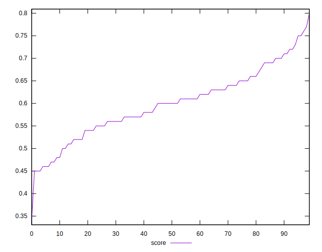

# //mainthread-work-breakdown/samples/music

[→ Parent](../..)


## Raw


```yaml
p90min: 2778.031999999994
p90max: 4263.183999999991
p90range: 1485.1519999999973
p90mean: 3510.9127234042476
median: 3480.977999999991
p90stdev: 345.706385782372
mad: 234.41400000000044
stdevBySn: 378.5944478000057
lfitCenter: 3509.2740918855957
lfitStdev: 283.53916755546885
mfitCenter: 3509.2740918855957
mfitStdev: 355.3636475375195
mfitConfidence: 35.536364753751954
p90skewness: 0.12276949351393636
p90eccentricity: 0.9999999999999988
p90discretization: 1
outlandishness: 1.0025767811244657

```


## Score


```yaml
p90min: 0.45
p90max: 0.75
p90range: 0.3
p90mean: 0.5980851063829786
median: 0.6
p90stdev: 0.07077498950817514
mad: 0.04999999999999993
stdevBySn: 0.08348199999999995
lfitCenter: 0.5981460231078977
lfitStdev: 0.05791247989511059
mfitCenter: 0.5981460231078977
mfitStdev: 0.0725825298525774
mfitConfidence: 0.007258252985257741
p90skewness: -0.023598848390540595
p90eccentricity: 0.9999999999999982
p90discretization: 3.357142857142857
outlandishness: 0.9993810989909665

```


## Raw Estimate


## Score Estimate


## P Score


```yaml
p90min: 0.45253022149182764
p90max: 0.7524903843054843
p90range: 0.29996016281365667
p90mean: 0.5982716684107439
median: 0.6026208933864591
p90stdev: 0.07039103757253307
mad: 0.04851395436144812
stdevBySn: 0.07871316545908896
lfitCenter: 0.5983189543433817
lfitStdev: 0.05753932151165829
mfitCenter: 0.5983189543433817
mfitStdev: 0.07211484517466824
mfitConfidence: 0.0072114845174668235
p90skewness: -0.002952416270400911
p90eccentricity: 1
p90discretization: 1
outlandishness: 0.9994711293567042

```


## Score Difference


```yaml
p90min: 0
p90max: 1.1102230246251565e-16
p90range: 1.1102230246251565e-16
p90mean: 1.4173059888831785e-17
median: 0
p90stdev: 3.615365185717666e-17
mad: 0
stdevBySn: 0
lfitCenter: 9.44243396818974e-18
lfitStdev: 2.149163732028158e-17
mfitCenter: 9.44243396818974e-18
mfitStdev: 2.6935772914670235e-17
mfitConfidence: 2.6935772914670235e-18
p90skewness: 2.2294472716652196
p90eccentricity: 0.9999999999999987
p90discretization: 31.333333333333332
outlandishness: 1.3806250000000002

```


## P Score Difference


```yaml
p90min: -0.004678406374749033
p90max: 0.004619576984260854
p90range: 0.009297983359009887
p90mean: 0.00023346457694006664
median: 0.0005780035298279806
p90stdev: 0.00271112706885371
mad: 0.0024455058563915277
stdevBySn: 0.0033893505998430656
lfitCenter: 0.00031501336593856304
lfitStdev: 0.0025611992232786153
mfitCenter: 0.00031501336593856304
mfitStdev: 0.003209987198246593
mfitConfidence: 0.00032099871982465926
p90skewness: -0.2179914627395615
p90eccentricity: 0.9999999999999996
p90discretization: 1
outlandishness: 0.8358400401684052

```

