# //max-potential-fid/samples/agenda

[→ Parent](../..)


## Raw


```yaml
p90min: 42
p90max: 1022
p90range: 980
p90mean: 418.61170212765956
median: 574
p90stdev: 338.10414921163573
mad: 400
stdevBySn: 525.3403000000001
lfitCenter: 423.70527481741243
lfitStdev: 385.8772189267274
mfitCenter: 423.70527481741243
mfitStdev: 483.62537423550015
mfitConfidence: 48.362537423550016
p90skewness: 0.02419990906588572
p90eccentricity: 0.9999999999999997
p90discretization: 1.1898734177215189
outlandishness: 1.070270291528833

```

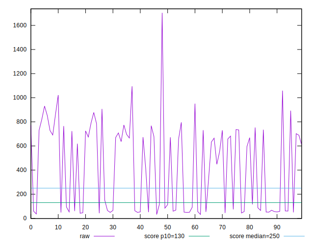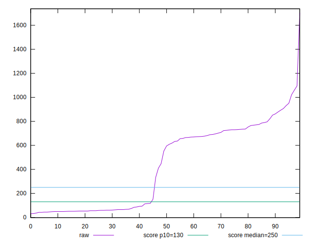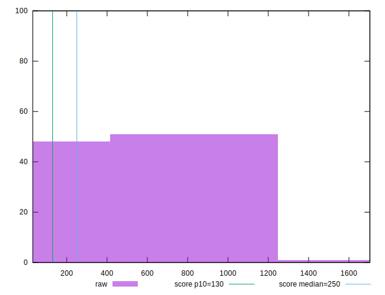
## Score


```yaml
p90min: 0
p90max: 1
p90range: 1
p90mean: 0.4691489361702128
median: 0.05
p90stdev: 0.4787964956022504
mad: 0.05
stdevBySn: 0.06559300000000001
lfitCenter: 0.44580111454708293
lfitStdev: 0.5798171528385676
mfitCenter: 0.44580111454708293
mfitStdev: 0.7266930354418283
mfitConfidence: 0.07266930354418283
p90skewness: 0.16253733224391095
p90eccentricity: 0.9999999999999997
p90discretization: 5.875
outlandishness: 1.0079067240501647

```

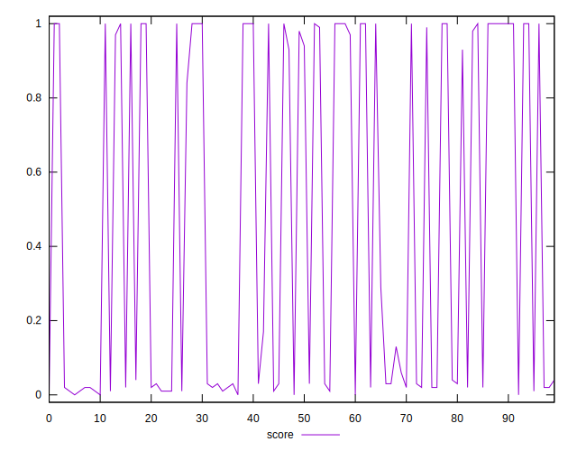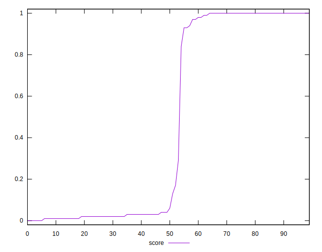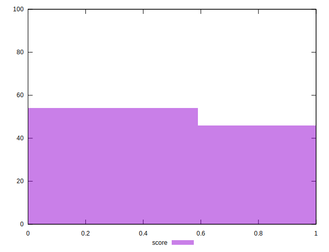
## Raw Estimate

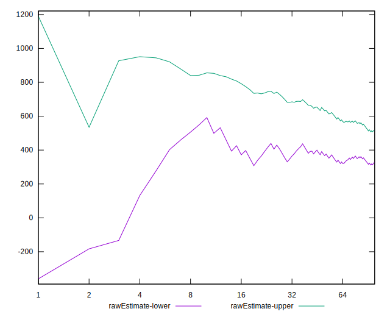
## Score Estimate

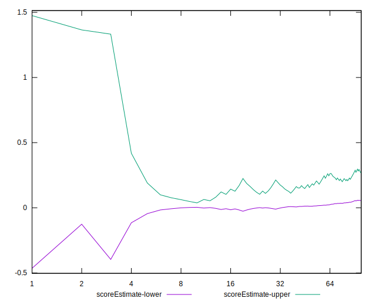
## P Score


```yaml
p90min: 0.002894739223085918
p90max: 0.9997636670093073
p90range: 0.9968689277862214
p90mean: 0.46860956365404965
median: 0.05224961810630632
p90stdev: 0.4785520244742224
mad: 0.051258487699975375
stdevBySn: 0.06621571718211004
lfitCenter: 0.44531082490044677
lfitStdev: 0.5798006456651089
mfitCenter: 0.44531082490044677
mfitStdev: 0.7266723467679446
mfitConfidence: 0.07266723467679445
p90skewness: 0.16271751998369488
p90eccentricity: 1.0000000000000002
p90discretization: 1.205128205128205
outlandishness: 1.0082340723718186

```

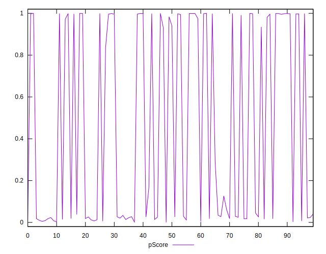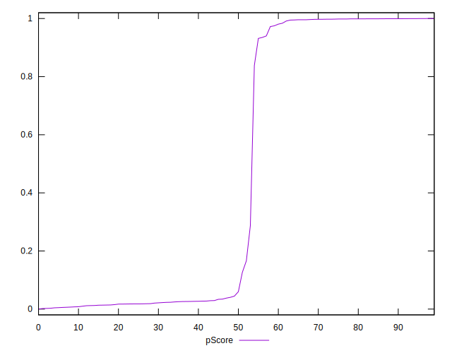
## Score Difference


```yaml
p90min: 0
p90max: 0
p90range: 0
p90mean: 0
median: 0
p90stdev: 0
mad: 0
stdevBySn: 0
lfitCenter: 5.166535369026208e-19
lfitStdev: 1.2890316797319448e-18
mfitCenter: 5.166535369026208e-19
mfitStdev: 1.6155616292812394e-18
mfitConfidence: 1.6155616292812395e-19
p90skewness: .nan
p90eccentricity: .nan
p90discretization: 94
outlandishness: .inf

```

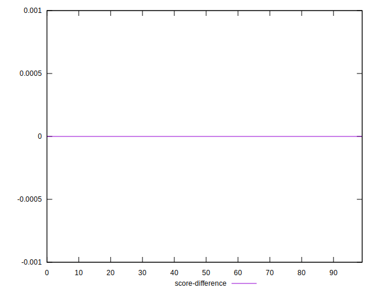
## P Score Difference


```yaml
p90min: -0.004223807377222158
p90max: 0.0046375893622611075
p90range: 0.008861396739483265
p90mean: -0.0005023431090835417
median: -0.0009187501882677029
p90stdev: 0.0024685070505876304
mad: 0.0016616190216740545
stdevBySn: 0.002647026825442338
lfitCenter: -0.0006293983472680063
lfitStdev: 0.00197814244768784
mfitCenter: -0.0006293983472680063
mfitStdev: 0.0024792338978057676
mfitConfidence: 0.0002479233897805768
p90skewness: 0.5517160583171591
p90eccentricity: 1
p90discretization: 1.205128205128205
outlandishness: 0.8572522021695532

```

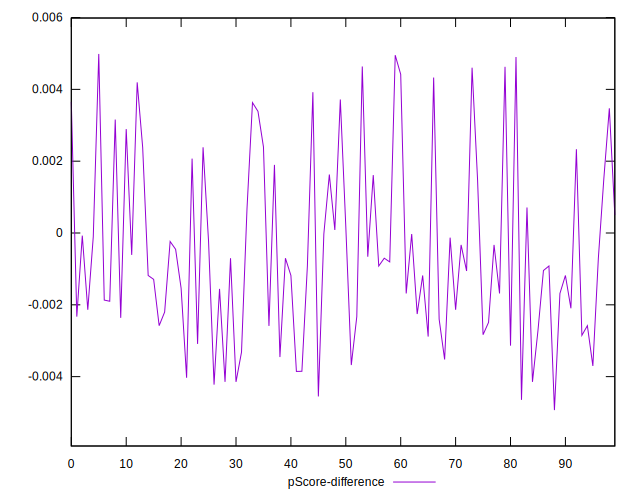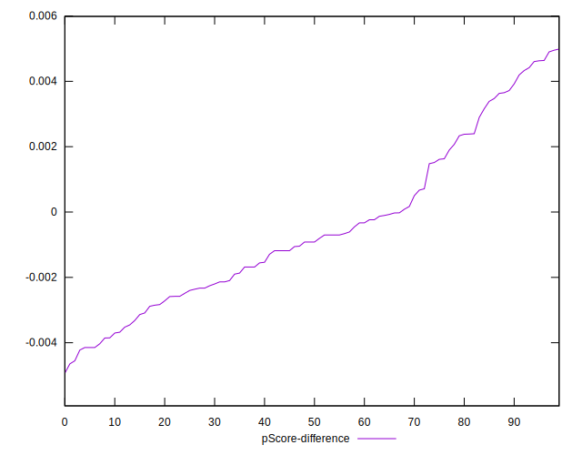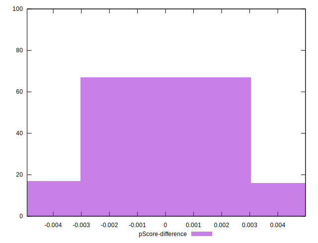