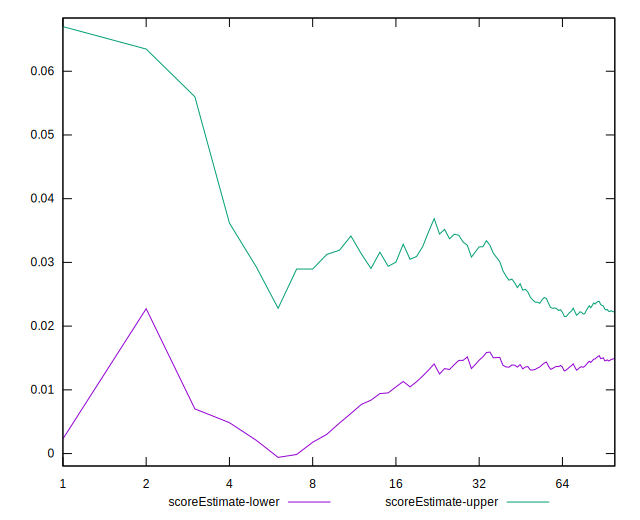

# //max-potential-fid/samples/astro

[→ Parent](../..)


## Raw


```yaml
p90min: 498
p90max: 1168
p90range: 670
p90mean: 734.4042553191489
median: 710
p90stdev: 163.21349542324998
mad: 91.5
stdevBySn: 146.0935
lfitCenter: 724.7411693469456
lfitStdev: 120.46631142149751
mfitCenter: 724.7411693469456
mfitStdev: 150.9821313267392
mfitConfidence: 15.09821313267392
p90skewness: 1.0416285076497258
p90eccentricity: 1.0000000000000002
p90discretization: 1.1325301204819278
outlandishness: 1.0185649635768539

```


## Score


```yaml
p90min: 0
p90max: 0.09
p90range: 0.09
p90mean: 0.026702127659574474
median: 0.02
p90stdev: 0.021257704379190733
mad: 0.01
stdevBySn: 0.023851999999999998
lfitCenter: 0.02585337737708617
lfitStdev: 0.017243746234484325
mfitCenter: 0.02585337737708617
mfitStdev: 0.02161183095770687
mfitConfidence: 0.002161183095770687
p90skewness: 1.0328377097593788
p90eccentricity: 0.9999999999999997
p90discretization: 9.4
outlandishness: 1.1391947746861155

```


## Raw Estimate


## Score Estimate


## P Score


```yaml
p90min: 0.0012590656687628266
p90max: 0.08841816618555004
p90range: 0.08715910051678721
p90mean: 0.026788126127595135
median: 0.02039654360278248
p90stdev: 0.020725678878413725
mad: 0.011808240595191005
stdevBySn: 0.01912369119640264
lfitCenter: 0.025873593700071824
lfitStdev: 0.016879506186136407
mfitCenter: 0.025873593700071824
mfitStdev: 0.021155323755276588
mfitConfidence: 0.0021155323755276587
p90skewness: 1.0543052054329392
p90eccentricity: 1
p90discretization: 1.1325301204819278
outlandishness: 1.1368194539200052

```


## Score Difference


```yaml
p90min: 0
p90max: 0
p90range: 0
p90mean: 0
median: 0
p90stdev: 0
mad: 0
stdevBySn: 0
lfitCenter: 0
lfitStdev: 0
mfitCenter: 0
mfitStdev: 0
mfitConfidence: 0
p90skewness: .nan
p90eccentricity: .nan
p90discretization: 94
outlandishness: .nan

```


## P Score Difference


```yaml
p90min: -0.004432790906158104
p90max: 0.004195249530410736
p90range: 0.00862804043656884
p90mean: 0.00006621128082440737
median: 0.0003174915200486045
p90stdev: 0.002472724976810512
mad: 0.00221581083416327
stdevBySn: 0.0029907835730964717
lfitCenter: 0.00015208379307102981
lfitStdev: 0.002169535286560827
mfitCenter: 0.00015208379307102981
mfitStdev: 0.002719109248787603
mfitConfidence: 0.00027191092487876027
p90skewness: -0.25909670950395636
p90eccentricity: 0.9999999999999997
p90discretization: 1.119047619047619
outlandishness: 0.8758500238468371

```

