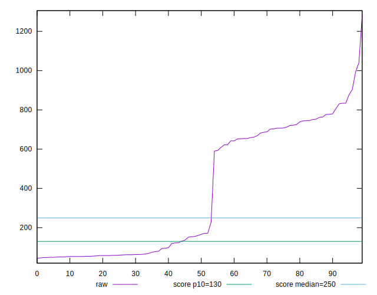
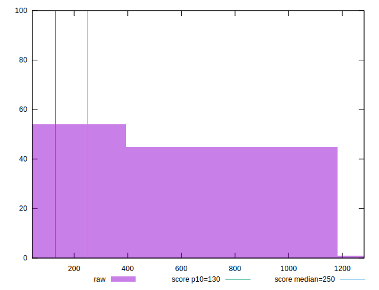

# //max-potential-fid/samples/card

[→ Parent](../..)


## Raw


```yaml
p90min: 48
p90max: 904
p90range: 856
p90mean: 373.75531914893617
median: 162.9999999999999
p90stdev: 320.2039471818791
mad: 114.49999999999989
stdevBySn: 141.02494999999993
lfitCenter: 360.08101563166645
lfitStdev: 373.5348791607213
mfitCenter: 360.08101563166645
mfitStdev: 468.15654530364804
mfitConfidence: 46.8156545303648
p90skewness: 0.21624516782209185
p90eccentricity: 0.9999999999999996
p90discretization: 1.2207792207792207
outlandishness: 1.0657669415775377

```


## Score


```yaml
p90min: 0.01
p90max: 1
p90range: 0.99
p90mean: 0.5275531914893619
median: 0.8
p90stdev: 0.4684099090704064
mad: 0.19999999999999996
stdevBySn: 0.24448299999999998
lfitCenter: 0.5403134135398507
lfitStdev: 0.5564928783069055
mfitCenter: 0.5403134135398507
mfitStdev: 0.6974603923992533
mfitConfidence: 0.06974603923992533
p90skewness: -0.12333941921828796
p90eccentricity: 0.9999999999999992
p90discretization: 5.222222222222222
outlandishness: 0.9937424274330818

```


## Raw Estimate


## Score Estimate


## P Score


```yaml
p90min: 0.005883808313443317
p90max: 0.9993899006474856
p90range: 0.9935060923340422
p90mean: 0.5266177290717807
median: 0.7989861731973336
p90stdev: 0.4678606873847626
mad: 0.200403727450152
stdevBySn: 0.24520508768681595
lfitCenter: 0.5394265242824767
lfitStdev: 0.5559132843256065
mfitCenter: 0.5394265242824767
mfitStdev: 0.6967339790678573
mfitConfidence: 0.06967339790678573
p90skewness: -0.123605337148168
p90eccentricity: 0.9999999999999996
p90discretization: 1.2207792207792207
outlandishness: 0.9941455552025085

```


## Score Difference


```yaml
p90min: 0
p90max: 0
p90range: 0
p90mean: 0
median: 0
p90stdev: 0
mad: 0
stdevBySn: 0
lfitCenter: 1.5916911634687915e-18
lfitStdev: 3.932577909407442e-18
mfitCenter: 1.5916911634687915e-18
mfitStdev: 4.928755494914505e-18
mfitConfidence: 4.928755494914504e-19
p90skewness: .nan
p90eccentricity: .nan
p90discretization: 94
outlandishness: .inf

```


## P Score Difference


```yaml
p90min: -0.004444511220520846
p90max: 0.004180911427837053
p90range: 0.0086254226483579
p90mean: -0.0008729217850580304
median: -0.001171406202407457
p90stdev: 0.0021115596776681185
mad: 0.0016759246732134976
stdevBySn: 0.0022132444757978834
lfitCenter: -0.0009451675678754779
lfitStdev: 0.0016269209155767815
mfitCenter: -0.0009451675678754779
mfitStdev: 0.0020390429858384296
mfitConfidence: 0.00020390429858384296
p90skewness: 0.5426820899424595
p90eccentricity: 1.0000000000000002
p90discretization: 1.236842105263158
outlandishness: 0.8955163861699453

```

