# //max-potential-fid/samples/music

[→ Parent](../..)


## Raw


```yaml
p90min: 494
p90max: 1118.999999999999
p90range: 624.9999999999991
p90mean: 787.0425531914893
median: 767.0000000000005
p90stdev: 123.28266386845507
mad: 79
stdevBySn: 119.8563
lfitCenter: 782.6516899189836
lfitStdev: 100.82109667749114
mfitCenter: 782.6516899189836
mfitStdev: 126.36050593270177
mfitConfidence: 12.636050593270177
p90skewness: 0.4365396782022971
p90eccentricity: 1.0000000000000002
p90discretization: 1.119047619047619
outlandishness: 1.0044454691886757

```

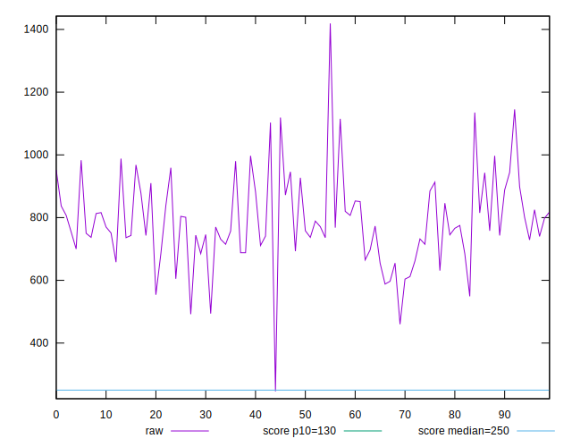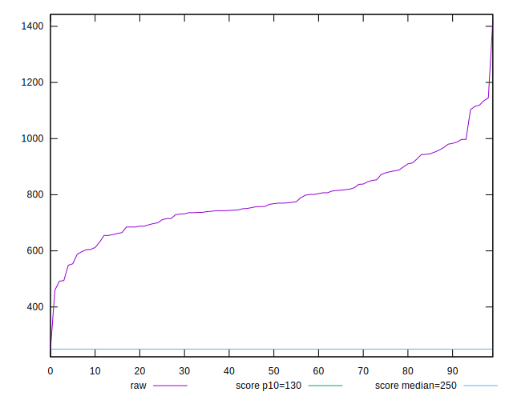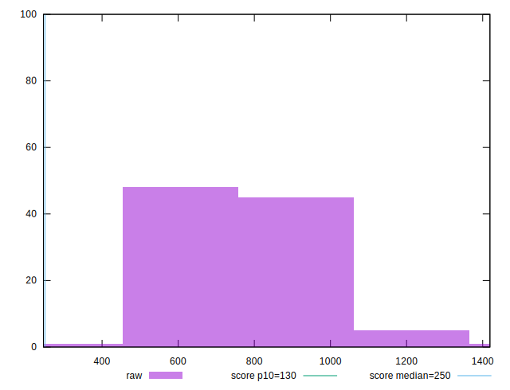
## Score


```yaml
p90min: 0
p90max: 0.09
p90range: 0.09
p90mean: 0.01648936170212767
median: 0.01
p90stdev: 0.014344355165865448
mad: 0.01
stdevBySn: 0.011926
lfitCenter: 0.018225931536260162
lfitStdev: 0.014224738658820362
mfitCenter: 0.018225931536260162
mfitStdev: 0.017828066078657244
mfitConfidence: 0.0017828066078657244
p90skewness: 2.1437697322375224
p90eccentricity: 0.9999999999999988
p90discretization: 11.75
outlandishness: 1.8951519001040533

```

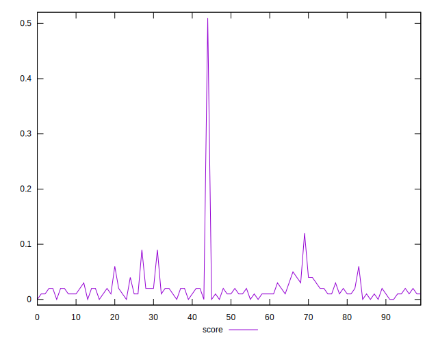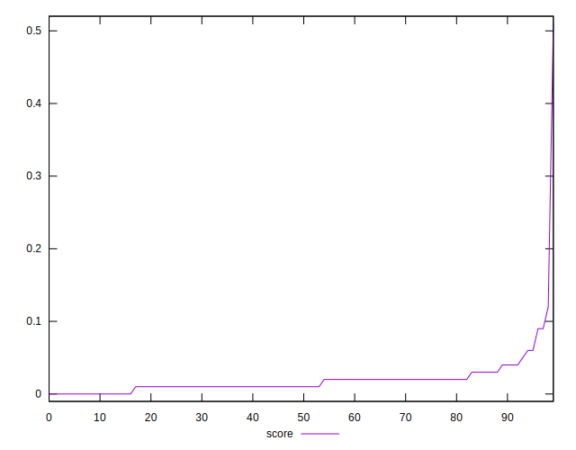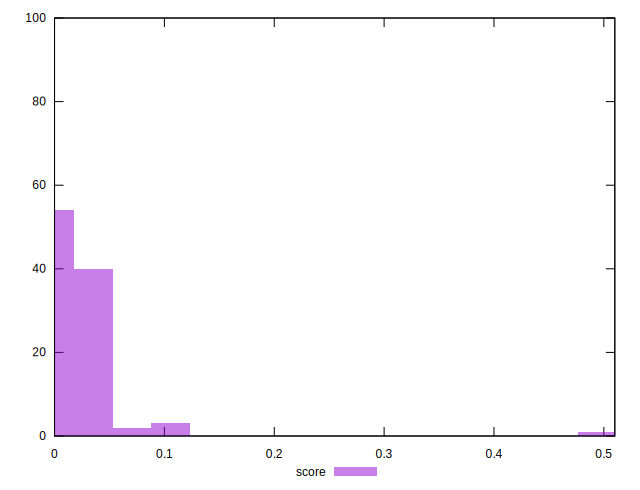
## Raw Estimate

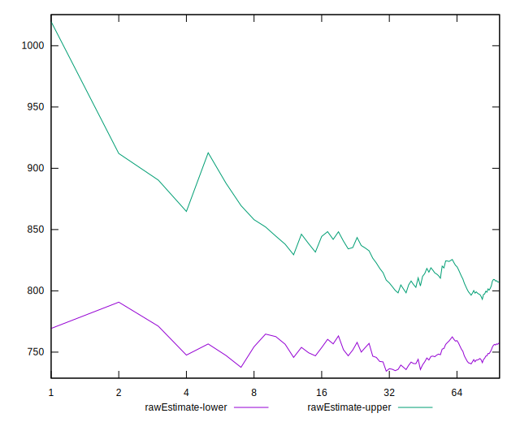
## Score Estimate

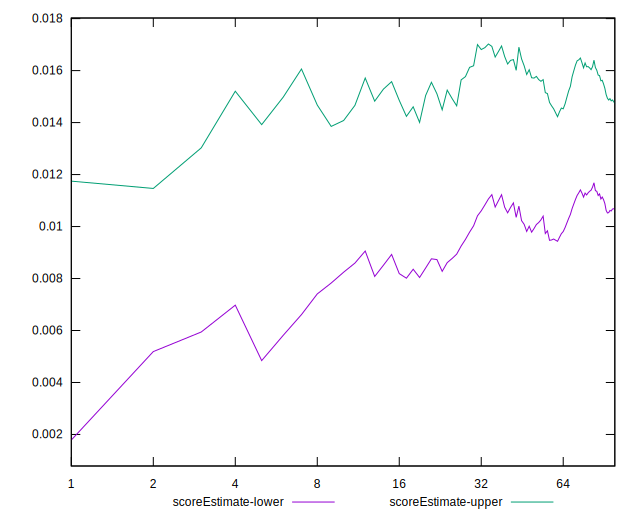
## P Score


```yaml
p90min: 0.0016561291294848735
p90max: 0.09097818843290029
p90range: 0.08932205930341541
p90mean: 0.016790151486977063
median: 0.01401179926626267
p90stdev: 0.014054706633121231
mad: 0.006968975609235317
stdevBySn: 0.009341219854931106
lfitCenter: 0.018441822044131976
lfitStdev: 0.013664484822477695
mfitCenter: 0.018441822044131976
mfitStdev: 0.017125892024377178
mfitConfidence: 0.0017125892024377177
p90skewness: 2.4263240295958255
p90eccentricity: 1.0000000000000002
p90discretization: 1.1325301204819278
outlandishness: 1.8805559905209113

```

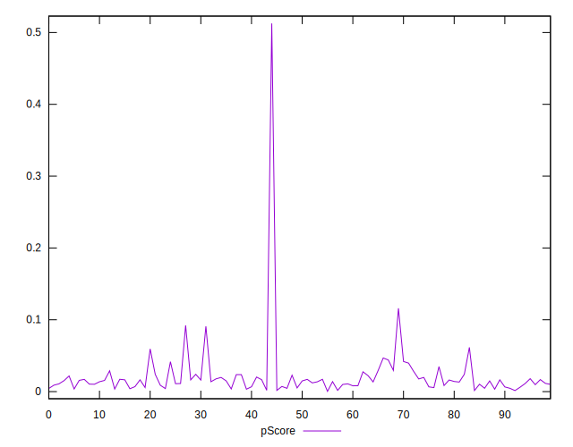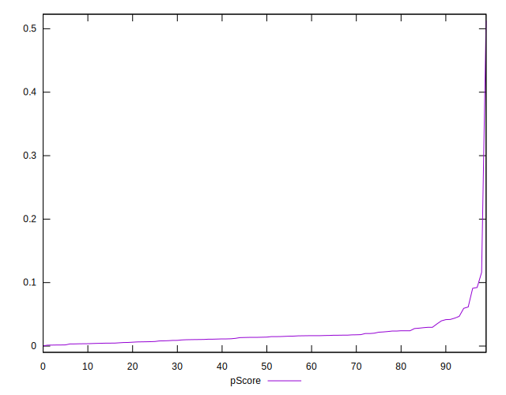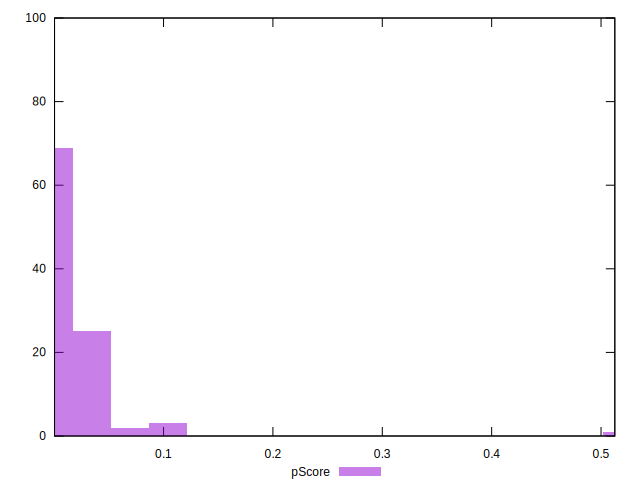
## Score Difference


```yaml
p90min: 0
p90max: 0
p90range: 0
p90mean: 0
median: 0
p90stdev: 0
mad: 0
stdevBySn: 0
lfitCenter: 0
lfitStdev: 0
mfitCenter: 0
mfitStdev: 0
mfitConfidence: 0
p90skewness: .nan
p90eccentricity: .nan
p90discretization: 94
outlandishness: .nan

```


## P Score Difference


```yaml
p90min: -0.004432790906158104
p90max: 0.004804045665204509
p90range: 0.009236836571362613
p90mean: 0.000339333908264819
median: 0.00037354966160105686
p90stdev: 0.002864373427594386
mad: 0.003133466207483615
stdevBySn: 0.0037660281589122226
lfitCenter: 0.00037671170584383694
lfitStdev: 0.002593647799311634
mfitCenter: 0.00037671170584383694
mfitStdev: 0.003250655457365454
mfitConfidence: 0.0003250655457365454
p90skewness: -0.0958839506668078
p90eccentricity: 0.9999999999999997
p90discretization: 1.119047619047619
outlandishness: 0.9167361164377781

```

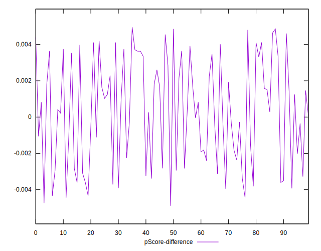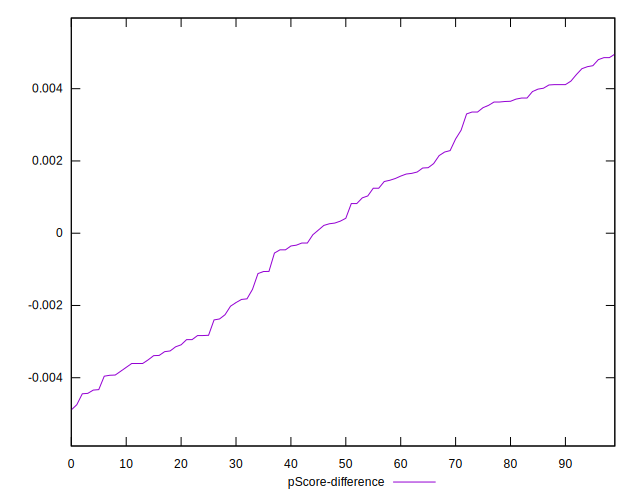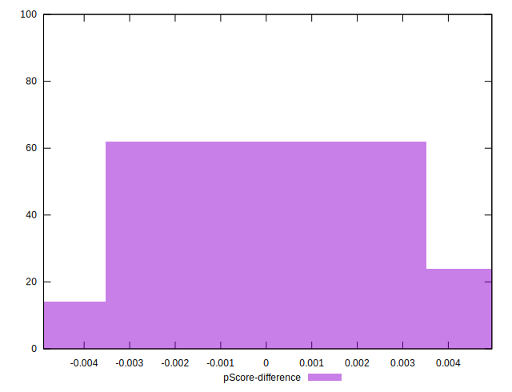