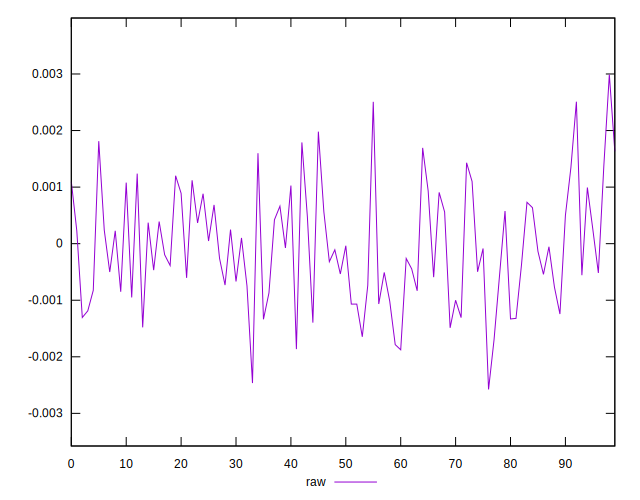
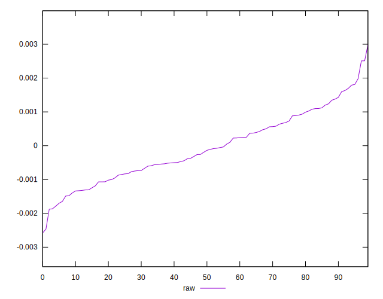
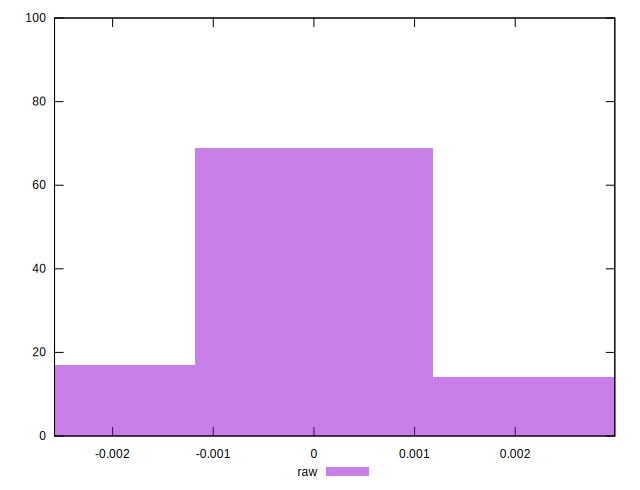

# //meta/pScore-difference/samples/agenda

[→ Parent](../..)


## Raw


```yaml
p90min: -0.0018647054386838893
p90max: 0.001980358075029112
p90range: 0.003845063513713001
p90mean: -0.00007237544346510101
median: -0.000166133291382356
p90stdev: 0.0009633060994493283
mad: 0.0007936901777317075
stdevBySn: 0.0011596270635832583
lfitCenter: -0.00009037569879321227
lfitStdev: 0.0008633699989478577
mfitCenter: -0.00009037569879321227
mfitStdev: 0.0010820738265042472
mfitConfidence: 0.00010820738265042472
p90skewness: 0.20419039793239668
p90eccentricity: 0.9999999999999996
p90discretization: 1
outlandishness: 0.6233976992539534

```

