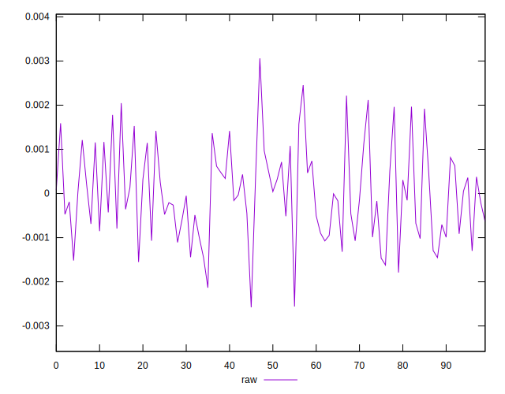
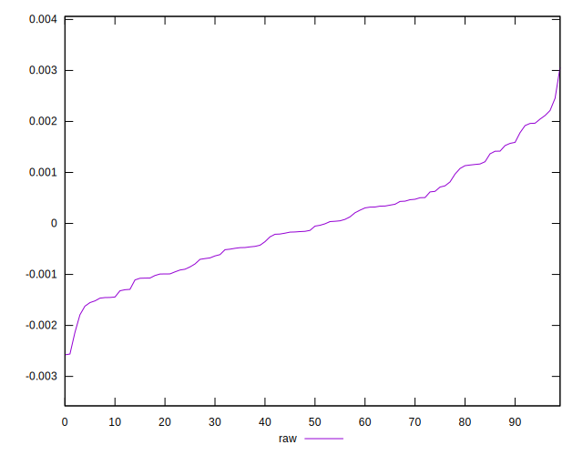
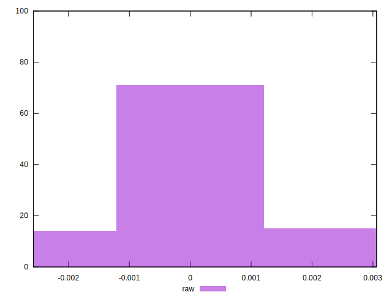

# //meta/pScore-difference/samples/astro

[→ Parent](../..)


## Raw


```yaml
p90min: -0.0017901678747913043
p90max: 0.002116618852275401
p90range: 0.003906786727066705
p90mean: -0.000001229089865672266
median: -0.00009408680286454582
p90stdev: 0.0009849101553757776
mad: 0.0007809720850857865
stdevBySn: 0.0011487807029813486
lfitCenter: -0.000026013774792608557
lfitStdev: 0.0008357339290405003
mfitCenter: -0.000026013774792608557
mfitStdev: 0.0010474371493546639
mfitConfidence: 0.00010474371493546639
p90skewness: 0.3067337170104315
p90eccentricity: 1.0000000000000007
p90discretization: 1
outlandishness: 7.696102049911338

```

