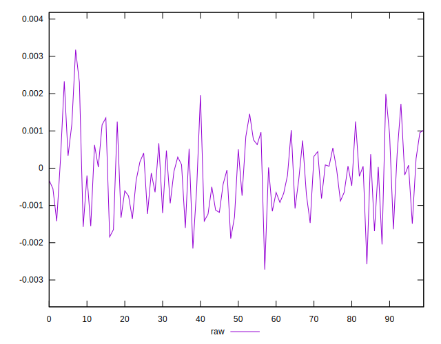
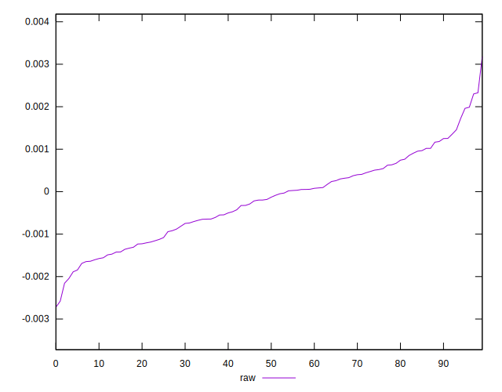
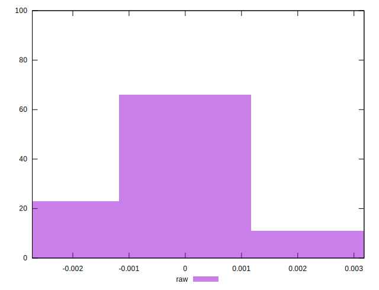

# //meta/pScore-difference/samples/card

[→ Parent](../..)


## Raw


```yaml
p90min: -0.0020461692085257115
p90max: 0.001987860322425996
p90range: 0.004034029530951708
p90mean: -0.0001995206832889262
median: -0.00015667317154409444
p90stdev: 0.0009552271862070063
mad: 0.0007712836955140933
stdevBySn: 0.001127679276001816
lfitCenter: -0.00019149145477218696
lfitStdev: 0.0008304277962111439
mfitCenter: -0.00019149145477218696
mfitStdev: 0.0010407868980584658
mfitConfidence: 0.00010407868980584659
p90skewness: 0.11350126236841654
p90eccentricity: 1.0000000000000002
p90discretization: 1
outlandishness: 0.8504919230214879

```

