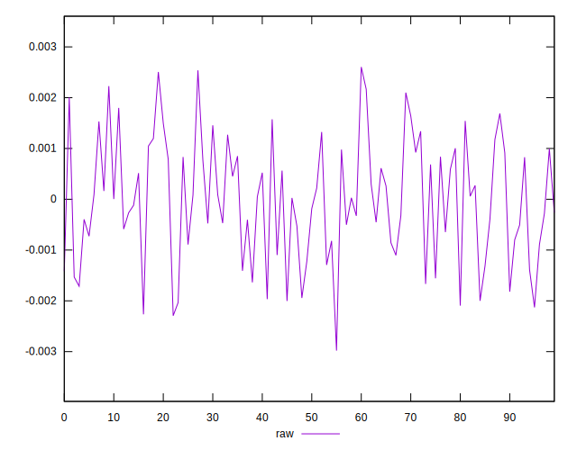
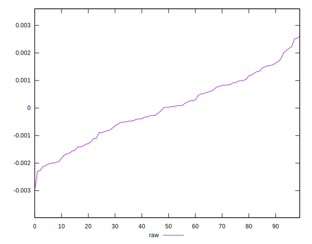
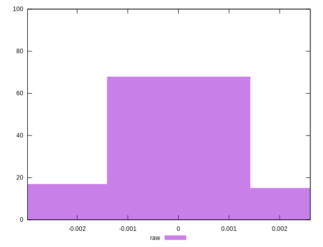

# //meta/pScore-difference/samples/music

[→ Parent](../..)


## Raw


```yaml
p90min: -0.002129477835097092
p90max: 0.002228198986744807
p90range: 0.0043576768218419
p90mean: -0.000027348161556038495
median: 0.00002737992875590928
p90stdev: 0.0011503992733013322
mad: 0.0009062992559264013
stdevBySn: 0.0013743721936236633
lfitCenter: -0.000020143063394067885
lfitStdev: 0.0009861404524261195
mfitCenter: -0.000020143063394067885
mfitStdev: 0.0012359437716480183
mfitConfidence: 0.00012359437716480181
p90skewness: -0.042599168320608484
p90eccentricity: 1.0000000000000007
p90discretization: 1
outlandishness: 0.8098442631469096

```

