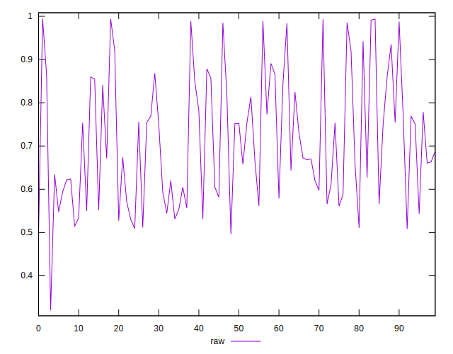
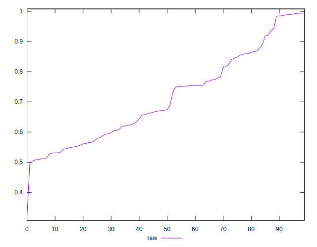
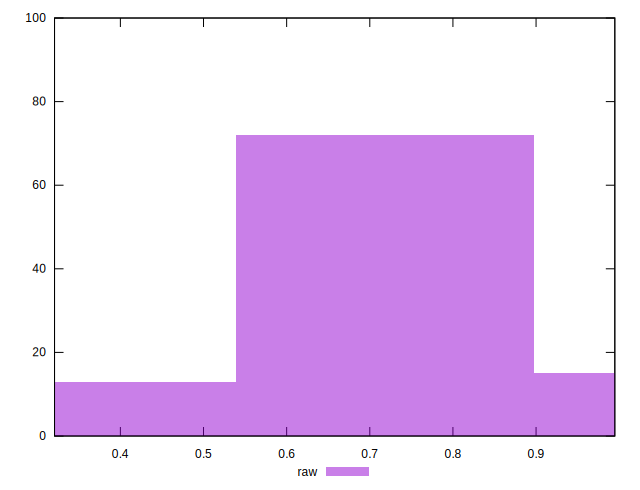

# //meta/pScore/samples/agenda

[→ Parent](../..)


## Raw


```yaml
p90min: 0.5080096702526041
p90max: 0.9931926724431063
p90range: 0.48518300219050214
p90mean: 0.7131490167900305
median: 0.6731514515249835
p90stdev: 0.14597421134445115
mad: 0.11448287296109477
stdevBySn: 0.16370032335510964
lfitCenter: 0.7070201606751914
lfitStdev: 0.13416567549718222
mfitCenter: 0.7070201606751914
mfitStdev: 0.1681517380123037
mfitConfidence: 0.01681517380123037
p90skewness: 0.3853358324562655
p90eccentricity: 0.9999999999999997
p90discretization: 1
outlandishness: 1.0006699266996033

```

