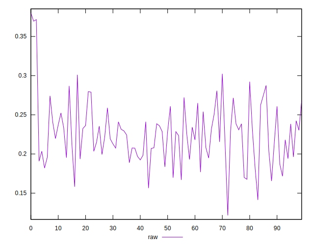
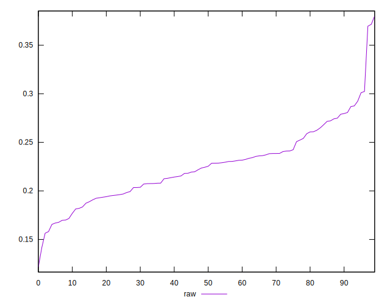
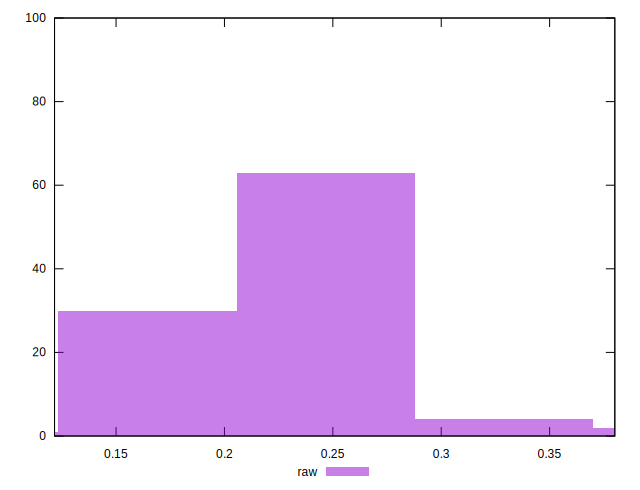

# //meta/pScore/samples/astro

[→ Parent](../..)


## Raw


```yaml
p90min: 0.1581423629538379
p90max: 0.3023639453697841
p90range: 0.1442215824159462
p90mean: 0.22466902461456922
median: 0.22488018982731175
p90stdev: 0.033420291601846466
mad: 0.026187051583572124
stdevBySn: 0.038261876037368664
lfitCenter: 0.2249797382197851
lfitStdev: 0.028706768443910995
mfitCenter: 0.2249797382197851
mfitStdev: 0.03597859876359933
mfitConfidence: 0.003597859876359933
p90skewness: 0.2670721169895287
p90eccentricity: 1.0000000000000002
p90discretization: 1
outlandishness: 1.0172147740230706

```

