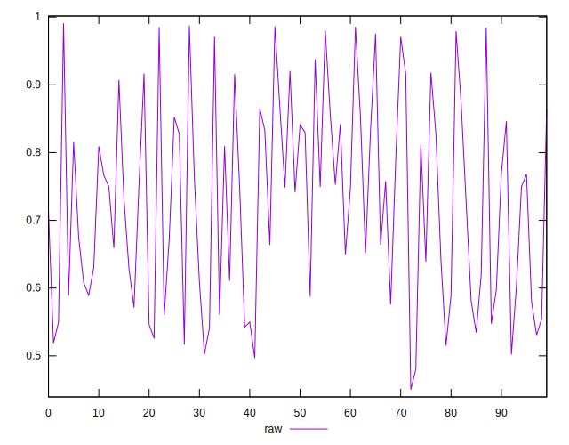
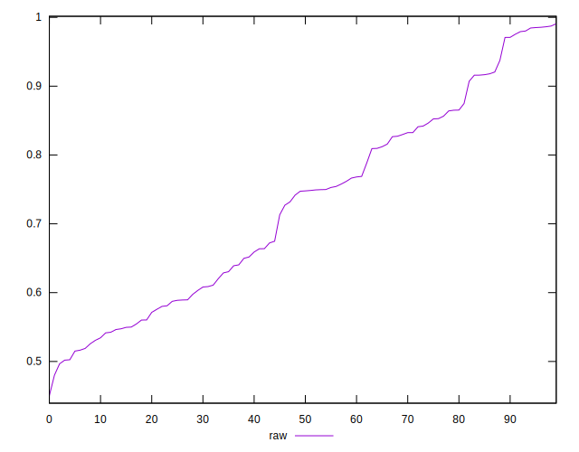
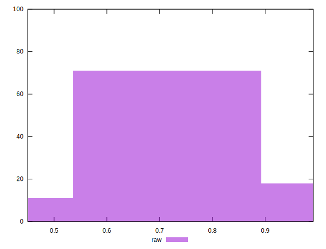

# //meta/pScore/samples/card

[→ Parent](../..)


## Raw


```yaml
p90min: 0.5018987680716038
p90max: 0.985580127447267
p90range: 0.48368135937566314
p90mean: 0.7268865903632022
median: 0.7475965631056711
p90stdev: 0.1450616892633796
mad: 0.137751191988706
stdevBySn: 0.18537175373088333
lfitCenter: 0.7252127654551679
lfitStdev: 0.13288086642606647
mfitCenter: 0.7252127654551679
mfitStdev: 0.16654146863810282
mfitConfidence: 0.016654146863810282
p90skewness: 0.16085052155795235
p90eccentricity: 1.0000000000000009
p90discretization: 1
outlandishness: 1.000823977501778

```

