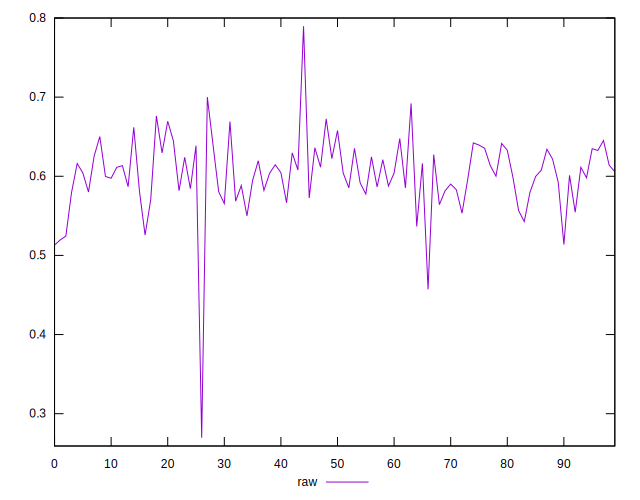
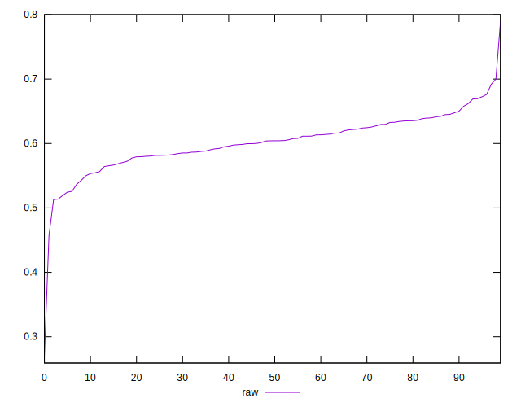
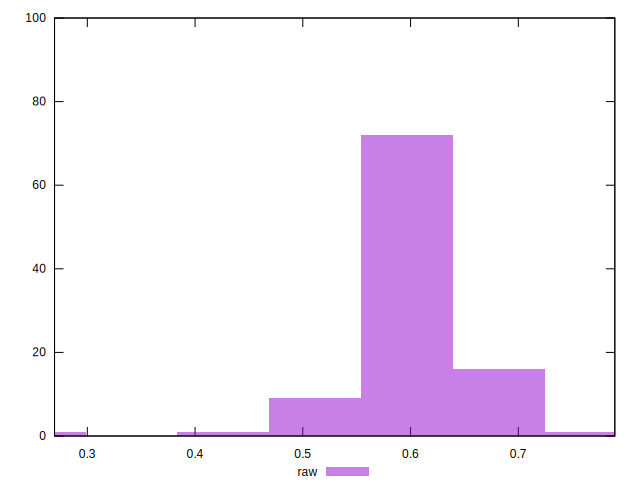

# //meta/pScore/samples/music

[→ Parent](../..)


## Raw


```yaml
p90min: 0.513679782339987
p90max: 0.6761957364201947
p90range: 0.1625159540802077
p90mean: 0.6032136129258476
median: 0.604162502885423
p90stdev: 0.03464881745811169
mad: 0.02385426272269786
stdevBySn: 0.03784487516991029
lfitCenter: 0.602712626117977
lfitStdev: 0.03043921713744749
mfitCenter: 0.602712626117977
mfitStdev: 0.038149901205567244
mfitConfidence: 0.003814990120556724
p90skewness: -0.282710020568521
p90eccentricity: 0.9999999999999991
p90discretization: 1
outlandishness: 0.9934518051489105

```

