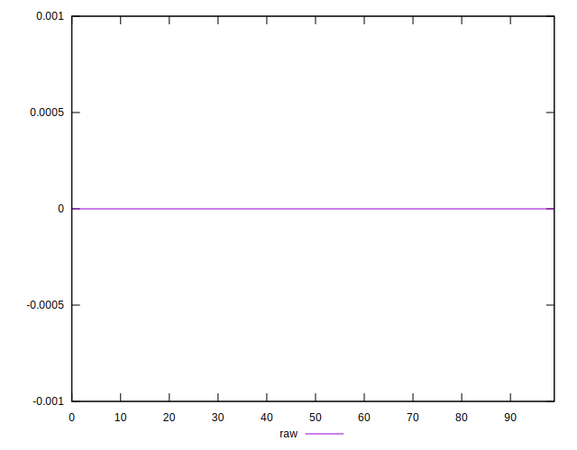

# //meta/score-difference/samples/agenda

[→ Parent](../..)


## Raw


```yaml
p90min: 0
p90max: 2.7755575615628914e-17
p90range: 2.7755575615628914e-17
p90mean: 4.340499590954734e-18
median: 0
p90stdev: 8.754257013767505e-18
mad: 0
stdevBySn: 0
lfitCenter: 3.15031111200579e-18
lfitStdev: 6.663585293434773e-18
mfitCenter: 3.15031111200579e-18
mfitStdev: 8.351565661873158e-18
mfitConfidence: 8.351565661873158e-19
p90skewness: 1.801177932515359
p90eccentricity: 1.0000000000000007
p90discretization: 18.8
outlandishness: 1.4606448979591848

```

