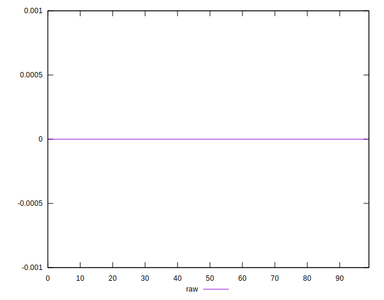
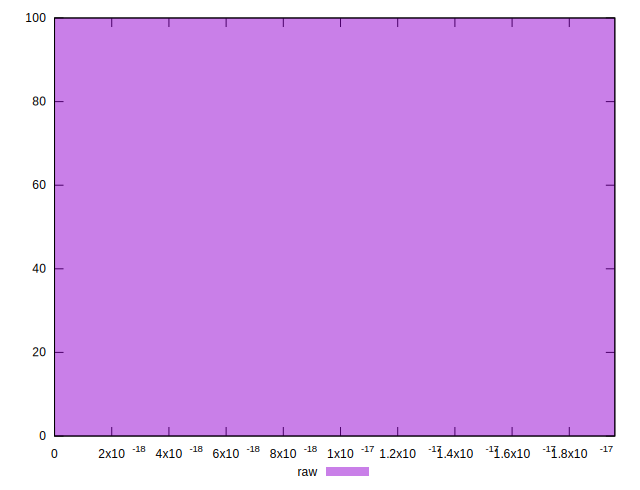

# //meta/score-difference/samples/astro

[→ Parent](../..)


## Raw


```yaml
p90min: 0
p90max: 1.6653345369377347e-17
p90range: 1.6653345369377347e-17
p90mean: 3.809009845123541e-18
median: 0
p90stdev: 6.870455347781699e-18
mad: 0
stdevBySn: 0
lfitCenter: 2.6923049443339033e-18
lfitStdev: 5.569851979177252e-18
mfitCenter: 2.6923049443339033e-18
mfitStdev: 6.98077423528192e-18
mfitConfidence: 6.98077423528192e-19
p90skewness: 1.295332449509058
p90eccentricity: 0.9999999999999972
p90discretization: 23.5
outlandishness: 1.1639782761092217

```

