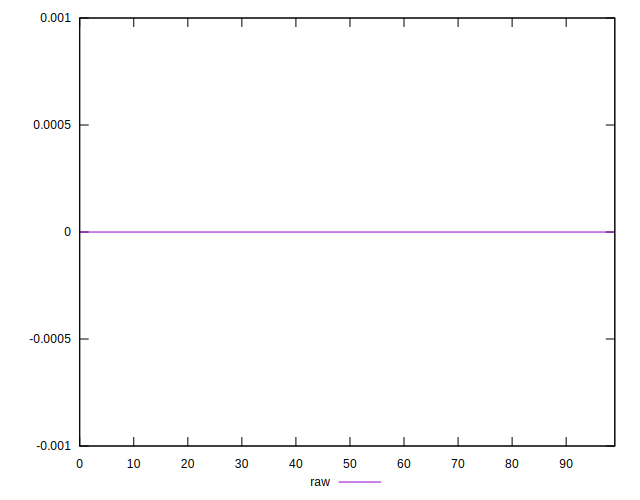
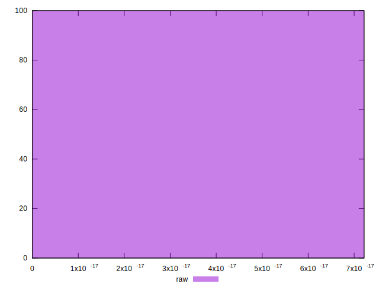

# //meta/score-difference/samples/card

[→ Parent](../..)


## Raw


```yaml
p90min: 0
p90max: 4.9960036108132046e-17
p90range: 4.9960036108132046e-17
p90mean: 1.1663247200184492e-17
median: 0
p90stdev: 1.5403611787358115e-17
mad: 0
stdevBySn: 0
lfitCenter: 9.80987687257071e-18
lfitStdev: 1.4847811025341243e-17
mfitCenter: 9.80987687257071e-18
mfitStdev: 1.860897148497427e-17
mfitConfidence: 1.8608971484974272e-18
p90skewness: 1.0076724977088831
p90eccentricity: 1.0000000000000013
p90discretization: 9.4
outlandishness: 1.2297967735939752

```

