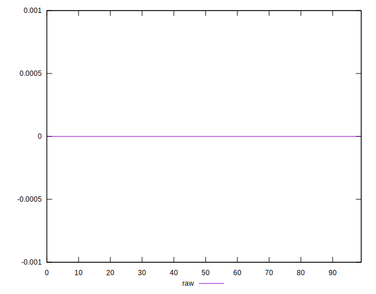

# //meta/score-difference/samples/music

[→ Parent](../..)


## Raw


```yaml
p90min: 0
p90max: 4.4408920985006264e-17
p90range: 4.4408920985006264e-17
p90mean: 4.3700267990564666e-18
median: 0
p90stdev: 8.762967001324206e-18
mad: 0
stdevBySn: 0
lfitCenter: 3.287225472368262e-18
lfitStdev: 6.8006261110225484e-18
mfitCenter: 3.287225472368262e-18
mfitStdev: 8.523320856118019e-18
mfitConfidence: 8.523320856118019e-19
p90skewness: 2.125394081682157
p90eccentricity: 1.000000000000001
p90discretization: 13.428571428571429
outlandishness: 1.5496885317750186

```

