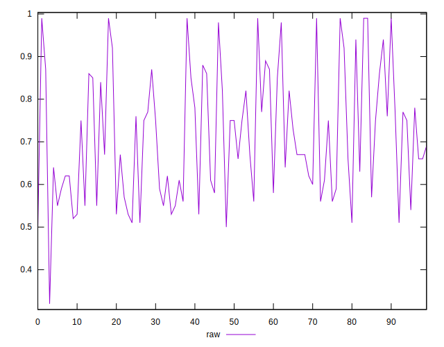
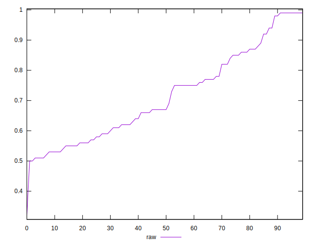
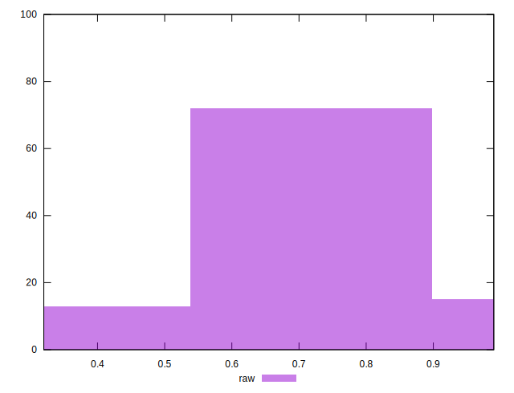

# //meta/score/samples/agenda

[→ Parent](../..)


## Raw


```yaml
p90min: 0.51
p90max: 0.99
p90range: 0.48
p90mean: 0.7132978723404256
median: 0.67
p90stdev: 0.14596260303528014
mad: 0.10999999999999999
stdevBySn: 0.16696400000000003
lfitCenter: 0.7070117630427857
lfitStdev: 0.133861021564341
mfitCenter: 0.7070117630427857
mfitStdev: 0.16776991093090082
mfitConfidence: 0.016776991093090082
p90skewness: 0.3857670658041534
p90eccentricity: 0.9999999999999999
p90discretization: 2.8484848484848486
outlandishness: 1.0002863739671386

```

