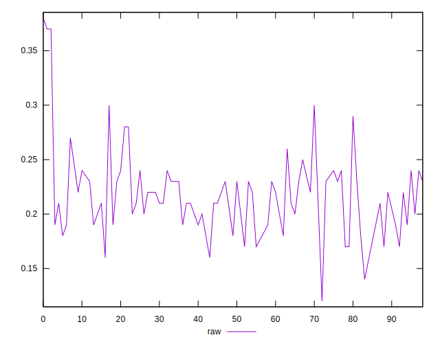
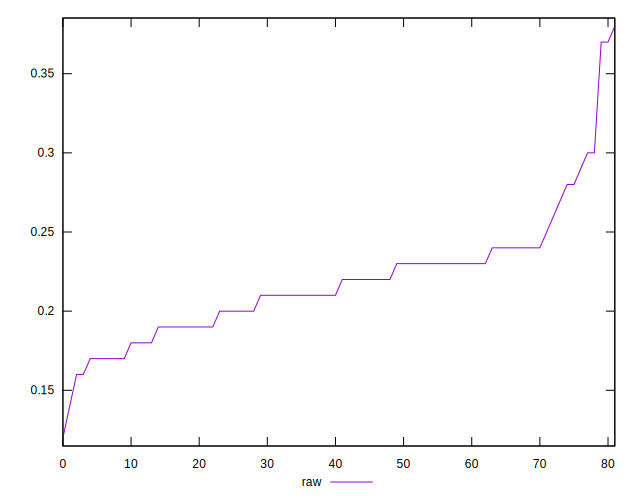
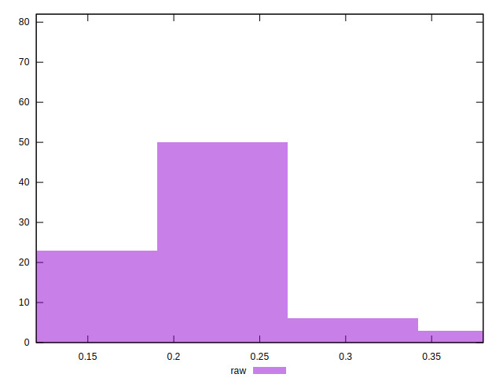

# //meta/score/samples/astro

[→ Parent](../..)


## Raw


```yaml
p90min: 0.16
p90max: 0.3
p90range: 0.13999999999999999
p90mean: 0.21657894736842115
median: 0.215
p90stdev: 0.030416089560545496
mad: 0.024999999999999994
stdevBySn: 0.035778000000000004
lfitCenter: 0.21741272668376907
lfitStdev: 0.026729700215383043
mfitCenter: 0.21741272668376907
mfitStdev: 0.03350071119985458
mfitConfidence: 0.0036995346623926446
p90skewness: 0.6044460572348004
p90eccentricity: 1.0000000000000004
p90discretization: 5.066666666666666
outlandishness: 1.0272705272870342

```

