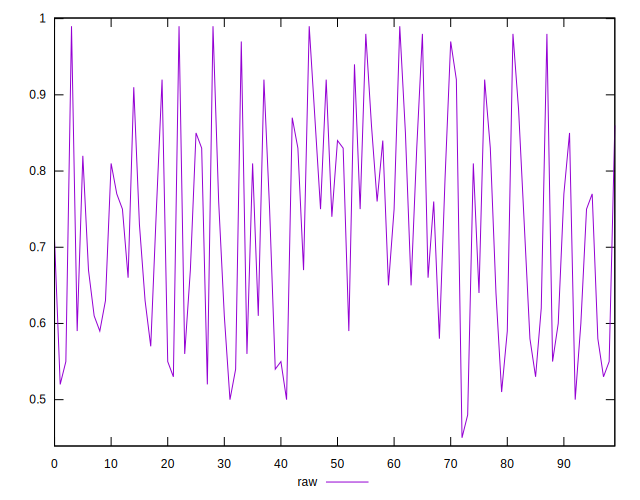
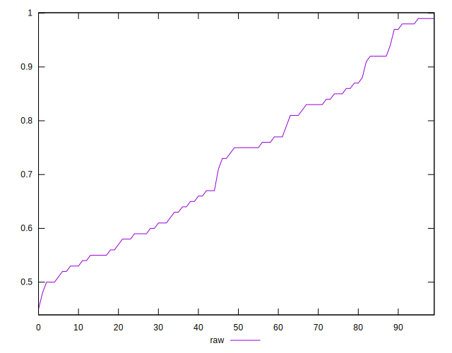
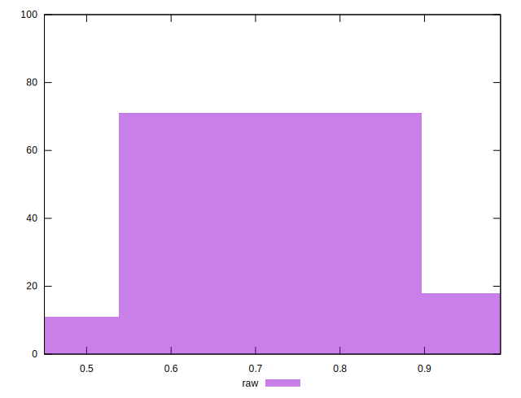

# //meta/score/samples/card

[→ Parent](../..)


## Raw


```yaml
p90min: 0.5
p90max: 0.99
p90range: 0.49
p90mean: 0.7274468085106381
median: 0.75
p90stdev: 0.14571858750733738
mad: 0.14
stdevBySn: 0.18783449999999996
lfitCenter: 0.7257580156785975
lfitStdev: 0.13364860284250393
mfitCenter: 0.7257580156785975
mfitStdev: 0.16750368354352405
mfitConfidence: 0.016750368354352403
p90skewness: 0.16074810064040373
p90eccentricity: 1.0000000000000009
p90discretization: 2.41025641025641
outlandishness: 1.0009712798966521

```

