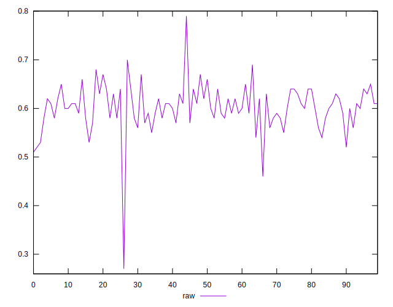
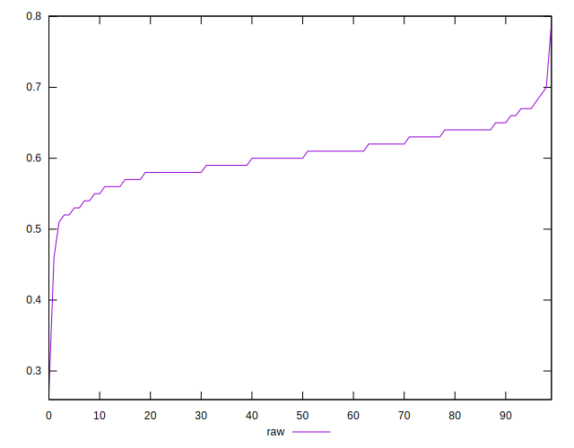
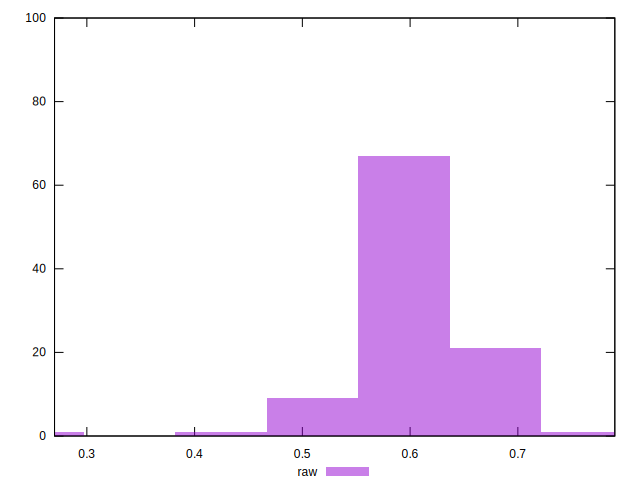

# //meta/score/samples/music

[→ Parent](../..)


## Raw


```yaml
p90min: 0.52
p90max: 0.68
p90range: 0.16000000000000003
p90mean: 0.6034042553191492
median: 0.6
p90stdev: 0.034504183881038465
mad: 0.020000000000000018
stdevBySn: 0.03577800000000003
lfitCenter: 0.6027612280588068
lfitStdev: 0.030638673234383712
mfitCenter: 0.6027612280588068
mfitStdev: 0.03839988235188272
mfitConfidence: 0.003839988235188272
p90skewness: -0.19542873221534754
p90eccentricity: 1.0000000000000002
p90discretization: 5.529411764705882
outlandishness: 0.9933678735122274

```

