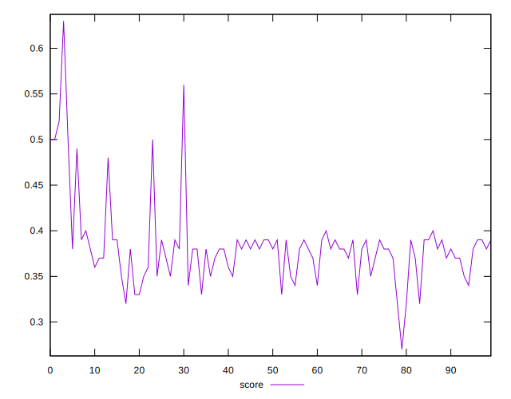

# //render-blocking-resources/samples/astro

[→ Parent](../..)


## Raw


```yaml
p90min: 758
p90max: 2243
p90range: 1485
p90mean: 1773.1382978723404
median: 1781.5
p90stdev: 300.7196545969893
mad: 92
stdevBySn: 156.52875
lfitCenter: 1775.0981045230435
lfitStdev: 176.2569976778708
mfitCenter: 1775.0981045230435
mfitStdev: 220.90538721274515
mfitConfidence: 22.090538721274516
p90skewness: -1.8777278615698905
p90eccentricity: 1.0000000000000004
p90discretization: 1.1325301204819278
outlandishness: 0.9840492398333593

```


## Score


```yaml
p90min: 0.32
p90max: 0.5
p90range: 0.18
p90mean: 0.3802127659574469
median: 0.38
p90stdev: 0.035728846543489234
mad: 0.010000000000000009
stdevBySn: 0.017889000000000016
lfitCenter: 0.3810023180349056
lfitStdev: 0.0221123662437961
mfitCenter: 0.3810023180349056
mfitStdev: 0.02771374125073444
mfitConfidence: 0.002771374125073444
p90skewness: 1.7781328783239523
p90eccentricity: 1.0000000000000024
p90discretization: 7.833333333333333
outlandishness: 1.0178969378108198

```


## Raw Estimate


## Score Estimate


## P Score


```yaml
p90min: 0.3243529411764706
p90max: 0.4990588235294118
p90range: 0.17470588235294116
p90mean: 0.37963078848560694
median: 0.3786470588235294
p90stdev: 0.03537878289376345
mad: 0.010823529411764732
stdevBySn: 0.01841514705882355
lfitCenter: 0.38015948454848314
lfitStdev: 0.02185152694523007
mfitCenter: 0.38015948454848314
mfitStdev: 0.027386827669945223
mfitConfidence: 0.0027386827669945222
p90skewness: 1.8777278615698954
p90eccentricity: 0.9999999999999996
p90discretization: 1.1325301204819278
outlandishness: 1.0173646461496775

```


## Score Difference


```yaml
p90min: 0
p90max: 5.551115123125783e-17
p90range: 5.551115123125783e-17
p90mean: 3.543264972207946e-18
median: 0
p90stdev: 1.3569671737421589e-17
mad: 0
stdevBySn: 0
lfitCenter: 2.593298623283183e-18
lfitStdev: 6.196756661059375e-18
mfitCenter: 2.593298623283183e-18
mfitStdev: 7.766482736624675e-18
mfitConfidence: 7.766482736624675e-19
p90skewness: 3.5685919470918024
p90eccentricity: 0.9999999999999984
p90discretization: 47
outlandishness: 1.9881000000000004

```


## P Score Difference


```yaml
p90min: -0.004588235294117671
p90max: 0.0040000000000000036
p90range: 0.008588235294117674
p90mean: -0.0007224308162981612
median: -0.0010588235294117787
p90stdev: 0.0024818153462691124
mad: 0.002254901960784317
stdevBySn: 0.0029464235294117598
lfitCenter: -0.0007718609365822298
lfitStdev: 0.0021954104403762932
mfitCenter: -0.0007718609365822298
mfitStdev: 0.002751538944902372
mfitConfidence: 0.0002751538944902372
p90skewness: 0.21858333465280552
p90eccentricity: 0.9999999999999997
p90discretization: 1.492063492063492
outlandishness: 0.905160861174541

```

