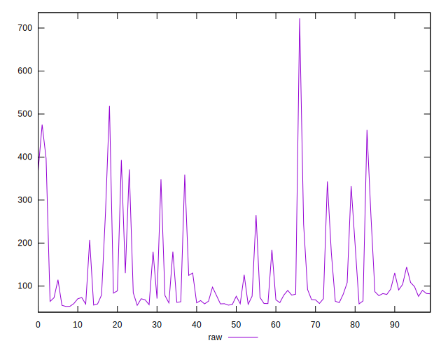
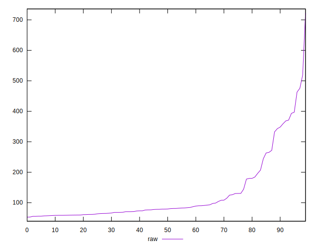
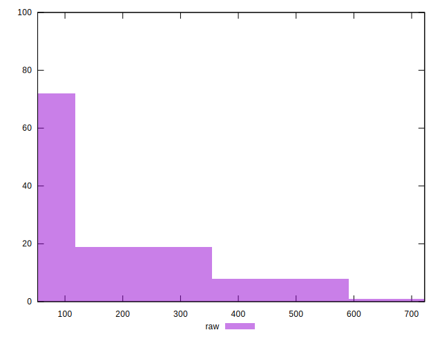
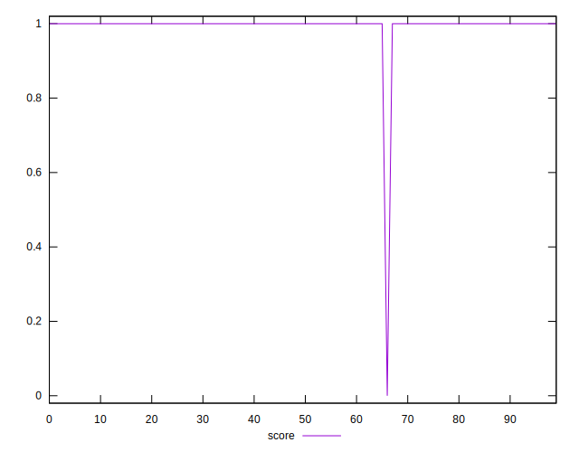
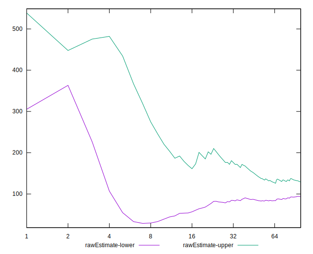
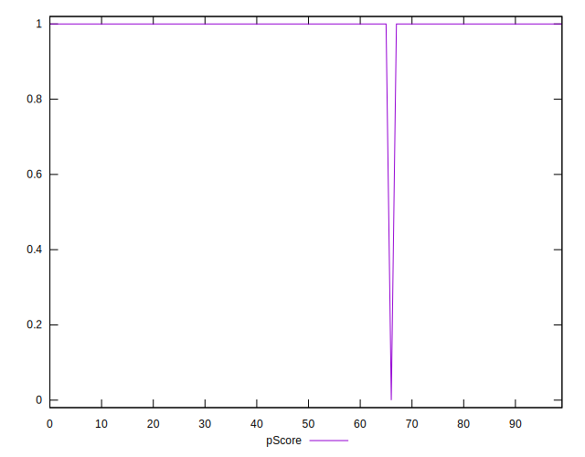

# //server-response-time/samples/astro

[→ Parent](../..)


## Raw


```yaml
p90min: 55.334999999999994
p90max: 463.068
p90range: 407.733
p90mean: 121.43374468085104
median: 79.226
p90stdev: 96.17812045764148
mad: 19.727
stdevBySn: 27.621212300000007
lfitCenter: 111.39151160936463
lfitStdev: 71.44170754887415
mfitCenter: 111.39151160936463
mfitStdev: 89.53890215506131
mfitConfidence: 8.953890215506132
p90skewness: 1.9180861523447563
p90eccentricity: 1.0000000000000013
p90discretization: 1
outlandishness: 1.1982829864233906

```


## Score


```yaml
p90min: 1
p90max: 1
p90range: 0
p90mean: 1
median: 1
p90stdev: 0
mad: 0
stdevBySn: 0
lfitCenter: 0.9953463986474514
lfitStdev: 0.01161056518501907
mfitCenter: 0.9953463986474514
mfitStdev: 0.01455168550325008
mfitConfidence: 0.001455168550325008
p90skewness: .nan
p90eccentricity: .nan
p90discretization: 94
outlandishness: 0.9801

```


## Raw Estimate


## Score Estimate


## P Score


```yaml
p90min: 1
p90max: 1
p90range: 0
p90mean: 1
median: 1
p90stdev: 0
mad: 0
stdevBySn: 0
lfitCenter: 0.9953463986474514
lfitStdev: 0.01161056518501907
mfitCenter: 0.9953463986474514
mfitStdev: 0.01455168550325008
mfitConfidence: 0.001455168550325008
p90skewness: .nan
p90eccentricity: .nan
p90discretization: 94
outlandishness: 0.9801

```


## Score Difference


```yaml
p90min: 0
p90max: 0
p90range: 0
p90mean: 0
median: 0
p90stdev: 0
mad: 0
stdevBySn: 0
lfitCenter: 0
lfitStdev: 0
mfitCenter: 0
mfitStdev: 0
mfitConfidence: 0
p90skewness: .nan
p90eccentricity: .nan
p90discretization: 94
outlandishness: .nan

```


## P Score Difference


```yaml
p90min: 0
p90max: 0
p90range: 0
p90mean: 0
median: 0
p90stdev: 0
mad: 0
stdevBySn: 0
lfitCenter: 0
lfitStdev: 0
mfitCenter: 0
mfitStdev: 0
mfitConfidence: 0
p90skewness: .nan
p90eccentricity: .nan
p90discretization: 94
outlandishness: .nan

```

