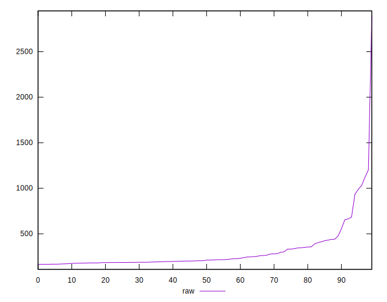

# //server-response-time/samples/card

[→ Parent](../..)


## Raw


```yaml
p90min: 164.767
p90max: 1032.307
p90range: 867.54
p90mean: 279.44847872340415
median: 207.47249999999997
p90stdev: 169.59818500808544
mad: 31.168499999999966
stdevBySn: 47.34383479999998
lfitCenter: 273.1543131727082
lfitStdev: 134.97492478406576
mfitCenter: 273.1543131727082
mfitStdev: 169.16598158518792
mfitConfidence: 16.91659815851879
p90skewness: 2.7190653157751354
p90eccentricity: 1.0000000000000004
p90discretization: 1
outlandishness: 1.3095190139523494

```


## Score


```yaml
p90min: 0
p90max: 1
p90range: 1
p90mean: 0.9361702127659575
median: 1
p90stdev: 0.2444494743207672
mad: 0
stdevBySn: 0
lfitCenter: 0.9532832851460858
lfitStdev: 0.11163084395861042
mfitCenter: 0.9532832851460858
mfitStdev: 0.13990851503456894
mfitConfidence: 0.013990851503456895
p90skewness: -3.568591947091798
p90eccentricity: 0.999999999999997
p90discretization: 47
outlandishness: 0.9448723657024793

```


## Raw Estimate


## Score Estimate


## P Score


```yaml
p90min: 0
p90max: 1
p90range: 1
p90mean: 0.9361702127659575
median: 1
p90stdev: 0.2444494743207672
mad: 0
stdevBySn: 0
lfitCenter: 0.9532832851460858
lfitStdev: 0.11163084395861042
mfitCenter: 0.9532832851460858
mfitStdev: 0.13990851503456894
mfitConfidence: 0.013990851503456895
p90skewness: -3.568591947091798
p90eccentricity: 0.999999999999997
p90discretization: 47
outlandishness: 0.9448723657024793

```


## Score Difference


```yaml
p90min: 0
p90max: 0
p90range: 0
p90mean: 0
median: 0
p90stdev: 0
mad: 0
stdevBySn: 0
lfitCenter: 0
lfitStdev: 0
mfitCenter: 0
mfitStdev: 0
mfitConfidence: 0
p90skewness: .nan
p90eccentricity: .nan
p90discretization: 94
outlandishness: .nan

```


## P Score Difference


```yaml
p90min: 0
p90max: 0
p90range: 0
p90mean: 0
median: 0
p90stdev: 0
mad: 0
stdevBySn: 0
lfitCenter: 0
lfitStdev: 0
mfitCenter: 0
mfitStdev: 0
mfitConfidence: 0
p90skewness: .nan
p90eccentricity: .nan
p90discretization: 94
outlandishness: .nan

```

