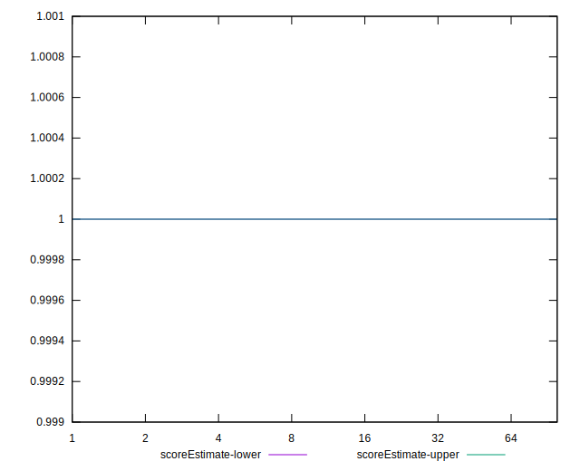

# //server-response-time/samples/music

[→ Parent](../..)


## Raw


```yaml
p90min: 167.215
p90max: 695.4290000000001
p90range: 528.214
p90mean: 251.293914893617
median: 198.93349999999998
p90stdev: 108.7242666749886
mad: 26.918000000000006
stdevBySn: 35.47209809999998
lfitCenter: 245.09248189673238
lfitStdev: 94.8934647610254
mfitCenter: 245.09248189673238
mfitStdev: 118.93132104351712
mfitConfidence: 11.89313210435171
p90skewness: 1.9584725517637938
p90eccentricity: 0.9999999999999996
p90discretization: 1.010752688172043
outlandishness: 1.1834752393746062

```


## Score


```yaml
p90min: 0
p90max: 1
p90range: 1
p90mean: 0.9787234042553191
median: 1
p90stdev: 0.14430489325798443
mad: 0
stdevBySn: 0
lfitCenter: 0.975450139288864
lfitStdev: 0.060026641072487806
mfitCenter: 0.975450139288864
mfitStdev: 0.0752322379474141
mfitConfidence: 0.00752322379474141
p90skewness: -6.634888026970382
p90eccentricity: 0.9999999999999989
p90discretization: 47
outlandishness: 0.9421656427221172

```


## Raw Estimate


## Score Estimate


## P Score


```yaml
p90min: 0
p90max: 1
p90range: 1
p90mean: 0.9787234042553191
median: 1
p90stdev: 0.14430489325798443
mad: 0
stdevBySn: 0
lfitCenter: 0.975450139288864
lfitStdev: 0.060026641072487806
mfitCenter: 0.975450139288864
mfitStdev: 0.0752322379474141
mfitConfidence: 0.00752322379474141
p90skewness: -6.634888026970382
p90eccentricity: 0.9999999999999989
p90discretization: 47
outlandishness: 0.9421656427221172

```


## Score Difference


```yaml
p90min: 0
p90max: 0
p90range: 0
p90mean: 0
median: 0
p90stdev: 0
mad: 0
stdevBySn: 0
lfitCenter: 0
lfitStdev: 0
mfitCenter: 0
mfitStdev: 0
mfitConfidence: 0
p90skewness: .nan
p90eccentricity: .nan
p90discretization: 94
outlandishness: .nan

```


## P Score Difference


```yaml
p90min: 0
p90max: 0
p90range: 0
p90mean: 0
median: 0
p90stdev: 0
mad: 0
stdevBySn: 0
lfitCenter: 0
lfitStdev: 0
mfitCenter: 0
mfitStdev: 0
mfitConfidence: 0
p90skewness: .nan
p90eccentricity: .nan
p90discretization: 94
outlandishness: .nan

```

