# //speed-index/samples/agenda

[→ Parent](../..)


## Raw


```yaml
p90min: 1495.296
p90max: 9906.86204156703
p90range: 8411.56604156703
p90mean: 4654.7913473567805
median: 5760.654329751679
p90stdev: 2799.7990073432716
mad: 3459.2618842142547
stdevBySn: 4253.112467636267
lfitCenter: 4673.705355364213
lfitStdev: 3183.7493927847568
mfitCenter: 4673.705355364213
mfitStdev: 3990.2381276619226
mfitConfidence: 399.02381276619224
p90skewness: 0.043425584209143636
p90eccentricity: 0.9999999999999989
p90discretization: 1
outlandishness: 1.0371992346511703

```

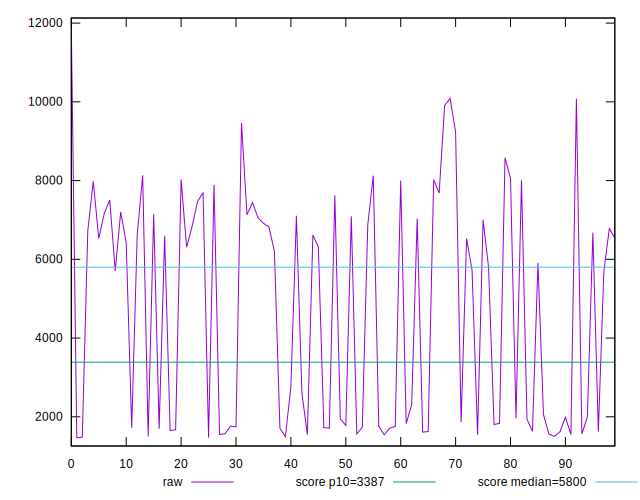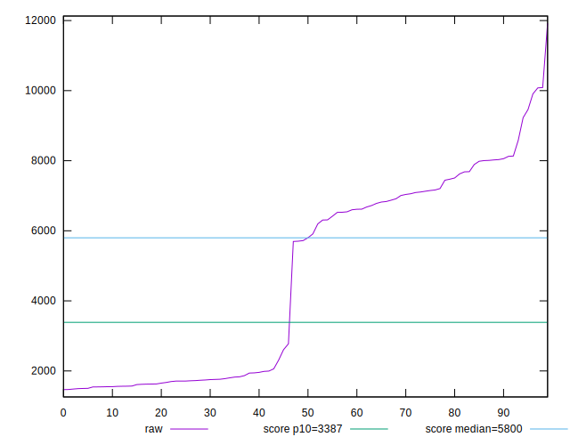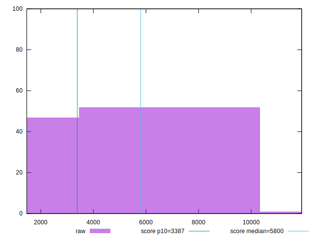
## Score


```yaml
p90min: 0.1
p90max: 1
p90range: 0.9
p90mean: 0.6359574468085107
median: 0.505
p90stdev: 0.3470278643203711
mad: 0.41000000000000003
stdevBySn: 0.5008920000000001
lfitCenter: 0.6376835146315509
lfitStdev: 0.4019288437480796
mfitCenter: 0.6376835146315509
mfitStdev: 0.5037431025712286
mfitConfidence: 0.050374310257122856
p90skewness: -0.001713522917066969
p90eccentricity: 0.9999999999999983
p90discretization: 2.9375
outlandishness: 0.9813523904590058

```

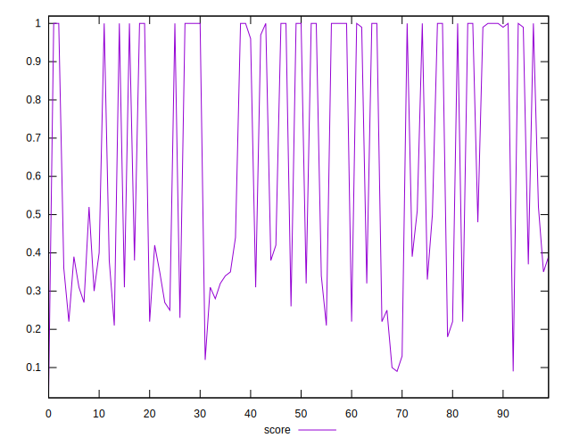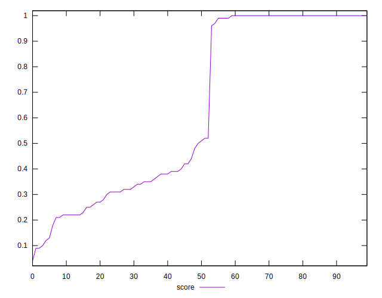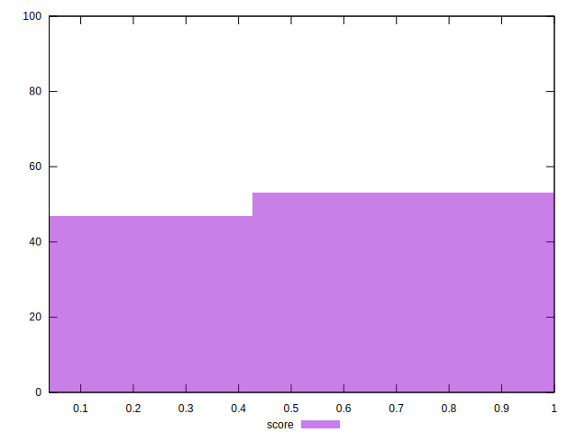
## Raw Estimate

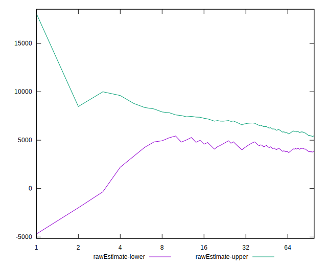
## Score Estimate

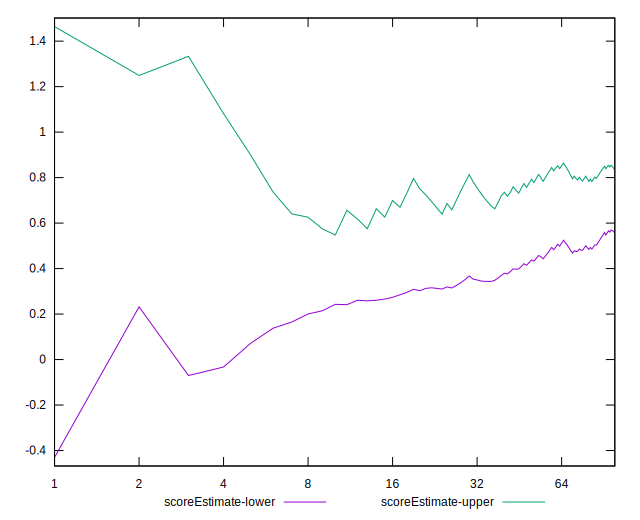
## P Score


```yaml
p90min: 0.10106772610827286
p90max: 0.9993798837696279
p90range: 0.8983121576613551
p90mean: 0.6353237134619537
median: 0.5064926221665494
p90stdev: 0.346320657931879
mad: 0.4089429542267816
stdevBySn: 0.49742683901060125
lfitCenter: 0.6370891103426309
lfitStdev: 0.4011481779239892
mfitCenter: 0.6370891103426309
mfitStdev: 0.5027646830563925
mfitConfidence: 0.050276468305639255
p90skewness: -0.0012472557689783802
p90eccentricity: 0.9999999999999999
p90discretization: 1
outlandishness: 0.9817353015767386

```

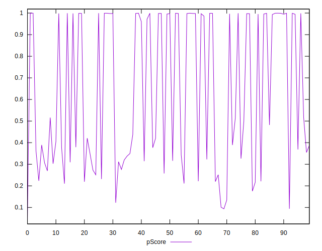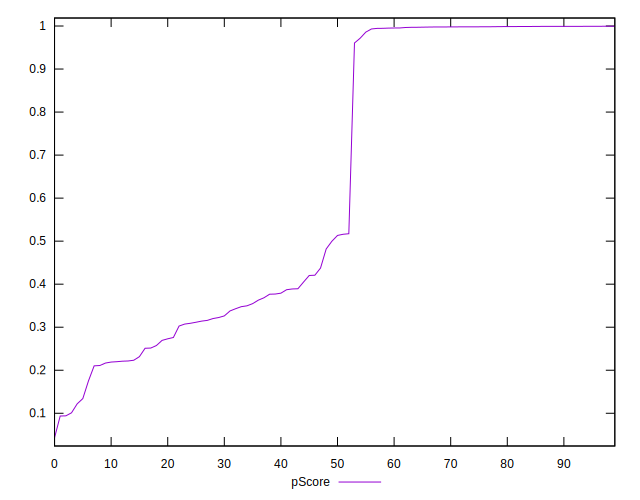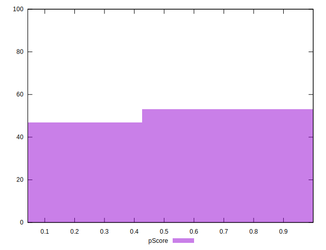
## Score Difference


```yaml
p90min: 0
p90max: 0
p90range: 0
p90mean: 0
median: 0
p90stdev: 0
mad: 0
stdevBySn: 0
lfitCenter: 7.958455817343958e-19
lfitStdev: 1.966288954703721e-18
mfitCenter: 7.958455817343958e-19
mfitStdev: 2.4643777474572523e-18
mfitConfidence: 2.464377747457252e-19
p90skewness: .nan
p90eccentricity: .nan
p90discretization: 94
outlandishness: .inf

```

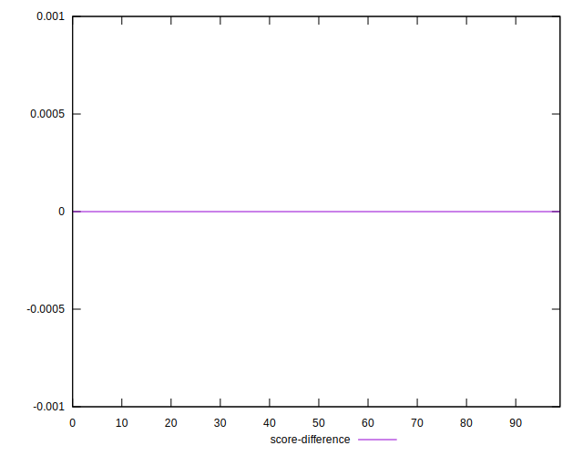
## P Score Difference


```yaml
p90min: -0.0045357447916524185
p90max: 0.004471198551384004
p90range: 0.009006943343036422
p90mean: -0.0005395950221285631
median: -0.0008760766096565231
p90stdev: 0.0021926270795121776
mad: 0.0016035734456543715
stdevBySn: 0.0022499258005464844
lfitCenter: -0.000639518176412954
lfitStdev: 0.0017087246298626403
mfitCenter: -0.000639518176412954
mfitStdev: 0.00214156873754098
mfitConfidence: 0.000214156873754098
p90skewness: 0.5082923959283654
p90eccentricity: 1.0000000000000004
p90discretization: 1
outlandishness: 0.8759617011578662

```

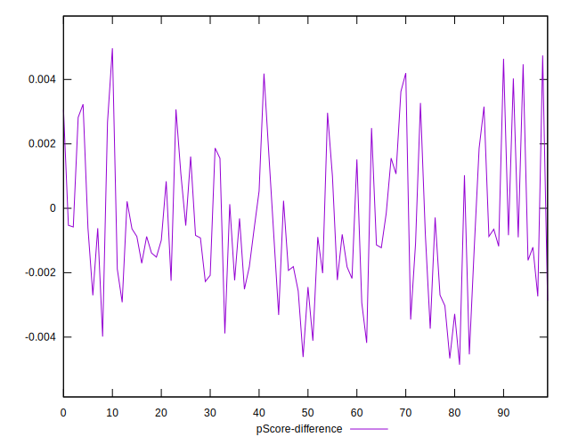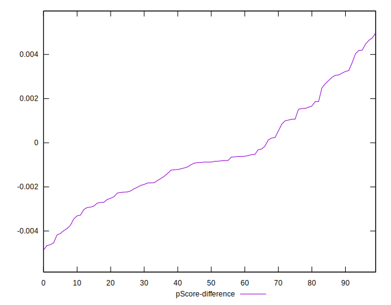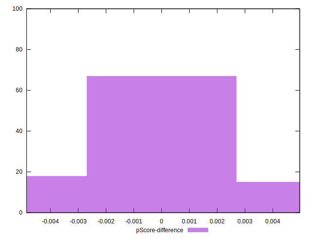