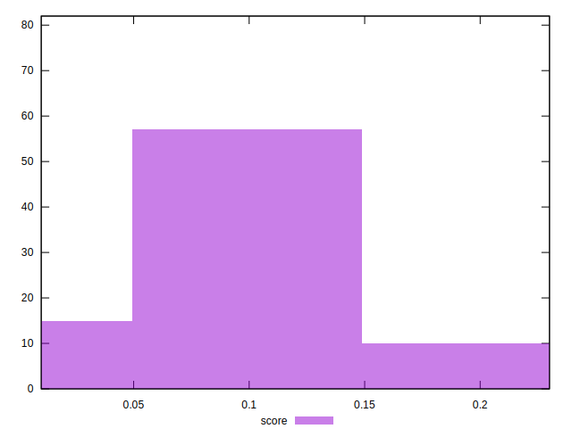

# //speed-index/samples/astro

[→ Parent](../..)


## Raw


```yaml
p90min: 8303.865955046724
p90max: 15392.45145429919
p90range: 7088.5854992524655
p90mean: 10596.807889428012
median: 10288.996722399326
p90stdev: 1354.7497446710306
mad: 729.0753637023299
stdevBySn: 1289.8360713101445
lfitCenter: 10541.208084411694
lfitStdev: 1077.9870658853097
mfitCenter: 10541.208084411694
mfitStdev: 1351.0564308768046
mfitConfidence: 149.19922347496095
p90skewness: 1.1459444624709867
p90eccentricity: 1.0000000000000002
p90discretization: 1
outlandishness: 1.0177837981645124

```


## Score


```yaml
p90min: 0.01
p90max: 0.2
p90range: 0.19
p90mean: 0.08657894736842105
median: 0.09
p90stdev: 0.03965484743644536
mad: 0.03
stdevBySn: 0.04174100000000001
lfitCenter: 0.08707363582277983
lfitStdev: 0.03273005167529375
mfitCenter: 0.08707363582277983
mfitStdev: 0.04102103652098964
mfitConfidence: 0.004530015664184899
p90skewness: 0.40589336376639246
p90eccentricity: 0.9999999999999992
p90discretization: 4.222222222222222
outlandishness: 1.0515028428668716

```


## Raw Estimate


## Score Estimate


## P Score


```yaml
p90min: 0.010027483482414223
p90max: 0.19628279898103612
p90range: 0.1862553154986219
p90mean: 0.08620491523579128
median: 0.08602351167666161
p90stdev: 0.03946268221442153
mad: 0.026263853003792054
stdevBySn: 0.04097363487551289
lfitCenter: 0.08666674172936198
lfitStdev: 0.031902614467759174
mfitCenter: 0.08666674172936198
mfitStdev: 0.03998399777000219
mfitConfidence: 0.004415493892314602
p90skewness: 0.3915356423992333
p90eccentricity: 1.0000000000000004
p90discretization: 1
outlandishness: 1.0503808945229554

```


## Score Difference


```yaml
p90min: 0
p90max: 0
p90range: 0
p90mean: 0
median: 0
p90stdev: 0
mad: 0
stdevBySn: 0
lfitCenter: 0
lfitStdev: 0
mfitCenter: 0
mfitStdev: 0
mfitConfidence: 0
p90skewness: .nan
p90eccentricity: .nan
p90discretization: 76
outlandishness: .nan

```


## P Score Difference


```yaml
p90min: -0.0042621202879829095
p90max: 0.004108562311217923
p90range: 0.008370682599200832
p90mean: -0.00045390332460741855
median: -0.000886985702244783
p90stdev: 0.0024574358102883143
mad: 0.0022658164728250954
stdevBySn: 0.0029825894778966033
lfitCenter: -0.0005017048062551305
lfitStdev: 0.0022261307175425104
mfitCenter: -0.0005017048062551305
mfitStdev: 0.002790041102615785
mfitConfidence: 0.0003081084967734086
p90skewness: 0.18037495862119143
p90eccentricity: 0.9999999999999992
p90discretization: 1
outlandishness: 0.9004377294177938

```

