# //speed-index/samples/card

[→ Parent](../..)


## Raw


```yaml
p90min: 1629.9629999999997
p90max: 9506.51035702971
p90range: 7876.547357029711
p90mean: 4373.726383038905
median: 2830.090571458434
p90stdev: 2690.9661191754913
mad: 1190.1120714584342
stdevBySn: 1502.6319405894033
lfitCenter: 4213.814434010473
lfitStdev: 2963.355476109901
mfitCenter: 4213.814434010473
mfitStdev: 3714.015315837044
mfitConfidence: 371.4015315837044
p90skewness: 0.33852182638413425
p90eccentricity: 0.9999999999999997
p90discretization: 1
outlandishness: 1.043136840440892

```

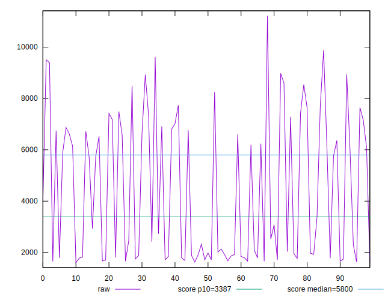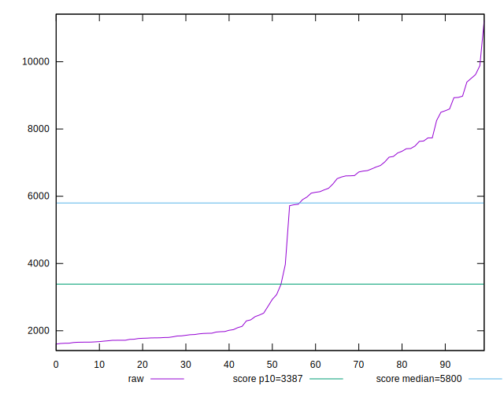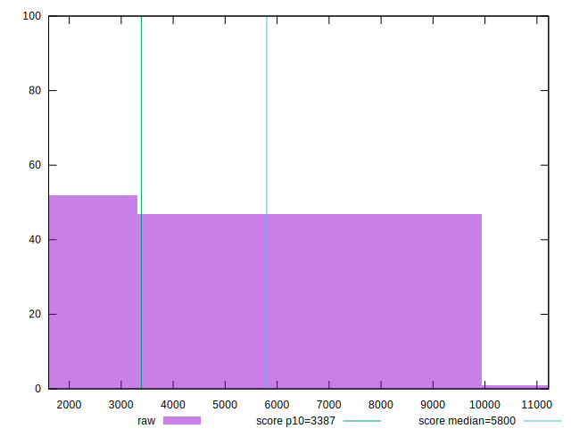
## Score


```yaml
p90min: 0.12
p90max: 1
p90range: 0.88
p90mean: 0.6845744680851064
median: 0.955
p90stdev: 0.3402773114825958
mad: 0.04500000000000004
stdevBySn: 0.05664850000000005
lfitCenter: 0.7113222641775893
lfitStdev: 0.3874090188488101
mfitCenter: 0.7113222641775893
mfitStdev: 0.48554520073531704
mfitConfidence: 0.048554520073531705
p90skewness: -0.3045567003585495
p90eccentricity: 0.9999999999999987
p90discretization: 2.8484848484848486
outlandishness: 0.9756834482751127

```

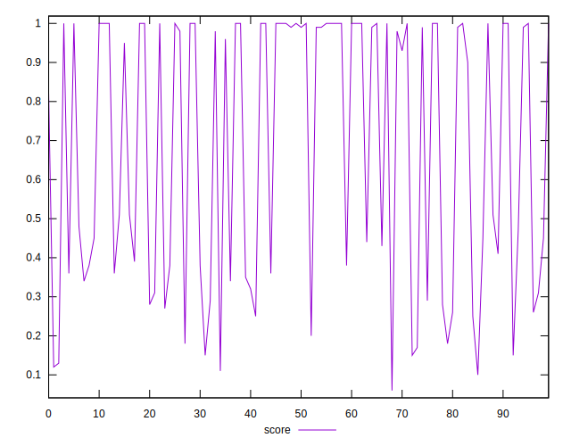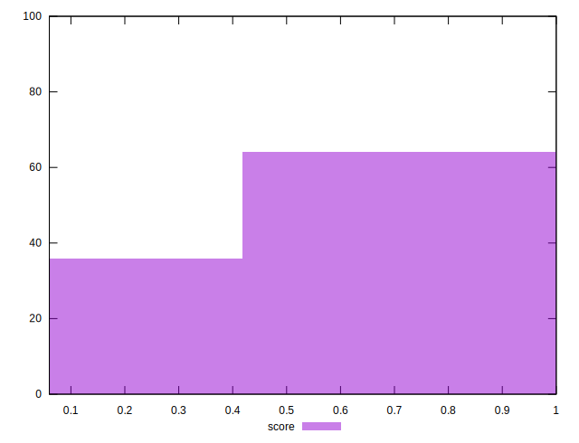
## Raw Estimate

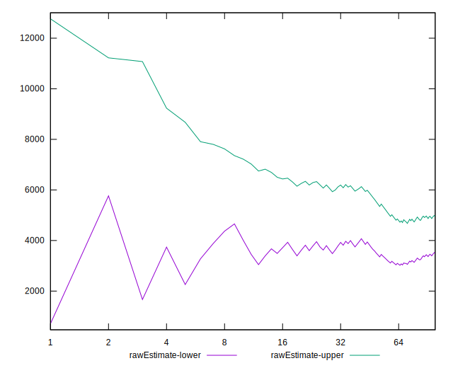
## Score Estimate

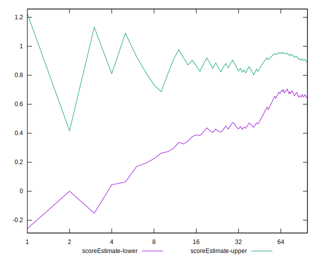
## P Score


```yaml
p90min: 0.11955519014691018
p90max: 0.9987528341904606
p90range: 0.8791976440435504
p90mean: 0.6836234345228526
median: 0.9558721780732453
p90stdev: 0.3397740334775939
mad: 0.042911353876142866
stdevBySn: 0.05603308633199065
lfitCenter: 0.7106113766311342
lfitStdev: 0.3867779969252841
mfitCenter: 0.7106113766311342
mfitStdev: 0.48475433203681006
mfitConfidence: 0.04847543320368101
p90skewness: -0.3060595304564666
p90eccentricity: 0.9999999999999999
p90discretization: 1
outlandishness: 0.9758320993671099

```

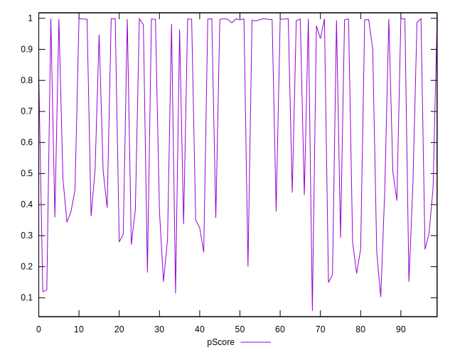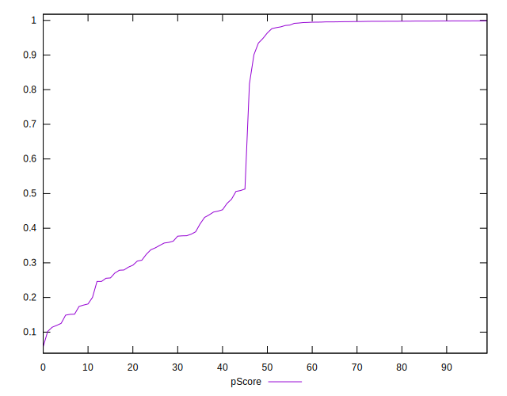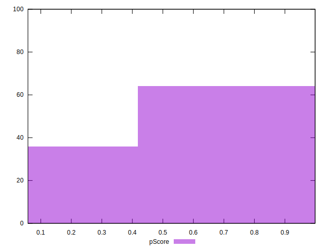
## Score Difference


```yaml
p90min: 0
p90max: 5.551115123125783e-17
p90range: 5.551115123125783e-17
p90mean: 1.1810883240693154e-18
median: 0
p90stdev: 8.010530753054493e-18
mad: 0
stdevBySn: 0
lfitCenter: 1.8863214532604964e-18
lfitStdev: 4.612227423793043e-18
mfitCenter: 1.8863214532604964e-18
mfitStdev: 5.780569840570726e-18
mfitConfidence: 5.780569840570726e-19
p90skewness: 6.6348880269703665
p90eccentricity: 0.9999999999999994
p90discretization: 47
outlandishness: 10.824100000000003

```

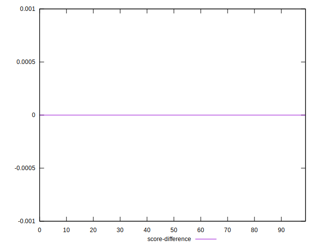
## P Score Difference


```yaml
p90min: -0.004655568601743765
p90max: 0.004571780211265808
p90range: 0.009227348813009573
p90mean: -0.0009449191118618727
median: -0.0015634121256558609
p90stdev: 0.0024539892722590315
mad: 0.0016274614485929373
stdevBySn: 0.002360014565544215
lfitCenter: -0.0011183923131175863
lfitStdev: 0.001981728152465207
mfitCenter: -0.0011183923131175863
mfitStdev: 0.0024837279123000036
mfitConfidence: 0.00024837279123000037
p90skewness: 0.701394326739216
p90eccentricity: 1.0000000000000007
p90discretization: 1
outlandishness: 0.8830778345162998

```

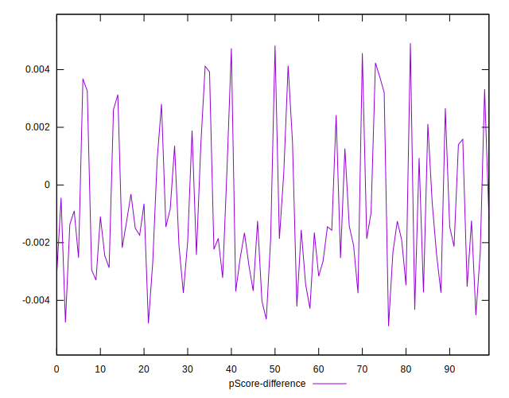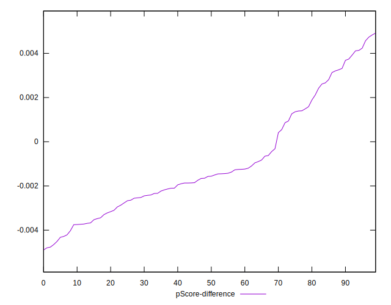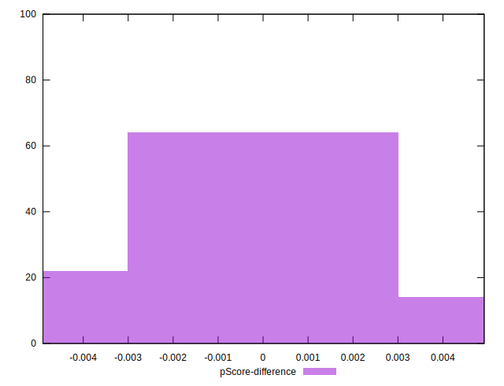