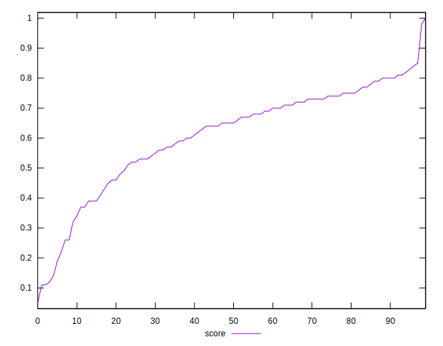

# //speed-index/samples/music

[→ Parent](../..)


## Raw


```yaml
p90min: 3800.117173838501
p90max: 9527.85549131471
p90range: 5727.73831747621
p90mean: 5222.682309830584
median: 4929.731041617044
p90stdev: 1124.4638401852549
mad: 571.8707175384698
stdevBySn: 942.0282765411451
lfitCenter: 5145.006956347651
lfitStdev: 889.6999478629542
mfitCenter: 5145.006956347651
mfitStdev: 1115.0735237475383
mfitConfidence: 111.50735237475382
p90skewness: 1.6186093511678012
p90eccentricity: 0.9999999999999997
p90discretization: 1
outlandishness: 1.0288573003235648

```


## Score


```yaml
p90min: 0.12
p90max: 0.84
p90range: 0.72
p90mean: 0.6113829787234043
median: 0.65
p90stdev: 0.16589923283414243
mad: 0.09999999999999998
stdevBySn: 0.16398250000000003
lfitCenter: 0.6233268731644459
lfitStdev: 0.13665781040709624
mfitCenter: 0.6233268731644459
mfitStdev: 0.17127516593013936
mfitConfidence: 0.017127516593013935
p90skewness: -1.0348689255302264
p90eccentricity: 0.9999999999999996
p90discretization: 1.9183673469387754
outlandishness: 0.9814958333213487

```


## Raw Estimate


## Score Estimate


## P Score


```yaml
p90min: 0.11849244943818898
p90max: 0.8431195114865241
p90range: 0.724627062048335
p90mean: 0.6115139292308123
median: 0.6507416122546086
p90stdev: 0.16570421090966653
mad: 0.10135018638489707
stdevBySn: 0.16368658006013592
lfitCenter: 0.623349727775842
lfitStdev: 0.13614758730783688
mfitCenter: 0.623349727775842
mfitStdev: 0.17063569610600923
mfitConfidence: 0.017063569610600925
p90skewness: -1.0371853264364392
p90eccentricity: 0.9999999999999994
p90discretization: 1
outlandishness: 0.9816487128989363

```


## Score Difference


```yaml
p90min: 0
p90max: 1.1102230246251565e-16
p90range: 1.1102230246251565e-16
p90mean: 7.677074106450551e-18
median: 0
p90stdev: 2.757910785993851e-17
mad: 0
stdevBySn: 0
lfitCenter: 5.5159912908274066e-18
lfitStdev: 1.3098564817890051e-17
mfitCenter: 5.5159912908274066e-18
mfitStdev: 1.641661648132413e-17
mfitConfidence: 1.6416616481324129e-18
p90skewness: 3.3941101404118648
p90eccentricity: 1.0000000000000022
p90discretization: 31.333333333333332
outlandishness: 1.8874532544378695

```


## P Score Difference


```yaml
p90min: -0.00468570537513241
p90max: 0.0048143120164109154
p90range: 0.009500017391543325
p90mean: 0.00018271748967771322
median: -0.000031804457606809944
p90stdev: 0.002845535163528903
mad: 0.0028704520934181854
stdevBySn: 0.003423301166610528
lfitCenter: 0.000182533864214092
lfitStdev: 0.0027117772532082693
mfitCenter: 0.000182533864214092
mfitStdev: 0.003398708772116444
mfitConfidence: 0.0003398708772116444
p90skewness: -0.030442291681481645
p90eccentricity: 0.9999999999999996
p90discretization: 1
outlandishness: 0.9374848486393117

```

