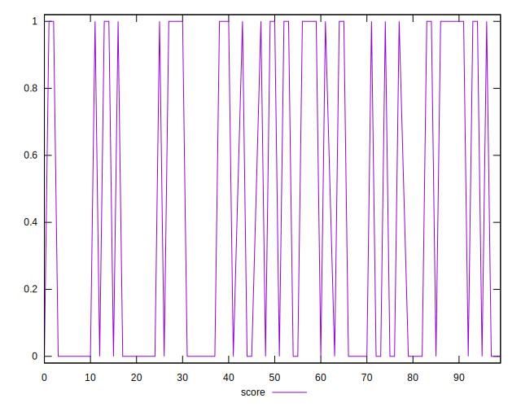
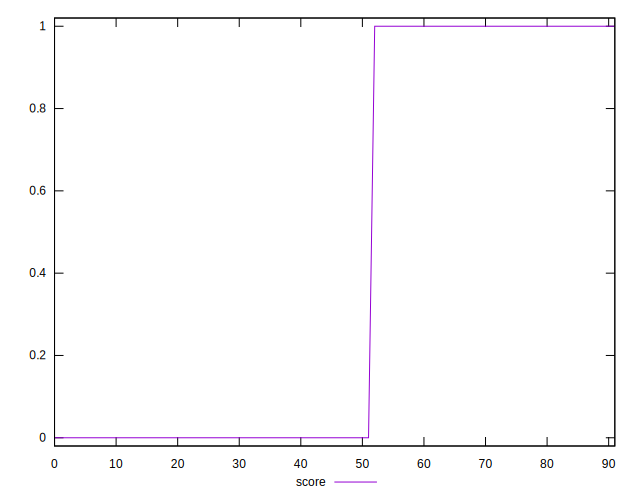
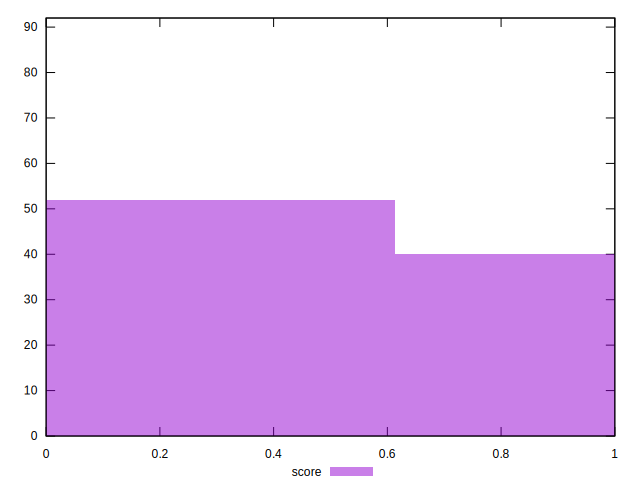

# //third-party-summary/samples/agenda

[→ Parent](../..)


## Raw


```yaml
p90range: 0

```


## Score


```yaml
p90min: 0
p90max: 1
p90range: 1
p90mean: 0.43023255813953487
median: 0
p90stdev: 0.4951085780475296
mad: 0
stdevBySn: 0
lfitCenter: 0.39033632592583506
lfitStdev: 0.5965120532939134
mfitCenter: 0.39033632592583506
mfitStdev: 0.7476169902246428
mfitConfidence: 0.0779444593279026
p90skewness: 0.2818268353806124
p90eccentricity: 0.9999999999999989
p90discretization: 43
outlandishness: 1.0212634337704587

```

