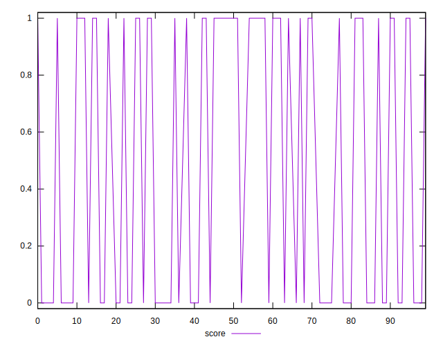
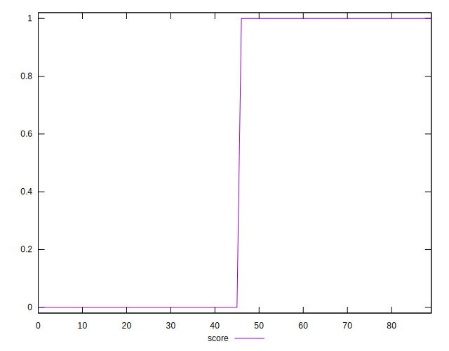
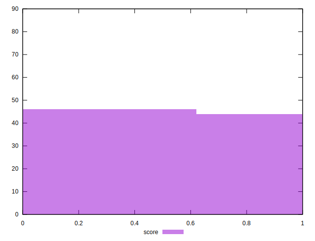

# //third-party-summary/samples/card

[→ Parent](../..)


## Raw


```yaml
p90range: 0

```


## Score


```yaml
p90min: 0
p90max: 1
p90range: 1
p90mean: 0.4880952380952381
median: 0
p90stdev: 0.49985825655278604
mad: 0
stdevBySn: 0
lfitCenter: 0.480096862172271
lfitStdev: 0.6256641063579683
mfitCenter: 0.480096862172271
mfitStdev: 0.7841536704983592
mfitConfidence: 0.08265705447853325
p90skewness: 0.047632550822954055
p90eccentricity: 0.9999999999999993
p90discretization: 42
outlandishness: 1.0032546764492036

```

