# //total-blocking-time/samples/agenda

[→ Parent](../..)


## Raw


```yaml
p90min: 0
p90max: 1177.9815000000017
p90range: 1177.9815000000017
p90mean: 392.5062819148937
median: 364.28600000000006
p90stdev: 395.72439835167546
mad: 361.28600000000006
stdevBySn: 434.4474836000001
lfitCenter: 368.14742303843565
lfitStdev: 386.4004299079876
mfitCenter: 368.14742303843565
mfitStdev: 484.2811219557721
mfitConfidence: 48.428112195577214
p90skewness: 0.43098181756317233
p90eccentricity: 0.9999999999999997
p90discretization: 1.205128205128205
outlandishness: 1.0732030508676462

```

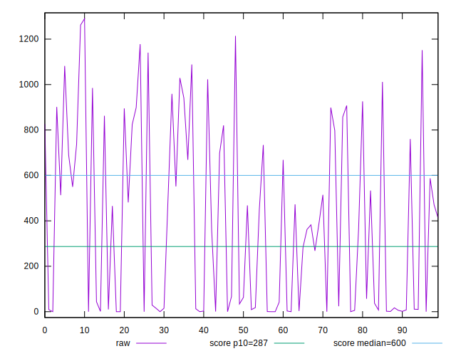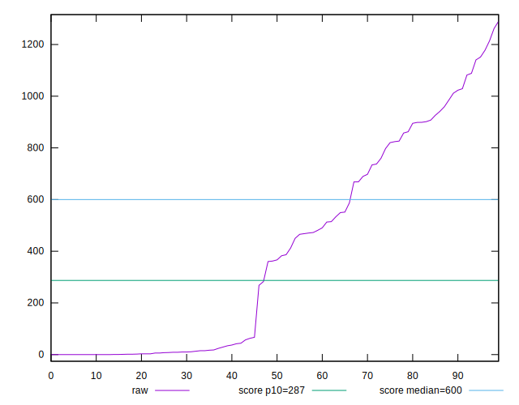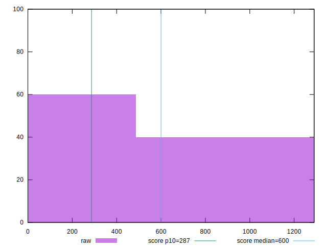
## Score


```yaml
p90min: 0.12
p90max: 1
p90range: 0.88
p90mean: 0.6946808510638297
median: 0.805
p90stdev: 0.330462931669781
mad: 0.19499999999999995
stdevBySn: 0.23553849999999996
lfitCenter: 0.7244929958860844
lfitStdev: 0.3296372394876138
mfitCenter: 0.7244929958860844
mfitStdev: 0.4131390128511997
mfitConfidence: 0.04131390128511997
p90skewness: -0.47076272953628095
p90eccentricity: 0.9999999999999988
p90discretization: 2.764705882352941
outlandishness: 0.9751638112704001

```

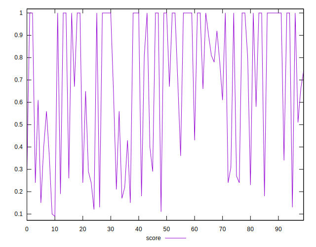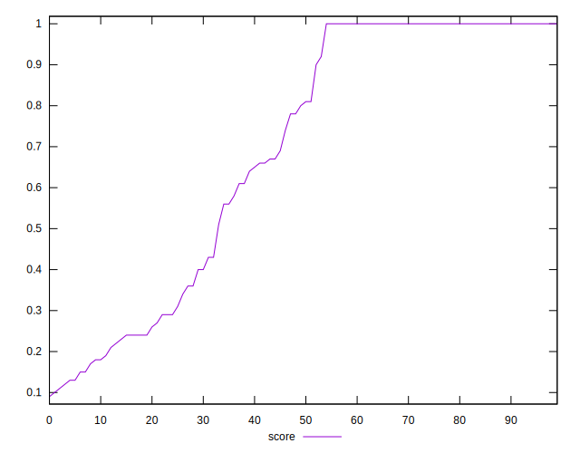
## Raw Estimate

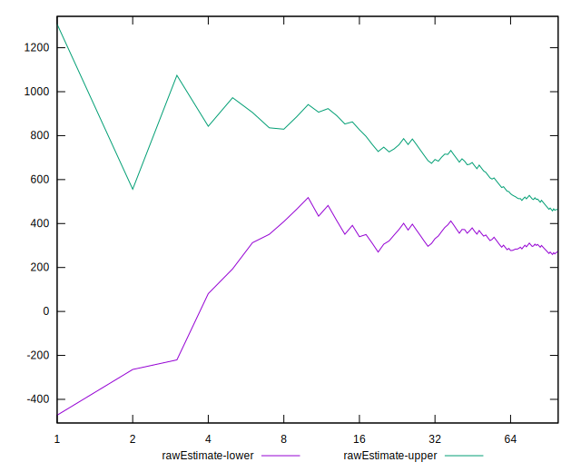
## Score Estimate

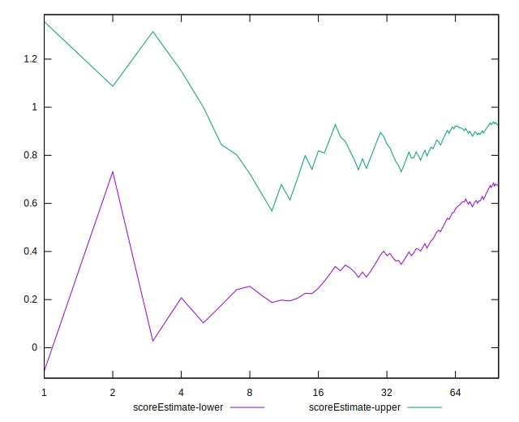
## P Score


```yaml
p90min: 0.12052179412345493
p90max: 1
p90range: 0.8794782058765451
p90mean: 0.694850485645965
median: 0.8070669938668815
p90stdev: 0.33038832335605706
mad: 0.19293300613311848
stdevBySn: 0.23187312439226912
lfitCenter: 0.7247087491929636
lfitStdev: 0.3299156256255153
mfitCenter: 0.7247087491929636
mfitStdev: 0.41348791813381536
mfitConfidence: 0.04134879181338154
p90skewness: -0.4703558643503721
p90eccentricity: 1.0000000000000004
p90discretization: 1.323943661971831
outlandishness: 0.9751448100990627

```

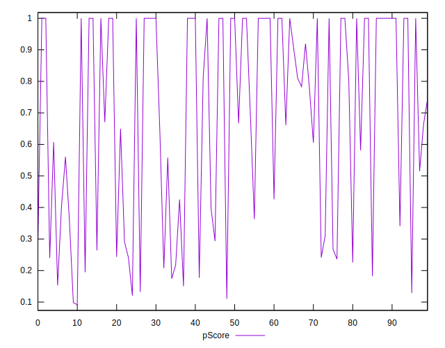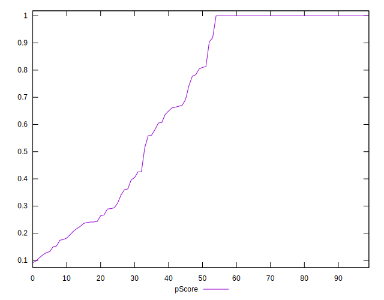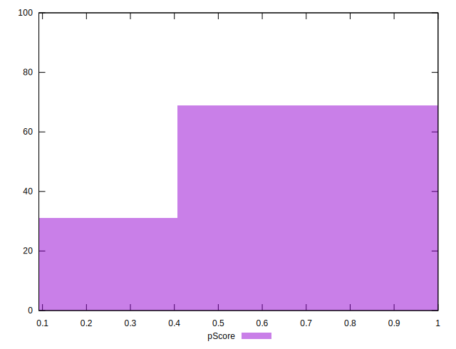
## Score Difference


```yaml
p90min: 0
p90max: 0
p90range: 0
p90mean: 0
median: 0
p90stdev: 0
mad: 0
stdevBySn: 0
lfitCenter: 5.166535369026208e-19
lfitStdev: 1.2890316797319448e-18
mfitCenter: 5.166535369026208e-19
mfitStdev: 1.6155616292812394e-18
mfitConfidence: 1.6155616292812395e-19
p90skewness: .nan
p90eccentricity: .nan
p90discretization: 94
outlandishness: .inf

```

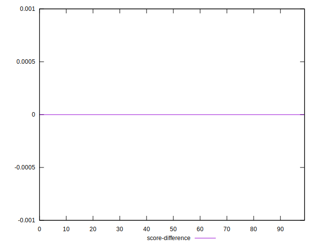
## P Score Difference


```yaml
p90min: -0.004353314213960402
p90max: 0.00427555215518946
p90range: 0.008628866369149862
p90mean: 0.00016899077282593643
median: 0
p90stdev: 0.0017448764517186733
mad: 0.000341573430650291
stdevBySn: 0.00044640859181643486
lfitCenter: 0.0001230089946333837
lfitStdev: 0.0010284871992305195
mfitCenter: 0.0001230089946333837
mfitStdev: 0.0012890175481406977
mfitConfidence: 0.00012890175481406976
p90skewness: 0.08882344802615587
p90eccentricity: 0.9999999999999996
p90discretization: 1.3823529411764706
outlandishness: 0.9057466816565108

```

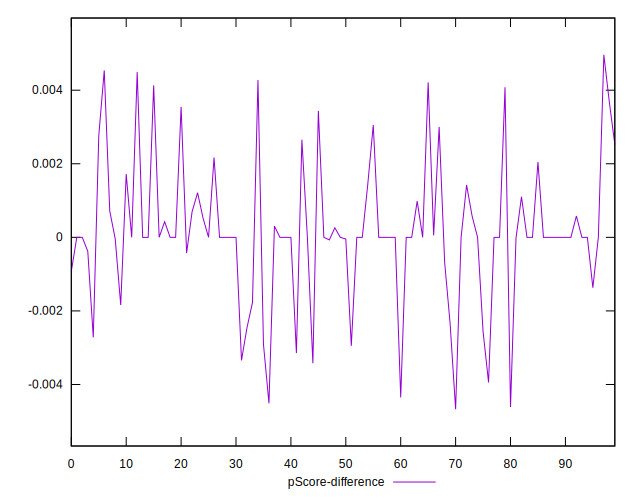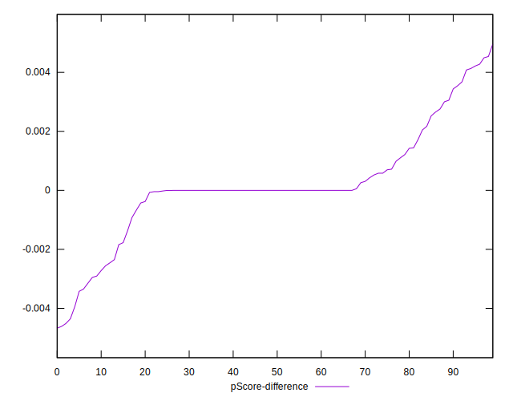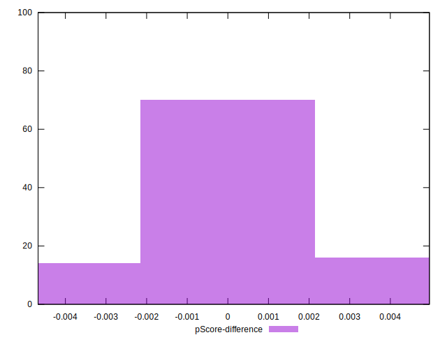