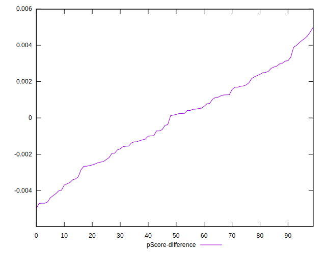

# //total-blocking-time/samples/astro

[→ Parent](../..)


## Raw


```yaml
p90min: 765.5
p90max: 2182.999999999999
p90range: 1417.499999999999
p90mean: 1184.4871489361701
median: 1077.250000000001
p90stdev: 299.30859025934467
mad: 182.5
stdevBySn: 263.63138560000095
lfitCenter: 1166.9799282645106
lfitStdev: 263.8535098328093
mfitCenter: 1166.9799282645106
mfitStdev: 330.69133438652995
mfitConfidence: 33.069133438653
p90skewness: 0.9970889772988201
p90eccentricity: 1.0000000000000004
p90discretization: 1.010752688172043
outlandishness: 1.0394599217062979

```


## Score


```yaml
p90min: 0.01
p90max: 0.34
p90range: 0.33
p90mean: 0.14787234042553188
median: 0.155
p90stdev: 0.08043594438956725
mad: 0.065
stdevBySn: 0.09540800000000002
lfitCenter: 0.1495788798287526
lfitStdev: 0.0719033461795118
mfitCenter: 0.1495788798287526
mfitStdev: 0.09011748037775265
mfitConfidence: 0.009011748037775266
p90skewness: 0.20271984913088248
p90eccentricity: 1.0000000000000004
p90discretization: 2.9375
outlandishness: 1.059388883805186

```


## Raw Estimate


## Score Estimate


## P Score


```yaml
p90min: 0.012402001757888526
p90max: 0.33602641654361365
p90range: 0.3236244147857251
p90mean: 0.147672764607369
median: 0.15458144482232816
p90stdev: 0.08027112617069927
mad: 0.06777112083359163
stdevBySn: 0.09700253543001876
lfitCenter: 0.1493006875228912
lfitStdev: 0.07213274673765134
mfitCenter: 0.1493006875228912
mfitStdev: 0.0904049913406663
mfitConfidence: 0.00904049913406663
p90skewness: 0.20761912224482063
p90eccentricity: 0.9999999999999996
p90discretization: 1.010752688172043
outlandishness: 1.060007929943576

```


## Score Difference


```yaml
p90min: 0
p90max: 0
p90range: 0
p90mean: 0
median: 0
p90stdev: 0
mad: 0
stdevBySn: 0
lfitCenter: 2.583267684513104e-19
lfitStdev: 6.445158398659724e-19
mfitCenter: 2.583267684513104e-19
mfitStdev: 8.077808146406197e-19
mfitConfidence: 8.077808146406197e-20
p90skewness: .nan
p90eccentricity: .nan
p90discretization: 94
outlandishness: .inf

```


## P Score Difference


```yaml
p90min: -0.004689924908443832
p90max: 0.00437236502805341
p90range: 0.009062289936497242
p90mean: -0.00017000296720889077
median: 0.00017336845050888727
p90stdev: 0.002390844970780132
mad: 0.002101246096562502
stdevBySn: 0.0028627532460202346
lfitCenter: -0.00014729751765709707
lfitStdev: 0.0021325156007022572
mfitCenter: -0.00014729751765709707
mfitStdev: 0.0026727119530953916
mfitConfidence: 0.0002672711953095392
p90skewness: -0.04169409360735256
p90eccentricity: 1
p90discretization: 1.010752688172043
outlandishness: 0.8970525135529848

```

